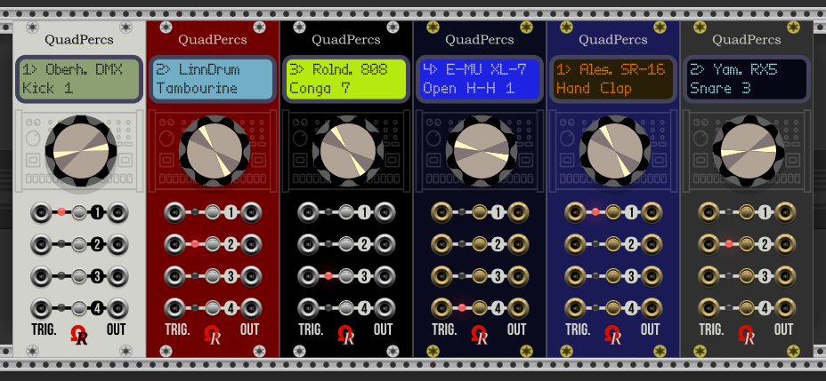
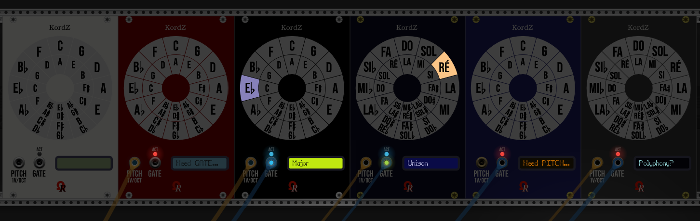
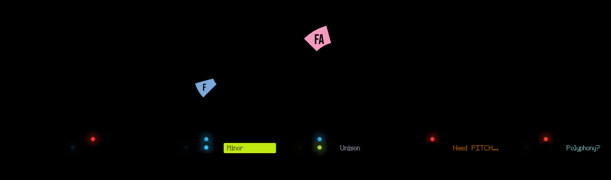
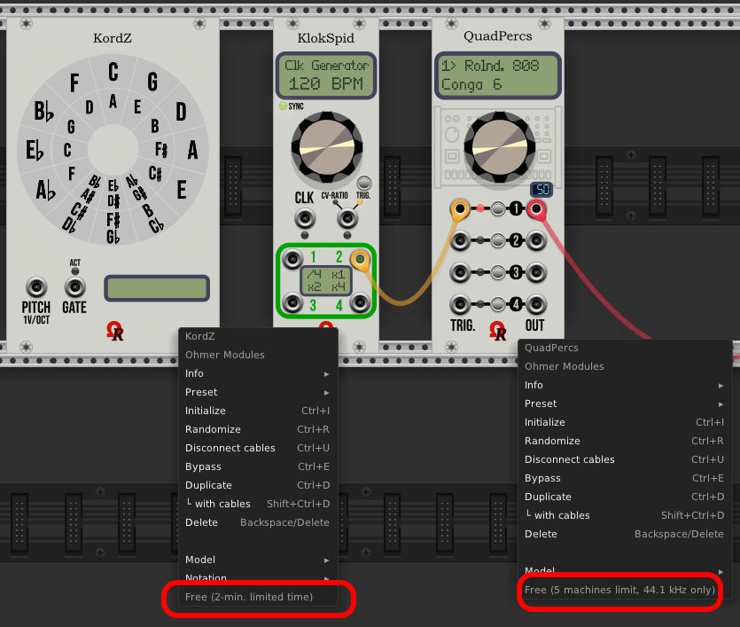

# OhmerPrems (Premium modules)

*OhmerPrems* is both Premium (for susbcribers) and free plugin/modules, designed for VCV Rack 2.

Actually, *OhmerPrems* plugin is a set of three modules (plus an expander):
- **FroeZe** a 64-step 16-track 128-pattern drum-based sequencer (triggers, or audio outputs).
- **FroeZe-X**, an expander module for FroeZe sequencer, brings additional outputs, plus edit features (along rightside of FroeZe module).
- **QuadPercs** a quad-channel drum machines.
- **KordZ** a mono-/polyphonic notes/intervals/triads display (1V/octave based) - remaining in development.

**FroeZe** & **FroeZe-X** modules: serie of video tutorials (as "manual") are coming soon!

**QuadPercs** module, all six models (aka themes or liveries): Classic beige, Stage Repro, Absolute Night, Absolute Night (bypassed), Dark "Signature", Deepblue "Signature", Carbon "Signature":

Some YouTube videos (made from old VCV Rack v0.6, but they're still valid), here:

[**VIDEO**: QuadPercs module presentation/tutorial from my YouTube channel "DoMiNo-MAO" (English, 1080p, 13 min.)](https://youtu.be/K51tFtwiisY) 

[**VIDEO**: Présentation/tutoriel du module QuadPercs sur ma chaîne YouTube "DoMiNo-MAO" (Français/French, 1080p, 13 mins.)](https://youtu.be/bAZPvrXWTXg)

[**VIDEO**: QuadPercs module in action, YouTube video made by Omar Brown (**thanks Omar!**)](https://www.youtube.com/watch?v=SBbM-12xc2w)

**KordZ** module (all six liveries - same than QuadPercs module), reduced room brightness:

[**VIDEO**: KordZ module in action (monophonic track) from Bitwig Studio 4 (uncommented, 1080p, 1'17")](https://www.youtube.com/watch?v=o6k0_MPDk3Y)

Modules by night: QuadPercs and KordZ modules are designed for VCV Rack's *Room brightness* feature (often named _Night mode_):

You can notice the *Absolute Night* model is the lone embedding a yellow backligth dot-matrix display (DMD). "Signature"-line luxury models (Dark "Signature", Deepblue "Signature" and Carbon "Signature") are using plasma-gas dot-matrix display (DMD) instead of LCD, visible in dark room/night. The first two models, "Classic" and "Stage Repro", use a standard LCD-based without backlight, by this way, they're not visible by night!

The KordZ modules by night (VCV Rack 2's *Room brightness* feature sets to... 0%):

------

"***OhmerPrems***" subdirectory hosts either free/full version (built package is strictly identical), but without personal license key, all modules work as free version (with limitations, depending the module). Full version requires a personal license key (the license key is sent by email during OhmerPrems subscription).

When installed, from VCV Rack module browser, QuadPercs and KordZ modules are listed (by brand: "Ohmer Modules"). QuadPercs module is also listed as "Drum" and "Quad" categories when you're browsing by tags, KordZ module as "Visual" and "Polyphonic".

## HOW TO VERIFY YOUR PERSONAL LICENSE INSTALLATION?

Over **any OhmerPrems module** (for now, Kord or QuadPercs), just do a right-click mouse button to bring the context-menu. At the bottom of this menu, if the grayed entry indicates **License:** (followed by your partial license key), that meaning all your modules run as full version, as expected!

Otherwise, the same grayed menu entry indicates **Free**, followed by limitation type (between brackets).

Hi! I'm enjoyed to present you my first *OhmerPrems* module: **QuadPercs**

Basically, QuadPercs is a 10HP **quad-channel drum** module, providing 4 independent drum machine channels, each having its own (sample-based) drum machine, and its related instrument.

QuadPercs module is available from OhmerPrems plugin, as both:

- free version (limited to **5** working drum machines, operating at 44.1 kHz only) to any who want to try it (fully usable, no other limitation). Other drum machines can be selected, but are muted (no audio output).
- full version (all 16 drum machines, from 44.1 to 192 kHz), reserved to *OhmerPrems* members exclusively, requires a personal license key to remove all limitations.

Free version: Oberheim DMX, Drumulator, LinnDrum, Roland 707, and Roland 808, for a total of 102 instruments. 44.1 and 48kHz sample rates only.

Full version: Oberheim DMX, Drumulator, Korg KR-55, Korg Minipops, LinnDrum, Roland R8, Roland 606, Roland 626, Roland 707, Roland 808, Roland 909, Yamaha RX5, Yamaha RY-30, Casio RZ-1, Alesis SR-16, and E-MU XL-7, for a **total of 369 instruments!**, 44.1 kHz to 192 kHz sample rates.

QuadPercs embeds all drum samples (44.1 ~ 192 kHz 16-bit mono PCM) via external PCM table files (220MB after installation).

KordZ module presentation coming soon...

------

## How to use QuadPercs

QuadPercs module is, in fact, very easy to use.

The main key are... four buttons (one per drum channel). Default channel is always 1.

For each channel (labeled 1 to 4, from top to bottom), you can find, from left to right:

- An ***input*** "TRIG." jack, to trigger drum sound for related channel. Minimum trigger voltage is +1.7V.
- Red LED, indicating selected channel (when lit), or when editing channel (while blinking).
- Volume level (from 0% to 100%, default is always 50%) can be changed by turning the **continuous encoder** (while the channel LED isn't blinking). By approaching the mouse cursor near the encoder, the current level is indicated in the dot-matrix display (DMD).
- Momentary button to select active channel (if its LED is off). When pressing button on **already active channel**, its LED blinks, indicating channel edit. The related item to edit also blinks in dot-matrix display. When the drum machine name is blinking, press the channel button again to change its related instrument (drumkit). Turn the encoder clockwise or counter-clockwise to select next or previous drum machine, or the instrument (drumkit). No need to validate anything, your choice is *immediately applied!* Also, please notice while channel LED is blinking (meaning you're editing active channel), and in case you don't touch the encoder or any button, the edit mode exits automatically after 30 seconds timeout.
- An ***output*** jack delivers monophonic audio, it can be connected to output of VCV's AUDIO module, mixer, audio effect, envelope generator or any modulator you want...

The dot-matrix display reports the current selected channel (number indicated at top-left, channel LED is doing exactly the same thing), the current loaded drum machine for active (selected) channel, and its current instrument.

Despite one channel can be selected at time (for level changing, or instrument selection), all four channels are able to play simultaneously, obviously.

This module supports monophonic cables only (because polyphony is never required for drum element).

Both *Initialize*, *Randomize* and *Preset* (via .vcvm preset file, or via copy/paste) commands, from module's context-menu (right-click, keyboard shortcuts), are fully supported.

QuadPercs can operate **from 44.1 to 192 kHz** (free version is limited to max. 48 kHz, higher sample rate sounds are muted), thanks to external pre-computed sample tables - made by fabulous iZotope softwares suite - who permit to keep the sound quality at any sample rate!

------

## Free version

Free *OhmerPrems* plugin is available to everybody, for Windows, MacOS and Linux platforms, and can be downloaded directly from either [VCV Plugin Library](https://library.vcvrack.com/?query=&brand=Ohmer+Modules&tag=&license=) for automatic installation/updates, or via ["Releases"](https://github.com/DomiKamu/OhmerPrems/releases) page on this GitHub repository (but requires **manual** installation/updates, by download/copy **.vcvplugin** file).

------

## Full version (OhmerPrems members only)

Since VCV Rack 2, the plugin is EXACTLY the same than free version, except a personal license key is sent to OhmerPrems members (by email). The license key unlocks all modules to full (unrestricted) version.

Obviously, all *OhmerPrems* members will benefit all **lifetime** updates/upgrades and all future *OhmerPrems* modules (full versions) without any additional charge!

To become *OhmerPrems* member, simply send me **12 euros** (if required, please convert your local currency first, to fit with 12+ euros, otherwise your payment will not be accepted) via [my "PayPal.Me" (Dominique CAMUS @DominiqueCAMUS - BARJAC)](https://www.paypal.com/paypalme/DominiqueCAMUS).

**Very important: don't forget to indicate:**
- your first and last name.
- your valid email address (required to send your personal license key & instructions).
- also in the message, please specify **OhmerPrems member** (or something similar), to avoid possible confusion. Thank you in advance!

New subscription requires from 24 to 48 hours after PayPal confirmation (in genereal, less than 24 hours). **Incomplete fee informations or/and payment less than 12 euros is refurbished**. Thank you for your understanding.

------

## License Clauses

All ***OhmerPrems*** modules (even free) remain under **proprietary license**.

Full version is granted for each OhmerPrems member, and of course, **cannot be shared, sold or distributed** to any third party (obviously, the license key can be used on ALL owned computers). Please read "LICENSE-FULL.txt" enclosed in your downloaded package for licensing conditions.

All graphic materials, the "Ohmer" logo and related resources cannot be used for derivative works and remains the proprietary of Dominique Camus (Ohmer Modules & OhmerPrems developer).

All SVG graphics named **XB_*.svg** are designed by **Xavier Belmont** (ask him the permission if you'll want to use them in your developments). Thanks a lot, Xavier!

Thanks to **Marc Boulé** (author of excellent ImpromptuModular/Geodesics/MindMeld plugins) for C++ code who permit to swap ports textures (silver, gold) "on-the-fly" when changing model, exactly like momentary buttons and screws.

Thanks to **Paul Bacon** (author of excellent Bacon Music plugin, and working hard on SurgeXT) for C++ coding tips who permit to display coloured textures (Kordz's circle of fifths) in dark/night mode.

Thanks to **Steve Baker** and **Jens Peter Nielsen** for MacOS builds.

Feature requests, suggestions, and bug reports are welcome on this GitHub repository!
