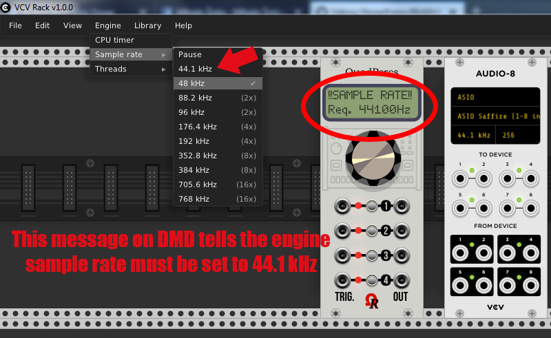

**@ OHMERPREMS MEMBERS:** Packages for each member (containing user-customized plugin for Windows, Mac and Linux, plugin version 1.0.1) are uploaded to respective user areas. Also, an email was sent to each member. Enjoy!

**VCV RACK V1.0:** OhmerPrems modules v1.0.1 (for now QuadPercs module) are (is) available for VCV Rack v1.0.0 (Windows, Mac and Linux). Full version for each OhmerPrems member is also available (please see your mailbox). Free version is available for all platforms from [VCV Plugin Library](https://vcvrack.com/plugins.html#Ohmer) - or from "Releases" on this GitHub repository (downloads from _lastest release_). **No more maintenance about v0.6.4 (and older)**.

**Enhancements for future v1.0.2 (planned first week of July):**
- By using "Randomize" command from module's context-menu or by pressing Ctrl+R over module (Command+R on Mac), random drum machine + random drumkit (for related drum machine) are applied, per channel. _Status: Implemented._
- Redesigned gold/silver buttons (stuff will be made by Xavier Belmont - TIA). _Status: Implemented._

# OhmerPrems (Premium module + free)

*OhmerPrems* is both Premium (for susbcribers) and free plugin/modules, designed for VCV Rack v1.0.x.

Actually *OhmerPrems* plugin is containing **QuadPercs** module only. More modules are under consideration.

_(note this image comes from OhmerPrems v1.0.1, VCV Rack v1.0.0 Windows)_

Some YouTube videos (made from VCV Rack v0.6 but still valid), here:

[QuadPercs module presentation/tutorial from my YouTube channel (English, 1080p, 13 min.)](https://youtu.be/7e7qjuJyDj0) 

[Présentation/tutoriel du module QuadPercs sur ma chaîne YouTube (Français, 1080p, 13 mins.)](https://youtu.be/jkP7m8JSPrk)

[QuadPercs module in action, YouTube video made by Omar Brown (Thanks!)](https://www.youtube.com/watch?v=SBbM-12xc2w)

[QuadPercs modules in action, YouTube video made by Billy Sorel (Thanks mon Ami!)](https://www.youtube.com/watch?v=-_YcB-VNbCE)

------

###### IMPORTANT - ABOUT INSTALLATION: from your "***documents/Rack/plugins-v1***" directory, if existing, never touch "***Ohmer***" subdirectory (in case you're already using regular "Ohmer Modules", like KlokSpid, Metriks, RKD, etc), so please understand "***OhmerPrems***" is a SEPARATE plugin and never replace (or merge) with existing other folder, anyway! PLEASE ALWAYS USE DIRECTORY NAMES PROVIDED FROM RESPECTIVE DOWNLOADED .ZIP FILES TO AVOID ISSUES/CONFICTS!

"***OhmerPrems***" subdirectory hosts either free or full version (simply delete existing "OhmerPrems" directory first, then replace it by provided from downloaded full version .zip archive file, for OhmerPrems members). Free version plugin.dll/plugin.so/plugin.dylib is smaller than full equivalent, because unavailble samples for disabled drum machines aren't implemented.

When installed, from Rack's browser, QuadPercs module is listed by Brands into "Ohmer Modules". QuadPercs module is also listed into "Drum" and/or "Quad" categories when you're browsing by tags.

------

Hi! I'm enjoyed to present you my first *OhmerPrems* module: **QuadPercs**

Basically, QuadPercs is a 10 HP **quad-channel drum** module, providing 4 independent drum/percussion channels, each having its own (sample-based) drum machine, and its related instrument.

QuadPercs module is available from OhmerPrems plugin, as both:

- free version (limited to 4 drum machines) to any who want to try it (fully usable, no other limitation).
- full version (all 16 drum machines), reserved to *OhmerPrems* members.

Free version: Oberheim DMX, LinnDrum, Roland 707, and Roland 808 (for a total of 90 instruments).

Full version: Oberheim DMX, Drumulator, Korg KR-55, Korg Minipops, LinnDrum, Roland R8, Roland 606, Roland 626, Roland 707, Roland 808, Roland 909, Yamaha RX5, Yamaha RY-30, Casio RZ-1, Alesis SR-16, and E-MU XL-7, for a **total of 369 instruments!**

QuadPercs embeds all drum samples (44.1 kHz 16-bit mono, streamed from RAM for best performance), with anti-pop feature (to avoid weak noises when you're changing drum machine and/or its instrument). Like KlokSpid module (provided from Ohmer Modules), QuadPercs is available as six models, shown by screen capture, top of this document, can be changed via right-click (context) menu.

## VERY IMPORTANT: QuadPercs operates at 44.1 kHz ONY!

if VCV Rack engine's sample rate is set to another than 44.1 kHz, the module stops immediately: all channel LEDs are turned on, and its dot-matrix display indicates "44100Hz !!SAMPLE RATE!!", because internal samples are 44100Hz only (to operate at higher sample rates, internal resampling algo must be implemented, **this feature is under consideration but requires upsampling + filtering techniques**). 

Changing Rack engine's sample rate back to 44.1 kHz will return QuadPercs module(s) as operational immediately (see picture just above!)

QuadPercs is very easy to use. The main key are... four buttons (one per channel). Default channel is always 1 (previous versions designed for VCV Rack v0.6.x, default channel was 4, instead).

For each channel (labeled 1 to 4, from top to bottom), you can find, from left to right:

- An ***input*** "TRIG." jack, to trigger drum sound for related channel. Minimum trigger voltage is +1.7V.
- Red LED, indicating currently selected channel (when lit), or when editing channel (while blinking).
- Momentary button to select active channel (if its LED is off). When pressing button on **already active channel**, the LED blinks, indicating channel edit. The related item to edit also blink in dot-matrix display (DMD). When drum machine name is blinking, press the channel button (again) to change its instrument. Turn the **rotary encoder** clockwise or counter-clockwise to select next / previous drum machine, or its instrument. No need to validate anything, your choice is *immediately applied!* Also, please notice while channel LED is blinking (meaning you're editing active channel), if you don't touch the rotary encoder nor any button, the edit mode ends - automatically - after 30 seconds (it's a kind of timeout). **Rotary encoder doesn't have effect while LED doesn't blink**, to avoid unwanted changes.
- An ***output*** jack (monophonic sound) can be connected to a mixer, effect, modulator input, etc.

The dot-matrix display (DMD) reports the current selected channel (number indicated at top-left, channel LED does exactly the same thing), the current loaded drum machine for active (selected) channel, and its current instrument.

## Free version

Free *OhmerPrems* plugin is available to everybody, for Windows, MacOS and Linux platforms, and can be downloaded directly from ["Releases"](https://github.com/DomiKamu/OhmerPrems/releases) page on this GitHub repository. This plugin isn't available yet from "Plugins Library" website and, by this way, cannot be installed via Rack's Plugin Manager (but this feature comin' soon).

## Full version (OhmerPrems members only)

Full version of OhmerPrems plugin (modules) is accessible only for *OhmerPrems* members (download link pointing to full personal version is **always** sent by email, including future updates).

The registration fee to become *OhmerPrems* member is now **10 EUR**, via [PayPal](https://www.paypal.me/DominiqueCAMUS) only. For other currencies, please do a *conversion to euro/EUR* first. Delivery delay to OhmerPrems members is less than 24 hours (2 to 6 hours, in general).

Obviously all *OhmerPrems* members will benefit all **lifetime** updates/upgrades and all future *OhmerPrems* modules (full versions), without any additional charge!

**To OhmerPrems members**: be careful in case you'll share your patches (.vcv files) on patchstorage (or equivalent) website, by using drum machine(s) provided in full version of QuadPercs, please keep in mind all users don't have the full version, too, and in this case, channels using drum machines included in full version (but not in free) will return automatically to default "Oberh. DMX Kick 1"! So, thanks in advance to consider it!

## License Clauses

All ***OhmerPrems*** modules (even free) remain under **proprietary license**.

Full version is watermaked for each member, and of course, cannot be shared, sold or distributed to any third party (obviously, it can be used on all owned computers). Please read "LICENSE-FULL.txt" enclosed in your downloaded package.

All graphic materials, Ohmer logo and related resources cannot be used for derivative works and remains the proprietary of Dominique Camus (Ohmer Modules & OhmerPrems developer).

All SVG graphics named 'XB_....svg' are designed by **Xavier Belmont** (ask him the permission if you'll want to use them in your productions). Thanks Xavier!

Thanks to **Marc Boulé** (author of excellent ImpromptuModular/Geodesics plugins) for C++ code who permit to swap ports SVG metal textures (silver, gold) "on-the-fly", like push buttons and screws...

Feature requests, suggestions, and bug reports are welcome on this GitHub repository.