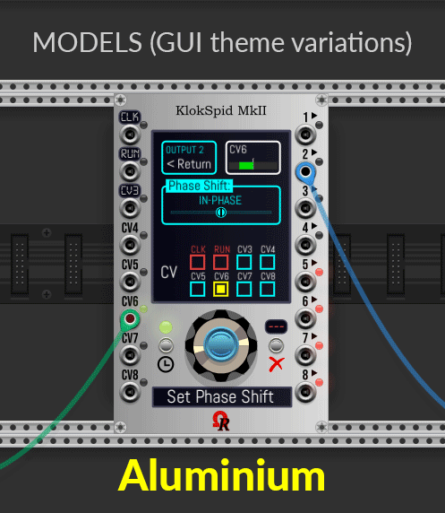
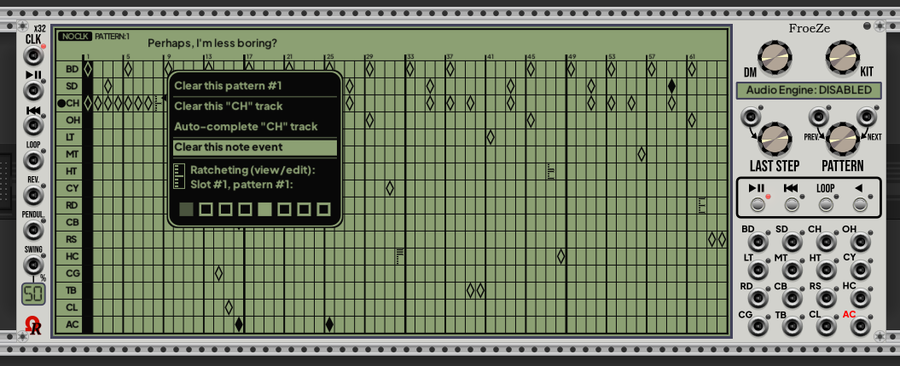
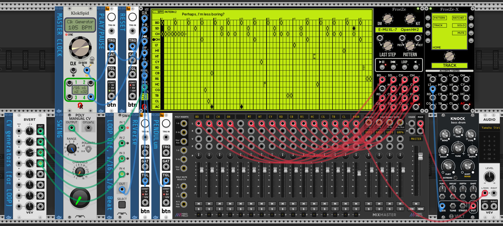
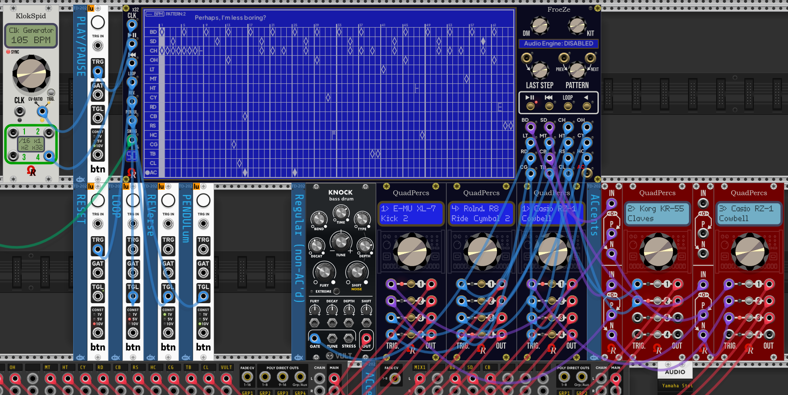
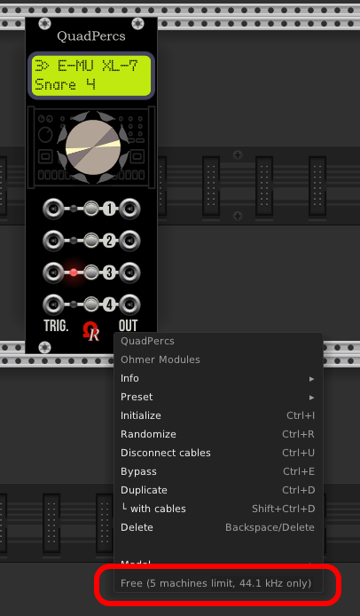

# OhmerPrems for VCV Rack 2

*OhmerPrems* is both Premium (**full version**, for susbcribers only) and free (limited) modules, for VCV Rack 2.

Actually, *OhmerPrems* plugin is a set of 4 main modules, plus 3 as _expanders_ modules:
- **FroeZe** is a 64-step 16-track 128-pattern drum-based sequencer (triggers, or direct-audio outputs by using 15x internal QuadPercs engines). [**FroeZe Specifications & Quick Guide** (incl. expanders)](doc/FroeZe-Specs.md)
- **FroeZe-X** is a 12HP **right-side expander** module for FroeZe sequencer. It brings additional outputs for ACcents, plus some edit features.
- **FroeZe-SX** is a 14HP **left-side expander** module for FroeZe sequencer. It brings 15 additional CV inputs (one per instrument track) for **track-based SWING**. NOTE: by using at least one CV - can be enabled by left mouse button click over relevant box(es) on expander's touchscreen - the FroeZe's internal **%SWING CV** input jack becomes disabled (its LED is red, and its two-digit display shows **-** **-**).
- **QuadPercs** is a quad-channel drum machine module.
- **KordZ** is a mono-/polyphonic notes/intervals/triads *visual/display only* module (1V/octave based) - **remaining in development, but delayed!**
- **KlokSpid MkII**, the versatile 16HP clocking source / LFO / clocked envelope module. [**KlokSpid MkII Specifications & User's Manual** (incl. KX expander)](doc/KlokSpid_MkII-Specs.md)
- **KX** is a 3HP **left-side expander** module for KlokSpid MkII. It brings discrete "CLK", "RUN", and "RESET" inputs. Also, it adds two dedicated CV inputs, exclusively for outputs' quantizers (pre-offsets).

---
Lastest version (**v2.4.1**) is available from [_Releases_](https://github.com/DomiKamu/OhmerPrems/releases) section.
--
----

## **KlokSpid MkII & KX modules**

[Please click here to read KlokSpid MkII/KX specifications & **USER'S MANUAL**](doc/KlokSpid_MkII-Specs.md)

This module is **entirely free** (even for non-OhmerPrems members, without any feature limitation), because it's the successor of [2017 *KlokSpid*](https://library.vcvrack.com/Ohmer/KlokSpid) module from freeware [*Ohmer*](https://github.com/DomiKamu/Ohmer) plugin. By this way, **KlokSpid MkII** becomes the **first 100% free module** provided by OhmerPrems commercial plugin! Original KlokSpid module will stay alive, however, but its maintenance is discontinued (except if serious issue is discovered). Source code is not provided, however.

Like other Ohmer and OhmerPrems modules, KlokSpid MkII comes in six models (GUI theme variations):
- _Aluminium_ (default/browser view if **Use dark panels if available** option is disabled from **View** menu)
- _Stage Repro_
- _Absolute Night_ (default/browser view if **Use dark panels if available** option is enabled from **View** menu)
- _Dark "Signature"_
- _Fort Knox "Signature"_
- _Titanium "Signature"_

**KX expander** module inherits KlokSpid MkII model as soon as it placed along (left-side, without space) KlokSpid MkII module, automatically.

----

## **FroeZe, FroeZe-X & FroeZe-SX modules**

:warning: **No sound (by Audio Engine) is meaning you don't have a license keyfile (the module is running as "Free" instead of "Full"), and you're using higher than 44.1kHz, and/or you've selected a not allowed drum machine (without a valid license keyfile, only Oberheim DMX, Drumulator, LinnDrum, Roland 707 and Roland 808 output sounds, all other drum machines are muted).** Also, without license keyfile, FroeZe module have more feature limitations (indicated in Quick Guide).

[Please click here to read FroeZe/FroeZe-X/FroeZe-SX specifications & **Quick Guide**](doc/FroeZe-Specs.md)

Below this is the _Creamy_ model - as presented from Rack's module browser (_Absolute Night_ is presented, instead of _Creamy_, if **Use dark panels if available** option is enabled from **View** menu). Not connected CLK source (the black "NO CLOCK" indicator is blinking). After a right mouse click over a cell - step 8 track CH - here it's a ratchet event: the OSD context menu permits to edit the ratchet pattern (clikable square boxes - bottom of menu):

FroeZe sequencer and its companion, FroeZe-X expander, _Absolute Night_ model (GUI theme), playing audio sequence (all outputs are direct-connected to the audio mixer). Per instrument track (first 15th, AC isn't an instrument track), you can select drum machine and related drum kit by using both DM and KIT continuous encoders (wheels):

Patch using FroeZe (_Dark "Signature"_ model, displays are dimmed - **left mouse click over Ohmer logo to switch bright/dim**)... but here without its companion (I mean... FroeZe-X expander). On AC'd note(s), without FroeZe-Xexpander, the sequencer delivers a **-10V** (1ms) triggers! by this way, you'll must "filter" the -10V signal, in order to invert it to +10V, then route it to alternate way. It is exactly the role of **[Polarity Switch](https://library.vcvrack.com/Ohmer/PolaritySwitch)** (dual) module - the tiny red module located at the left of red QuadPercs modules does this job!

## FroeZe "Quicky Guide" - tips:

- Instrument tracks refer to BD to CL tracks (last AC track isn't an instrument track, only ACcents).
- Main screen (display) is working like a tablet-touchscreen.
- FroeZe module requires a **X32 pulse-based external source clock** (32 PPQN) to work correctly. KlokSpid MkII (see above), or [Impromptu's CLOCKED](https://library.vcvrack.com/ImpromptuModular/Clocked) clocking modules are perfect!
- Left mouse click on track header (near track name) selects the track, **or**, if already selected, toggles its SOLO state.
- SOLO indicator (below BPM / NO CLK indicator) is blinking while at least one instrument track is SOLO.
- Right mouse click on track header (near track name) selects the track, **or**, if already selected, toggles its MUTE state (MUTEd tracks are entirely highlighted, song pointer doesn't run over them).
- Left mouse click on cell to add a simple (normal) note event (unfilled diamond) - if previously was empty (silence).
- Left mouse click again on the note event to transform it to **AC'd note** event (plain diamond).
- Left mouse click again on the plain diamond to transform it to 1st (of 8) of ratchet pattern (its representation is from top to bottom).
- Using left **Ctrl** (left **Command** on Mac) key while left mouse click on cell erases its content (step becomes silence).
- Right mouse click in any cell brings an OSD context menu.
- Top of display: left click to name or rename the current (displayed) pattern. An OSD indicates instructions, please follow them carefully!
- Top of display: right click on pattern name blanks the pattern name, and enters pattern name edit.
- While you name a pattern simply press **Esc** or **Enter** key (main or keypad), or just move the mouse cursor outside the edit box to finish!
- For models having **brightness displays** (all, except _Creamy_ and _Stage Repro_), left mouse click on the **Ohmer logo** (it's a hotspot) near bottom-left screw - toggles bright/dim all displays, including displays on attached expanders!
- Please take attention about module's context menu option (right mouse click over module, but outside the main screen)...
- AC track accepts only silence or accent event (to accent/mark all note events located into same step/column).
- SWING input port applies a global swing (all instrument tracks) on even steps. 50% is meaning no swing. Max is 75% (dotted 16th followed by 32th).
- Top-right area of display is empty at the moment (this area is reserved for future usage).

FroeZe-X expander:

- As soon as you attach the expander at right side of FroeZe sequencer, the expander inherits both model and displays dim settings from FroeZe!
- When attached, FroeZe-X displays are turned on (turned off when unattached).
- You can left mouse click on buttons (labelled L1 to L4, and R1 to R4), or left mouse click on the related menu boxes on touchscreen, you have the choice!
- Message below continuous encoder (like TRACK, PATTERN, STEPS, PULSES, OFFSET,...) indicates the contextual role of the continuous encoder.
- TRACK/COPY actions works on tracks who having same nature: you can copy instrument track to another instrument track (any), but not to AC track. Also, you cannot copy AC track to instrument track.
- You can copy track to another track, even to another pattern if you want. In this case, use TRACK encoder from FroeZe-X expander (or mouse click in track name box), and PATTERN encoder from FroeZe module, prior clicking PASTE (L1 button). On CANCEL (R1 button), the FroeZe sequencer returns immediately to source pattern and track.
- You can copy AC track to another AC track (different pattern).
- If you move any pattern (PATTERN/MOVE) to pattern 128, in fact you can, but the destination pattern 128 becomes... 127: it's not an issue, because "source" pattern is removed after the move operation, by this way, all following patterns are "moved by -1".
- TRACK/EUCLID. menu: euclidean rhythm feature erases the current track as soon as you change any euclidean parameter via continuous encoder (STEPS, PULSES or OFFSET), so proceed with caution (if necessary, save the pattern first, from module context menu, or make a backup of it by using PATTERN/COPY from expander to any empty pattern).
- TRACK/EUCLID. menu: sets regular notes only (no AC'd or ratchets). However, it sets ACcent events on AC track.
- TRACK/COMPLT. menu (track auto-completion feature): this feature also may "cover" existing track events, so proceed with caution (save the pattern first, from module context menu, or make a backup of pattern by using PATTERN/COPY from expander to an empty pattern).
- RATCHET. menu permits to save, open, and "reset to factory" the eight ratchet slots/presets (for current pattern only).

More infos "on-the-fly" in [FroeZe/FroeZe-X/FroeZe-SX **Specifications & Quick Guide**](doc/FroeZe-Specs.md) document.

Like other Ohmer and OhmerPrems modules, FroeZe comes in six models (GUI theme variations):
- _Creamy_ (default/browser view if **Use dark panels if available** option is disabled from **View** menu)
- _Stage Repro_
- _Absolute Night_ (default/browser view if **Use dark panels if available** option is enabled from **View** menu)
- _Dark "Signature"_
- _Fort Knox "Signature"_
- _Titanium "Signature"_

----

## **QuadPercs module**

:warning: **No sound is meaning you don't have a license keyfile (the module is running as "Free" instead of "Full"), and you're using higher than 44.1kHz, and/or you've selected a not allowed drum machine (without a valid license keyfile, only Oberheim DMX, Drumulator, LinnDrum, Roland 707 and Roland 808 output sounds, all other drum machines are muted).**

However, since plugin v2.4.1, you can _preview_ ANY sound at ANY samplerate, by **disconnecting trigger input cable** first (on related channel). While the cable is disconnected, you can preview selected drum kit sound when you select another drum kit or another drum machine, whatever the engine's samplerate. It's a good way, for non-OhmerPrems members who are using QuadPercs as "Free", to have a chance to hear all drum machines/drum kits (at any samplerate, from 44.1kHz to 192kHz).

All six models (GUI theme variations): _Creamy_, _Stage Repro_, _Absolute Night_, _Absolute Night_ (bypassed), _Dark "Signature"_, _Deepblue "Signature"_, and Titanium "Signature":

Depending **Use dark panels if available** Rack's global option, the default model will be _Creamy_ if this option is disabled (aka default light panels), or _Absolute Night_ if this option is enabled, either from module browser and new module instanciation (when you bring the module in rack, as new fresh module).

Some YouTube videos (made from old VCV Rack v0.6, but they're still valid), here:

[**VIDEO**: QuadPercs module presentation/tutorial from my YouTube channel "DoMiNo-MAO" (English, 1080p, 13 min.)](https://youtu.be/K51tFtwiisY) 

[**VIDEO**: Présentation/tutoriel du module QuadPercs sur ma chaîne YouTube "DoMiNo-MAO" (Français/French, 1080p, 13 mins.)](https://youtu.be/bAZPvrXWTXg)

[**VIDEO**: QuadPercs module in action, YouTube video made by Omar Brown (**thanks Omar!**)](https://www.youtube.com/watch?v=SBbM-12xc2w)

## Quicky Guide - How to use QuadPercs module

QuadPercs module is, in fact, very easy to use!

The main key are... four buttons (one per drumming channel), and the continuous encoder. Default channel is always 1.

For each channel (labeled 1 to 4, from top to bottom), you can find, from left to right:

- An ***input*** "TRIG." jack, to trigger drum sound for related channel. Minimum trigger voltage is +1.7V.
- Green or red LED, indicating selected channel (when lit), or when editing channel (while blinking). Red LED indicates the sound isn't allowed from Free version (not allowed drum machines, and/or samplerate greater than 44.1kHz).
- Volume level (from 0% to 100%, default is always 50%) can be changed by turning the **continuous encoder** (while the channel LED isn't blinking). By approaching the mouse cursor near the encoder, the current level is indicated in the dot-matrix display (DMD).
- Momentary button to select active channel (if its LED is off). When pressing button on **already active channel**, its LED blinks, indicating channel edit. The related item to edit also blinks in dot-matrix display. When the drum machine name is blinking, press the channel button again to change its related instrument (drumkit). Turn the encoder clockwise or counter-clockwise to select next or previous drum machine, or the instrument (drumkit). No need to validate anything, your choice is *immediately applied!* Also, please notice while channel LED is blinking (meaning you're editing active channel), and in case you don't touch the encoder or any button, the edit mode exits automatically after 30 seconds timeout.
- An ***output*** jack delivers monophonic audio, it can be connected to output of VCV's AUDIO module, mixer, audio effect, envelope generator or any modulator you want...

The dot-matrix display reports the current selected channel (number indicated at top-left, channel LED is doing exactly the same thing), the current loaded drum machine for active (selected) channel, and its current instrument.

Despite one channel can be selected at time (for level changing, or instrument selection), all four channels are able to play simultaneously, obviously.

This module supports monophonic cables only (because polyphony is never required for drum element).

Both *Initialize*, *Randomize* and *Preset* (via .vcvm preset file, or via copy/paste) commands, from module's context-menu (right-click, keyboard shortcuts), are fully supported.

QuadPercs can operate **from 44.1kHz to 192kHz** (Free version is limited at 44.1kHz, higher sample rate sounds are muted), thanks to external pre-computed sample tables - made by fabulous iZotope softwares suite - who permit to keep the sound quality at highest sample rates!

Like other Ohmer and OhmerPrems modules, QuadPercs comes in six models (GUI theme variations):
- _Creamy_ (default/browser view if **Use dark panels if available** option is disabled from **View** menu)
- _Stage Repro_
- _Absolute Night_ (default/browser view if **Use dark panels if available** option is enabled from **View** menu)
- _Dark "Signature"_
- _Deepblue "Signature"_
- _Titanium "Signature"_

----

## **KordZ module**

Since **OhmerPrems v2.4.1 Beta 14**, KordZ module is entirely free (no more time limitation) for everyone (even for non-OhmerPrems members), like KlokSpid MkII.

All six models (aka GUI themes, same than QuadPercs modules), reduced room brightness:

[**VIDEO**: KordZ module in action (monophonic track) from Bitwig Studio (uncommented, 1080p, 1'17")](https://www.youtube.com/watch?v=EyG_Tz8sP3c)

Modules by night: QuadPercs and KordZ modules are designed for VCV Rack's *Room brightness* feature (often named _Night mode_):

You can notice the _Absolute Night_ model is the lone embedding a yellow backligth dot-matrix display (DMD). "Signature"-line luxury models (Dark "Signature", Deepblue "Signature" and Titanium "Signature") are using plasma-gas dot-matrix display (DMD) instead of LCD, visible in dark room/night. The first two models, _Creamy_ and _Stage Repro_, use a standard LCD-based without backlight (by this way, they're not visible by night!).

The KordZ modules by night (VCV Rack 2's *Room brightness* feature sets to... 0%):

Like other Ohmer and OhmerPrems modules, Kord comes in six models (GUI theme variations):
- _Creamy_ (default/browser view if **Use dark panels if available** option is disabled from **View** menu)
- _Stage Repro_
- _Absolute Night_ (default/browser view if **Use dark panels if available** option is enabled from **View** menu)
- _Dark "Signature"_
- _Deepblue "Signature"_
- _Titanium "Signature"_

----

"***OhmerPrems***" subdirectory hosts either free/full version (built package is strictly identical), but without personal license key, all modules work as free version (with limitations, depending the module). Full version requires a personal license key (the license key is sent by email during OhmerPrems subscription).

When installed, from VCV Rack module browser, QuadPercs and KordZ modules are listed (by brand: "Ohmer Modules"). QuadPercs module is also listed as "Drum" and "Quad" categories when you're browsing by tags, KordZ module as "Visual" and "Polyphonic".

## HOW TO VERIFY YOUR PERSONAL LICENSE INSTALLATION?

Over **FroeZe** or **QuadPercs** module, just do a right mouse click button, to bring its context-menu. At the bottom of this menu, if the grayed entry indicates **License:** (followed by your partial license key - some digits are masked by *), that meaning all OhmerPrems modules run as full registered version.

Otherwise, the same grayed menu entry indicates **Free**, followed by limitation type between brackets. Not applicable for KlokSpid MkII and KordZ modules, because these modules are always free, even for non-OhmerPrems member (these modules always mention **License: full version (for everyone)**).

Hi! I'm enjoyed to present you my first *OhmerPrems* module: **QuadPercs**

Basically, QuadPercs is a 10HP **quad-channel drum** module, providing 4 independent drum machine channels, each having its own (sample-based) drum machine, and its related instrument.

QuadPercs module is available from OhmerPrems plugin, as both:

- free version (limited to **5** fully working drum machines, operating at 44.1kHz only) to any who want to try it (fully usable, no other limitation). Other drum machines can be selected, but are muted (no audio output).
- full version (all 16 drum machines, from 44.1 to 192kHz), reserved to *OhmerPrems* members exclusively, requires a personal license key to remove all limitations.

Free version: Oberheim DMX, Drumulator, LinnDrum, Roland 707, and Roland 808, for a total of 102 instruments. 44.1kHz sample rate only.

Full version: Oberheim DMX, Drumulator, Korg KR-55, Korg Minipops, LinnDrum, Roland R8, Roland 606, Roland 626, Roland 707, Roland 808, Roland 909, Yamaha RX5, Yamaha RY-30, Casio RZ-1, Alesis SR-16, and E-MU XL-7, for a **total of 369 instruments!**, from 44.1kHz to 192kHz sample rates.

KordZ module remains unfinished. Presentation coming later...

----

## Free version

Free *OhmerPrems* plugin is available to everybody, for Windows, MacOS and Linux platforms, and can be downloaded directly from either [VCV Plugin Library](https://library.vcvrack.com/?query=&brand=Ohmer+Modules&tag=&license=) for automatic installation/updates, or via ["Releases"](https://github.com/DomiKamu/OhmerPrems/releases) page on this GitHub repository (but requires **manual** installation/updates, by download/copy **.vcvplugin** file).

----

## Full version (OhmerPrems members only)

A personal license keyfile is sent to OhmerPrems members (by email), including detailled instructions to install it. The presence of (valid) license keyfile unlocks all modules to **full version** (unrestricted). However, KlokSpid MkII module (and its expander, KX) always work as full version (whatever the license keyfile is detected, or not), because KlokSpid MkII and KX modules are free for everyone.

Obviously, all *OhmerPrems* members will benefit all **lifetime** updates/upgrades and all future *OhmerPrems* modules (full versions) without any additional charge!

To become *OhmerPrems* member, simply send me **15 euros**. If required, please convert your local currency first, to fit with 15+ euros, otherwise your payment will be not accepted) via [my "PayPal.Me" (Dominique CAMUS @DominiqueCAMUS - BARJAC)](https://www.paypal.com/paypalme/DominiqueCAMUS).

## During 2023 Black Friday - from November 24th, until December 3rd (included), the license price is 7.50 euros (-50%).

**Very important: don't forget to indicate:**
- your first and last name (personal name, not company or nickname).
- your valid email address (required to send your personal license key & instructions). Your email address stays private!
- also in the message, please specify **OhmerPrems member**, or something similar, to avoid possible confusion. Thank you in advance!

New subscription requires 24 hours max. after PayPal confirmation. **Incomplete/not regular fee informations or/and payment less than 15 euros is refurbished**. Thank you for your understanding.

----

## License Clauses

All ***OhmerPrems*** modules (even free) remain under **proprietary license**.

Full version is granted for each OhmerPrems member, and of course, **cannot be shared, sold or distributed** to any third party (obviously, the license key can be used on ALL owned computers). Please read "LICENSE-FULL.txt" enclosed in your downloaded package for licensing conditions.

All graphic materials, the "Ohmer" logo and related resources cannot be used for derivative works and remains the proprietary of Dominique Camus (Ohmer Modules & OhmerPrems developer).

All SVG graphics named **XB_*.svg** are designed by **Xavier Belmont** (ask him the permission if you'll want to use them in your developments). Thanks a lot, Xavier!

Thanks to **Marc Boulé** (author of excellent ImpromptuModular/Geodesics/MindMeld plugins) for C++ code who permit to swap ports textures (silver, gold) "on-the-fly" when changing model, exactly like momentary buttons and screws.

Thanks to **Paul Bacon** (author of excellent Bacon Music plugin, and working hard on SurgeXT) for C++ coding tips who permit to display coloured textures (Kordz's circle of fifths) in dark/night mode.

Thanks to **Steve Baker** and **Jens Peter Nielsen** for MacOS builds.

Big big big thanks to beta testers!

Feature requests, suggestions, and bug reports are welcome on this GitHub repository!
