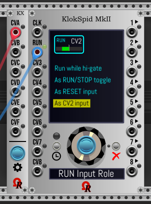
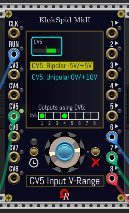
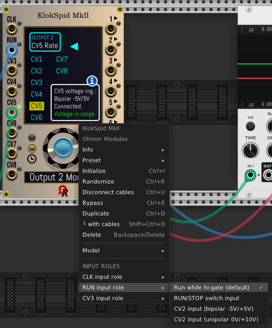

# OhmerPrems (Premium modules)

*OhmerPrems* is both Premium (for susbcribers) and free plugin/modules, designed for VCV Rack 2.

Actually, *OhmerPrems* plugin is a set of three modules (plus one as "expander"):
- **FroeZe** is a 64-step 16-track 128-pattern drum-based sequencer (triggers, or direct-audio outputs by using 15x internal QuadPercs engines).
- **FroeZe-X**, an expander module for FroeZe sequencer. It brings additional outputs for ACcents, plus edit features. Must be placed right-side, alongside FroeZe module (without space between them).
- COMING SOON: **FroeZe-SP-X**, an expander module for FroeZe sequencer. It brings additional inputs for track-based SWINGs/PROBAbilities. Must be placed left-side, alongside FroeZe module (without space between them).
- **QuadPercs** is a quad-channel drum machines module. Its technology now is part of FroeZe sequencer, but **X 15** !
- **KordZ** is a mono-/polyphonic notes/intervals/triads *visual/display only* module (1V/octave based) - remaining in development, **but delayed**!
- COMING SOON: **Entirely free KlokSpid MkII**, the successor of *KlokSpid* (2017 / Ohmer Modules), is a 16HP "CPU-controlled" clocking module, 8 analog/digital outputs, 6 configurable CV modulators (upto 8 by changing "CLK" and/or "RUN" input roles). "CLK" input may be redefined as "CV1". "RUN" input may be redefined as "CV2". Native "CV3" can be redefined - if needed - as "RESET" input. Basically, KlokSpid MkII outputs +10V 1ms triggers by default, but it may output ratchets, gates, envelopes / LFO, S&H/random... instead, into -5V/+5V ranges (can be offset upto 0V/+10V), even in audio range domain (when used as slave clocking module only). Master BPM is between 10 and 350, but unlimited as slave (controlled by external clock device). All LEDs (inputs, outputs, RUN/STOP button, SET/Cancel buttons) are RGB - their color conventions are mainly RED for out-of-range input voltages, disabled output, BPM SYNC operation (when slave)... CYAN for regular pulses and gates (CLK/RUN/CV3 inputs, utility voltages on outputs). GREEN for valid CV inputs and outputs. YELLOW on "CLK" input only when set as "BPM CV" (fully compatible with [Impromptu Modular CLOCKED](https://library.vcvrack.com/ImpromptuModular/Clocked) **BPM CV** feature)...

----

## **First previews of KlokSpid MkII**

This module is entirely free, because it will replace 2017 *KlokSpid* (from freeware [*Ohmer modules*](https://github.com/DomiKamu/Ohmer) collection). KlokSpid MkII becomes the first 100% free module in commercial OhmerPrems plugin!

  

Please notice the menu system is using either "continuous encoder + SET (blue) button + Cancel button" combo, and/or by touchscreen-like (left mouse clicks over menus on main display).

Any input role setting (CLK, RUN, CV3) - as part of Global Settings - can be changed "on-the-fly" by using module's contextual menu (right mouse click anywhere over module):

----

## **FroeZe & FroeZe-X modules**

Please consider a written manual is under construction, but is coming later...

[Please click here to read FroeZe/FroeZe-X specifications](doc/FroeZe-Specs.md) -- **IMPORTANT SECTION CONCERNING FREE USERS (WHO DON'T HAVE A LICENSE KEY) AT THE END OF THIS DOCUMENT! PLEASE READ IT CAREFULLY! (TIA)**

Below this is the _Classic_ (default) model - as presented from Rack's module browser. Not connected on clock source (the black "NO CLOCK" indicator is blinking). After a right mouse click over a cell - step 8 track CH - here it's a ratchet event: the OSD context menu permits to edit the ratchet pattern (clikable square boxes - bottom of menu):

FroeZe sequencer and its companion, FroeZe-X expander, _Absolute Night_ model (GUI theme), playing audio sequence (all outputs are direct-connected to the audio mixer). Per instrument track (first 15th, AC isn't an instrument track), you can select drum machine and related drum kit by using both DM and KIT continuous encoders (wheels):

Patch using FroeZe (_Dark "Signature"_ model, displays are dimmed - left mouse click on Ohmer logo to switch bright/dim)... but here without its companion (I mean... FroeZe-X expander). On AC'd note(s), without expander, the sequencer delivers a **-10V** (1ms) trigger! by this way, you'll must filter the -10V signal, in order to invert it to +10V and route it to alternate way. It is exactly the role of **[Polarity Switch](https://library.vcvrack.com/Ohmer/PolaritySwitch)** (dual) module - the tiny red module located at the left of red QuadPercs modules. This Polarity Switch module is available as free Ohmer Modules plugin!

## FroeZe "Quicky Guide" - tips:

- Instrument tracks refer to BD to CL tracks (last AC track isn't an instrument track, only ACcents).
- Main screen (display) is working like a touchscreen.
- FroeZe module requires a **X32 external source clock** to work correctly. [KlokSpid](https://library.vcvrack.com/Ohmer/KlokSpid) or [Impromptu's CLOCKED](https://library.vcvrack.com/ImpromptuModular/Clocked) clocking modules are perfect!
- Left mouse click on track header (near track name) selects the track, **or**, if already selected, toggles its SOLO state.
- SOLO indicator (below BPM / NO CLK indicator) is blinking while at least one instrument track is SOLO.
- Right mouse click on track header (near track name) selects the track, **or**, if already selected, toggles its MUTE state (MUTEd tracks are entirely highlighted, song pointer doesn't run over them).
- Left mouse click on cell to add a simple (normal) note event (unfilled diamond) - if previously was empty (silence).
- Left mouse click again on the note event to transform it to **AC'd note** event (plain diamond).
- Left mouse click again on the plain diamond to transform it to 1st (of 8) of ratchet pattern (its representation is from top to bottom).
- Using left **Ctrl** (left **Command** on Mac) key while left mouse click on cell erases its content (becomes silence).
- Right mouse click in any cell brings an OSD context menu.
- Top of display: left click to name or rename the current (displayed) pattern. An OSD indicates instructions, please follow them carefully!
- Top of display: right click on pattern name blanks the pattern name, and enters pattern name edit.
- While you name a pattern simply press **Esc** or **Enter** key (main or keypad), or just move the mouse cursor outside the edit box to finish!
- For models having **brightness displays** (all, except _Classic_ and _Stage Repro_), left mouse click on the **Ohmer logo** (it's a hotspot) near bottom-left screw - toggles bright/dim all displays, including displays on attached expanders!
- Please take attention about module's context menu option (right mouse click over module, but outside the main screen)...
- AC track accepts only silence or accent event (to accent/mark all note events located into same step/column).
- SWING input port applies a global swing (all instrument tracks) on even steps. 50% is meaning no swing. Max is 75% (dotted 16th followed by 32th).

FroeZe-X expander:

- As soon as you attach the expander at right side of FroeZe sequencer, the expander inherits both model and displays dim settings from FroeZe!
- When attached, FroeZe-X displays are turned on (turned off when unattached).
- You can left mouse click on buttons (labelled L1 to L4, and R1 to R4), or left mouse click on the related menu boxes on touchscreen, you have the choice!
- Message below continuous encoder (like TRACK, PATTERN, STEPS, PULSES, OFFSET,...) indicates the contextual role of the continuous encoder.
- TRACK/COPY actions works on tracks who having same nature: you can copy instrument track to another instrument track (any), but not to AC track. Also, you cannot copy AC track to instrument track.
- You can copy track to another track, even to another pattern if you want. In this case, use TRACK encoder from FroeZe-X expander (or mouse click in track name box), and PATTERN encoder from FroeZe module, prior clicking PASTE (L1 button). On CANCEL (R1 button), the FroeZe sequencer returns immediately to source pattern and track.
- You can copy AC track to another AC track (different pattern).
- If you move any pattern (PATTERN/MOVE) to pattern 128, in fact you can, but the destination pattern 128 becomes... 127: it's not an issue, because "source" pattern is removed after the move operation, by this way, all following patterns are "moved by -1".
- TRACK/EUCLID. menu: euclidean rhythm feature erases the current track as soon as you change any euclidean parameter via continuous encoder (STEPS, PULSES or OFFSET), so proceed with caution (if necessary, save the pattern first, from module context menu, or make a backup of it by using PATTERN/COPY from expander to any empty pattern).
- TRACK/EUCLID. menu: sets regular notes only (no AC'd or ratchets). However, it sets ACcent events on AC track.
- TRACK/COMPLT. menu (track auto-completion feature): this feature also may "cover" existing track events, so proceed with caution (save the pattern first, from module context menu, or make a backup of pattern by using PATTERN/COPY from expander to an empty pattern).
- RATCHET. menu permits to save, open, and "reset to factory" the eight ratchet slots/presets (for current pattern only).

More infos "on-the-fly" in [**FroeZe Specs**](doc/FroeZe-Specs.md) document.

----

## **QuadPercs module**

All six models (aka GUI themes, identical to FroeZe/FroeZe-X, and KordZ modules): Classic beige, Stage Repro, Absolute Night, Absolute Night (bypassed), Dark "Signature", Deepblue "Signature", and Carbon "Signature":

Some YouTube videos (made from old VCV Rack v0.6, but they're still valid), here:

[**VIDEO**: QuadPercs module presentation/tutorial from my YouTube channel "DoMiNo-MAO" (English, 1080p, 13 min.)](https://youtu.be/K51tFtwiisY) 

[**VIDEO**: Présentation/tutoriel du module QuadPercs sur ma chaîne YouTube "DoMiNo-MAO" (Français/French, 1080p, 13 mins.)](https://youtu.be/bAZPvrXWTXg)

[**VIDEO**: QuadPercs module in action, YouTube video made by Omar Brown (**thanks Omar!**)](https://www.youtube.com/watch?v=SBbM-12xc2w)

## Quicky Guide - How to use QuadPercs module

QuadPercs module is, in fact, very easy to use!

The main key are... four buttons (one per drumming channel), and the continuous encoder. Default channel is always 1.

For each channel (labeled 1 to 4, from top to bottom), you can find, from left to right:

- An ***input*** "TRIG." jack, to trigger drum sound for related channel. Minimum trigger voltage is +1.7V.
- Red LED, indicating selected channel (when lit), or when editing channel (while blinking).
- Volume level (from 0% to 100%, default is always 50%) can be changed by turning the **continuous encoder** (while the channel LED isn't blinking). By approaching the mouse cursor near the encoder, the current level is indicated in the dot-matrix display (DMD).
- Momentary button to select active channel (if its LED is off). When pressing button on **already active channel**, its LED blinks, indicating channel edit. The related item to edit also blinks in dot-matrix display. When the drum machine name is blinking, press the channel button again to change its related instrument (drumkit). Turn the encoder clockwise or counter-clockwise to select next or previous drum machine, or the instrument (drumkit). No need to validate anything, your choice is *immediately applied!* Also, please notice while channel LED is blinking (meaning you're editing active channel), and in case you don't touch the encoder or any button, the edit mode exits automatically after 30 seconds timeout.
- An ***output*** jack delivers monophonic audio, it can be connected to output of VCV's AUDIO module, mixer, audio effect, envelope generator or any modulator you want...

The dot-matrix display reports the current selected channel (number indicated at top-left, channel LED is doing exactly the same thing), the current loaded drum machine for active (selected) channel, and its current instrument.

Despite one channel can be selected at time (for level changing, or instrument selection), all four channels are able to play simultaneously, obviously.

This module supports monophonic cables only (because polyphony is never required for drum element).

Both *Initialize*, *Randomize* and *Preset* (via .vcvm preset file, or via copy/paste) commands, from module's context-menu (right-click, keyboard shortcuts), are fully supported.

QuadPercs can operate **from 44.1 to 192 kHz** (free version is limited to max. 48 kHz, higher sample rate sounds are muted), thanks to external pre-computed sample tables - made by fabulous iZotope softwares suite - who permit to keep the sound quality at any sample rate!

----

## **KordZ module**

All six models (aka GUI themes, same than FroeZe/FroeZe-X, and QuadPercs modules), reduced room brightness:

[**VIDEO**: KordZ module in action (monophonic track) from Bitwig Studio 4 (uncommented, 1080p, 1'17")](https://www.youtube.com/watch?v=o6k0_MPDk3Y)

Modules by night: QuadPercs and KordZ modules are designed for VCV Rack's *Room brightness* feature (sometimes named _Night mode_):

You can notice the *Absolute Night* model is the lone embedding a yellow backligth dot-matrix display (DMD). "Signature"-line luxury models (Dark "Signature", Deepblue "Signature" and Carbon "Signature") are using plasma-gas dot-matrix display (DMD) instead of LCD, visible in dark room/night. The first two models, "Classic" and "Stage Repro", use a standard LCD-based without backlight, by this way, they're not visible by night!

The KordZ modules by night (VCV Rack 2's *Room brightness* feature sets to... 0%):

----

"***OhmerPrems***" subdirectory hosts either free/full version (built package is strictly identical), but without personal license key, all modules work as free version (with limitations, depending the module). Full version requires a personal license key (the license key is sent by email during OhmerPrems subscription).

When installed, from VCV Rack module browser, QuadPercs and KordZ modules are listed (by brand: "Ohmer Modules"). QuadPercs module is also listed as "Drum" and "Quad" categories when you're browsing by tags, KordZ module as "Visual" and "Polyphonic".

## HOW TO VERIFY YOUR PERSONAL LICENSE INSTALLATION?

Over **any OhmerPrems module** (for now, Kord or QuadPercs), just do a right-click mouse button to bring the context-menu. At the bottom of this menu, if the grayed entry indicates **License:** (followed by your partial license key), that meaning all your modules run as full version, as expected!

Otherwise, the same grayed menu entry indicates **Free**, followed by limitation type (between brackets).

Hi! I'm enjoyed to present you my first *OhmerPrems* module: **QuadPercs**

Basically, QuadPercs is a 10HP **quad-channel drum** module, providing 4 independent drum machine channels, each having its own (sample-based) drum machine, and its related instrument.

QuadPercs module is available from OhmerPrems plugin, as both:

- free version (limited to **5** working drum machines, operating at 44.1 kHz only) to any who want to try it (fully usable, no other limitation). Other drum machines can be selected, but are muted (no audio output).
- full version (all 16 drum machines, from 44.1 to 192 kHz), reserved to *OhmerPrems* members exclusively, requires a personal license key to remove all limitations.

Free version: Oberheim DMX, Drumulator, LinnDrum, Roland 707, and Roland 808, for a total of 102 instruments. 44.1 and 48kHz sample rates only.

Full version: Oberheim DMX, Drumulator, Korg KR-55, Korg Minipops, LinnDrum, Roland R8, Roland 606, Roland 626, Roland 707, Roland 808, Roland 909, Yamaha RX5, Yamaha RY-30, Casio RZ-1, Alesis SR-16, and E-MU XL-7, for a **total of 369 instruments!**, 44.1 kHz to 192 kHz sample rates.

QuadPercs embeds all drum samples (44.1 ~ 192 kHz 16-bit mono PCM) via external PCM table files (220MB after installation).

KordZ module presentation coming soon...

----

## Free version

Free *OhmerPrems* plugin is available to everybody, for Windows, MacOS and Linux platforms, and can be downloaded directly from either [VCV Plugin Library](https://library.vcvrack.com/?query=&brand=Ohmer+Modules&tag=&license=) for automatic installation/updates, or via ["Releases"](https://github.com/DomiKamu/OhmerPrems/releases) page on this GitHub repository (but requires **manual** installation/updates, by download/copy **.vcvplugin** file).

----

## Full version (OhmerPrems members only)

Since VCV Rack 2, the plugin is EXACTLY the same than free version, except a personal license key is sent to OhmerPrems members (by email). The license key unlocks all modules included in the plugin to **full** (unrestricted).

Obviously, all *OhmerPrems* members will benefit all **lifetime** updates/upgrades and all future *OhmerPrems* modules (full versions) without any additional charge!

To become *OhmerPrems* member, simply send me **12 euros** (offer valid until May 1st 2023, instead of 15 euros). If required, please convert your local currency first, to fit with 12+ euros, otherwise your payment will be not accepted) via [my "PayPal.Me" (Dominique CAMUS @DominiqueCAMUS - BARJAC)](https://www.paypal.com/paypalme/DominiqueCAMUS).

**Very important: don't forget to indicate:**
- your first and last name (personal name, not company or nickname).
- your valid email address (required to send your personal license key & instructions). Your email address stays private!
- also in the message, please specify **OhmerPrems member**, or something similar, to avoid possible confusion. Thank you in advance!

New subscription requires 24 hours max. after PayPal confirmation. **Incomplete/not regular fee informations or/and payment less than 12 euros is refurbished**. Thank you for your understanding.

----

## License Clauses

All ***OhmerPrems*** modules (even free) remain under **proprietary license**.

Full version is granted for each OhmerPrems member, and of course, **cannot be shared, sold or distributed** to any third party (obviously, the license key can be used on ALL owned computers). Please read "LICENSE-FULL.txt" enclosed in your downloaded package for licensing conditions.

All graphic materials, the "Ohmer" logo and related resources cannot be used for derivative works and remains the proprietary of Dominique Camus (Ohmer Modules & OhmerPrems developer).

All SVG graphics named **XB_*.svg** are designed by **Xavier Belmont** (ask him the permission if you'll want to use them in your developments). Thanks a lot, Xavier!

Thanks to **Marc Boulé** (author of excellent ImpromptuModular/Geodesics/MindMeld plugins) for C++ code who permit to swap ports textures (silver, gold) "on-the-fly" when changing model, exactly like momentary buttons and screws.

Thanks to **Paul Bacon** (author of excellent Bacon Music plugin, and working hard on SurgeXT) for C++ coding tips who permit to display coloured textures (Kordz's circle of fifths) in dark/night mode.

Thanks to **Steve Baker** and **Jens Peter Nielsen** for MacOS builds.

Big big big thanks to beta testers!

Feature requests, suggestions, and bug reports are welcome on this GitHub repository!
