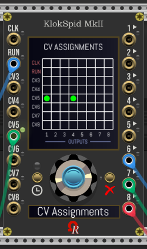
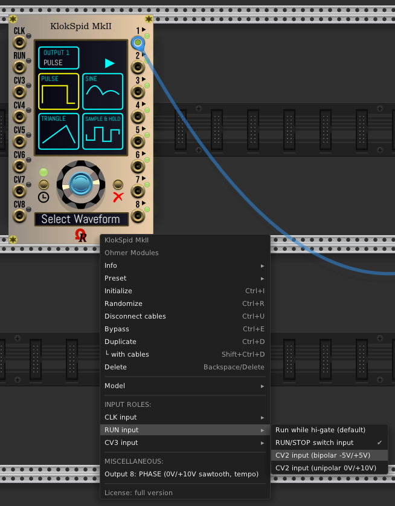
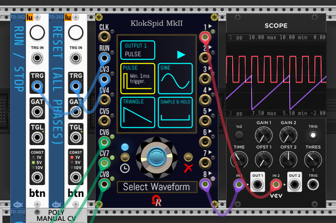
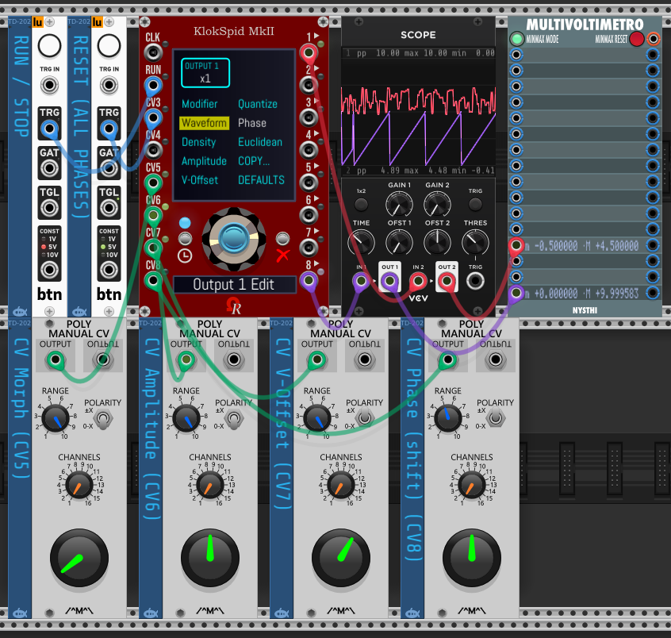
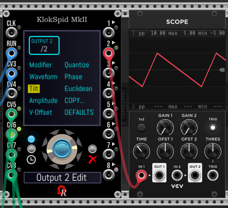
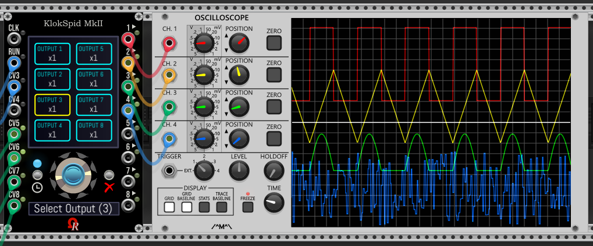
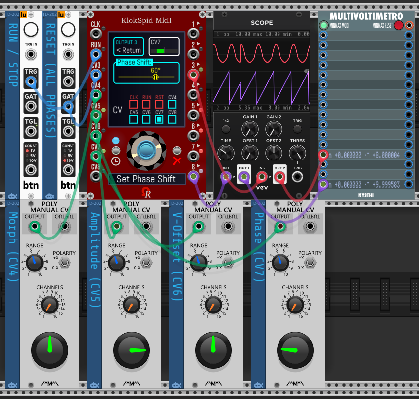

# OhmerPrems for VCV Rack 2

*OhmerPrems* is both Premium (for susbcribers) and free modules, designed for VCV Rack 2.

Actually, *OhmerPrems* plugin is a set of four modules (plus two as "expander"):
- **FroeZe** is a 64-step 16-track 128-pattern drum-based sequencer (triggers, or direct-audio outputs by using 15x internal QuadPercs engines).
- **FroeZe-X** is a **right-side** expander module for FroeZe sequencer. It brings additional outputs for ACcents, plus some edit features.
- COMING SOON: **FroeZe-SX** is a **left-side** expander module for FroeZe sequencer. It brings 15 additional CV inputs (for each track) as track-based SWING. NOTE: by using it, the in-build global SWING input jack (on FroeZe sequencer module) is disabled (it displays -- and its LED is red). **Remaining in development, near finished...FroeZe-SP-X project is cancelled / no probability.**
- **QuadPercs** is a quad-channel drum machines module.
- **KordZ** is a mono-/polyphonic notes/intervals/triads *visual/display only* module (1V/octave based) - **remaining in development, but delayed!**
- COMING SOON (*TLTR* I'm sorry in advance ;): **Entirely free KlokSpid MkII**, the successor of 2017 *KlokSpid* ([Ohmer plugin](https://github.com/DomiKamu/Ohmer), is a 16HP highly versatile clocking module, it offers 8 independent analog/digital outputs (right side of the module). By default, KlokSpid MkII embeds 6 configurable CV sources (all inputs are located on left side of the module), but can be increased upto 8 by changing "CLK" and "RUN" roles (both can become bipolar -5V/+5V / unipolar 0/+10V CV input) either from *Select Input* on-screen menu, or via context menu (right mouse click). "CLK" input can be assigned as "CV1" input, instead. On the same principle, "RUN" input can be assigned as "CV2" input. Also, native "CV3" input (default bipolar -5V/+5V CV input, possibly unipolar 0/+10V CV input) can be assigned as "RESET" input (useful for internal phases reset purposes). Basically, KlokSpid MkII is able to output pulses/gates (min. 1ms duration pulse is default setting, *P-Width* parameter can be set manually by on-screen fader, and possibly modulated by any CV source), triangles (including sawtooths up and down, by setting and CV-modulating *Tilt* parameter), sine (first half sine is always pure, but second half sine can be amplitude-deformed to become flat, hump, and any intermediate shapes), S&H (sample and hold) using internal random samples generator, variable *Density* (default minimum density is 1 sample per "BPM x ratio" tick, upto 64 samples for 100% density), and 8 customizable wavetables (manually *Morph*able, possibly modulated by any CV source) by this way, by using adequate wavetable, KlokSpid MkII is able to act as... envelope generator. Except for S&H waveforms, each output can be *Phase*-shifted (earl or late), and played/muted every "BPM x ratio" tick (thanks to euclidean settings). As master clock, BPM range can be manually set from 1 upto... 900 (15Hz equivalent). As slave clock, when "CLK" is patched to an external clock source and "CLK" input is set as "External CLK" input (it's the default role for "CLK" input), above BPM 900, the external clock speed is indicated as **frequency in Hz** (instead of BPM). All LEDs (inputs, outputs, and over RUN/STOP transport button) are RGB - colorscheme is following this convention: RED for disabled output (utility modifier is "OFF" - useful for CPU savings for unused outputs), out-of-range CV input voltage, and also during tempo "SYNC" operations (RUN/STOP LED is red while syncing against external clock pulse-based/PPQN source)... CYAN for pulse-based / gate-based input ("CLK" ticks, "RUN" as held gate or run/stop pulse toggle, and possibly "CV3" if assigned as "RESET" pulse-based input, to reset/realign all phases while clock is running), RUN/STOP LED while transport is controlled by pulses/gates (such manual button, sequencer, sequenced switches, and so on), and applied utility voltage to output (these utility modifiers are "GATE", "START", and "STOP" events)... GREEN for RUN/STOP LED while transport is manually controlled by RUN/STOP button on the module, gradual GREEN for valid CV voltage applied on input, and voltage sent to each output (even when the clock is stopped, in case of *V-Offset* setting is not 0V)... YELLOW on "CLK" input, only when slave and set as "BPM CV" (fully compatible with [Impromptu Modular CLOCKED](https://library.vcvrack.com/ImpromptuModular/Clocked) **"BPM CV"** feature)... For each output, most user-defined (or default) parameters can be CV-modulated by CV source: modifier ratio (picked from built-in table, from /16384 to x128), waveform morphing (*Pulse width*/*Tilt*/*Deform*/*Density*/*Morph* depending the waveform shape), voltage amplitude (*Amplitude*), voltage offset (*V-Offset*), phase shift (*Phase*), and *Euclidean* settings (steps, pulses, offset, and pads). Only waveform (shape selected from *Waveform* via output-related menu) and *Bipolar around offset* option (can be changed from both *Amplitude* and *V-Offset* on-screen settings) cannot be altered by CV. Any output settings (all settings) can be duplicated to another output (*COPY* feature), and the possibility to reset all settings to defaults (factory) for current output (obviously, other outputs are not affected). Via an option from context menu ("MISCELLANEOUS" section), you can decide the output 8 generates the module's master phase - **however, when enabled, this option takes priority over output 8 regular settings** - as unipolar 0V/+10V sawtooth signal who follows the module's main tempo (either as master clock or slave clock). Basic selectable waveforms are - from first page of 3: **PULSE** (default 0% pulse width generates **1ms pulses**, 50% generates squares, 100% generates continuous voltage without retrigger), **TRIANGLE** (default tilt at 0% generates sawtooths down, 50% generates perfect isosceles triangles, 100% generates sawtooths up, and obviously, any intermediate tilted triangle shapes), **SINE** (default 0% deform generates pure sines, but by altering *Deform* parameter, second half sine is amplitude-deformed via user-defined *Deform* setting), and **S&H** (default 0% density generates 1 sample per "BPM x ratio" tick, max. 100% generates 64 samples per "BPM x ratio" tick). Concerning waveform selection, pages 2 and 3 permit to select a **custom wavetable** (WT1 to WT4 from page 2, WT5 to WT8 from page 3) - in implementation, very tricky, no morphed (first WT frame or single-cycle wave) by default. KlokSpid MkII comes in six models (GUI theme variations): _Aluminium_ (default & browser view if **Use dark panels if available** option is disabled from **View** menu), _Stage Repro_, _Absolute Night_ (default & browser view if **Use dark panels if available** option is enabled), _Dark "Signature"_, _Fort Knox "Signature"_, and _Titanium "Signature"_.

----

## **First previews of KlokSpid MkII module - in development**

This module (actually in development) will be **entirely free** (even for non OhmerPrems members), because it will replace 2017 *KlokSpid* module from freeware [*Ohmer*](https://github.com/DomiKamu/Ohmer) plugin. By this way, **KlokSpid MkII** becomes the **first 100% free module** provided by OhmerPrems commercial plugin! cool, aren't? ;)

  

Please notice the system menu (module's main display) is using either "continuous encoder + SET (blue) button + Cancel button" combo, and/or touchscreen-like (left mouse clicks over menus items/boxes).

Any input role setting (CLK, RUN, CV3) can be changed "on-the-fly" by using module's context menu (right mouse click anywhere over module - except displays):

Below the first example of **square pulses** (50% gates) sent to output 1 - its output ratio is set to BPM **x3** (set from *Modifier* submenu), *P-Width* (pulse width) is set to 50% by "CV6" source (user defined is 0%) to obtain square waveform inside 7.5V *Amplitude* range (here adjustable by "CV7"), *V-Offset* is set at -2V (adjustable by "CV8") - by this way, for pulses, minimum voltage is -2V (during low-states) and maximum is +5V (during high-states, while pulsing). Output 8 is sending the module's master phase (BPM 120, as unipolar 0V/+10V sawtooth signal) while the clock is running. **Inputs:** "RUN" is assigned as run/stop toggle (any incoming pulse switches transport state), "CV3" is assigned as "RESET" input (any incoming pulse resets all internal phases). "CV6" and "CV7" are set as unipolar 0V/+10V CV inputs. "CV8" as default bipolar -5V/+5V CV input:

Please notice the module's main display above shows basic waveform selection for current selected output (here's output 1 as current output, as indicated in top-left box). All icons below "PULSE", "TRIANGLE", "SIN", and "S&H" blue labels (into clickable boxes - in order to select a specific waveform for current output), are **animated** (the animations show what the *P-width*/*Tilt*/*Deform*/*Density*/*Morph* parameter can do on relevant waveform).

Below, another example by using S&H (sample and hold) waveform, sent to output 1 - output ratio is set to BPM **x1** (set from *Modifier* menu, visible here as first menu item), *Density* (who replaces *P-Width* as third menu item, due to S&H waveform context) is set by unipolar 0V/+10V "CV5" input, voltage amplitude is set to 5V (controlled by unipolar 0V/+10V "CV6" input), bipolar enabled (in this case, min. and max. voltages are spread around *V-Offset*, instead of above offset when bipolar is disabled), voltage offset is set to +2V (controlled by bipolar -5V/+5V "CV7" input). By this way, sample voltages stay inside -0.5V/+4.5V range (5V amplitude around +2V offset). **Phase shift (controlled by "CV8" input) is ignored for S&H waveforms** (in this output-related menu - output 1, you can observe the *Phase* menu item is grayed, meaning it can't be selected).

Below, another example of **25% tilted triangle** waveform, sent to output 2 - output ratio is set to BPM **/2** (visible in top left box). *Tilt* parameter (third menu item replaces *P-With* and *Density* seen above, due to triangle waveform context) is set by unipolar 0V/10V "CV5" input (tilt parameter is user-defined to default 0%, here is a constant +0.25V applied on "CV5" input, who set the triangle's *Tilt* parameter to 25%, instead), the result shape is visible on VCV Scope module, the upper edge of triangle (maximum height) is at 25% of the lower vertice. For triangle waveform, by setting *Tilt* parameter to 0% (either defined by user, and possibily modulated by one or many CV sources), this will output a **sawtooth down** signal (right-angled triangle). By setting *Tilt* parameter to 100%, this will generate a **sawtooth up** signal, instead (right-angled triangle too). By setting *Tilt* parameter to 50%, this will generate a **perfect isosceles triangle**. And so on... In this example, *Amplitude* is set to (default) 10V, *V-Offset* is set to (default) 0V, "bipolar around offset" is enabled, by this way, generated voltages by this triangle waveform always stay inside -5V/+5V range.

Below they're all basic waveforms at the same time: square **pulse** to output 1, isosceles **triangle** to output 2, half **sine** to output 3, and 32-sample density **sample & hold** to output 4. All of these waveforms are "morphed" to 50% (by using 0% as used-defined morph parameter, then modulated by same unipolar CV source):

Finally, below it's a paramater edit page (here it's **Phase Shift** parameter for output 3), by horizontal fader. Also checkboxes permits to select a CV modulation source:

*Morphed* term used above mentions either **P-Width** (pulse width) for pulses, **Tilt** for triangles (upper edge of triangle "moves" left or right in graphical representation), **Deform** for second half sines, **Density** for sample & hold (number of sample per "BPM x ratio" ticks, from 1 upto 64), and **Morph** for wavetables (aka "frame index" inside wavetable).

Like other Ohmer and OhmerPrems modules, KlokSpid MkII comes in six models (GUI theme variations):
- _Aluminium_ (default & browser view if **Use dark panels if available** option is disabled from **View** menu)
- _Stage Repro_
- _Absolute Night_ (default & browser view if **Use dark panels if available** option is enabled from **View** menu)
- _Dark "Signature"_
- _Fort Knox "Signature"_
- _Titanium "Signature"_

----

## **FroeZe & FroeZe-X modules**

Please consider a set of tutorial videos is under consideration, but coming later...

[Please click here to read FroeZe/FroeZe-X specifications](doc/FroeZe-Specs.md) -- **IMPORTANT SECTION CONCERNING FREE USERS (WHO DON'T HAVE A LICENSE KEY) AT THE END OF THIS DOCUMENT! PLEASE READ IT CAREFULLY! (TIA)**

Below this is the _Creamy_ model - as presented from Rack's module browser (_Absolute Night_ is presented, instead of _Creamy_, if **Use dark panels if available** option is enabled from **View** menu). Not connected on clock source (the black "NO CLOCK" indicator is blinking). After a right mouse click over a cell - step 8 track CH - here it's a ratchet event: the OSD context menu permits to edit the ratchet pattern (clikable square boxes - bottom of menu):

FroeZe sequencer and its companion, FroeZe-X expander, _Absolute Night_ model (GUI theme), playing audio sequence (all outputs are direct-connected to the audio mixer). Per instrument track (first 15th, AC isn't an instrument track), you can select drum machine and related drum kit by using both DM and KIT continuous encoders (wheels):

Patch using FroeZe (_Dark "Signature"_ model, displays are dimmed - **left mouse click over Ohmer logo to switch bright/dim**)... but here without its companion (I mean... FroeZe-X expander). On AC'd note(s), without FroeZe-Xexpander, the sequencer delivers a **-10V** (1ms) triggers! by this way, you'll must "filter" the -10V signal, in order to invert it to +10V, then route it to alternate way. It is exactly the role of **[Polarity Switch](https://library.vcvrack.com/Ohmer/PolaritySwitch)** (dual) module - the tiny red module located at the left of red QuadPercs modules does this job!

## FroeZe "Quicky Guide" - tips:

- Instrument tracks refer to BD to CL tracks (last AC track isn't an instrument track, only ACcents).
- Main screen (display) is working like a touchscreen.
- FroeZe module requires a **X32 pulse-based external source clock** to work correctly. [KlokSpid](https://library.vcvrack.com/Ohmer/KlokSpid) , future KlokSpid MkII (see above), or [Impromptu's CLOCKED](https://library.vcvrack.com/ImpromptuModular/Clocked) clocking modules are perfect!
- Left mouse click on track header (near track name) selects the track, **or**, if already selected, toggles its SOLO state.
- SOLO indicator (below BPM / NO CLK indicator) is blinking while at least one instrument track is SOLO.
- Right mouse click on track header (near track name) selects the track, **or**, if already selected, toggles its MUTE state (MUTEd tracks are entirely highlighted, song pointer doesn't run over them).
- Left mouse click on cell to add a simple (normal) note event (unfilled diamond) - if previously was empty (silence).
- Left mouse click again on the note event to transform it to **AC'd note** event (plain diamond).
- Left mouse click again on the plain diamond to transform it to 1st (of 8) of ratchet pattern (its representation is from top to bottom).
- Using left **Ctrl** (left **Command** on Mac) key while left mouse click on cell erases its content (becomes silence).
- Right mouse click in any cell brings an OSD context menu.
- Top of display: left click to name or rename the current (displayed) pattern. An OSD indicates instructions, please follow them carefully!
- Top of display: right click on pattern name blanks the pattern name, and enters pattern name edit.
- While you name a pattern simply press **Esc** or **Enter** key (main or keypad), or just move the mouse cursor outside the edit box to finish!
- For models having **brightness displays** (all, except _Creamy_ and _Stage Repro_), left mouse click on the **Ohmer logo** (it's a hotspot) near bottom-left screw - toggles bright/dim all displays, including displays on attached expanders!
- Please take attention about module's context menu option (right mouse click over module, but outside the main screen)...
- AC track accepts only silence or accent event (to accent/mark all note events located into same step/column).
- SWING input port applies a global swing (all instrument tracks) on even steps. 50% is meaning no swing. Max is 75% (dotted 16th followed by 32th).

FroeZe-X expander:

- As soon as you attach the expander at right side of FroeZe sequencer, the expander inherits both model and displays dim settings from FroeZe!
- When attached, FroeZe-X displays are turned on (turned off when unattached).
- You can left mouse click on buttons (labelled L1 to L4, and R1 to R4), or left mouse click on the related menu boxes on touchscreen, you have the choice!
- Message below continuous encoder (like TRACK, PATTERN, STEPS, PULSES, OFFSET,...) indicates the contextual role of the continuous encoder.
- TRACK/COPY actions works on tracks who having same nature: you can copy instrument track to another instrument track (any), but not to AC track. Also, you cannot copy AC track to instrument track.
- You can copy track to another track, even to another pattern if you want. In this case, use TRACK encoder from FroeZe-X expander (or mouse click in track name box), and PATTERN encoder from FroeZe module, prior clicking PASTE (L1 button). On CANCEL (R1 button), the FroeZe sequencer returns immediately to source pattern and track.
- You can copy AC track to another AC track (different pattern).
- If you move any pattern (PATTERN/MOVE) to pattern 128, in fact you can, but the destination pattern 128 becomes... 127: it's not an issue, because "source" pattern is removed after the move operation, by this way, all following patterns are "moved by -1".
- TRACK/EUCLID. menu: euclidean rhythm feature erases the current track as soon as you change any euclidean parameter via continuous encoder (STEPS, PULSES or OFFSET), so proceed with caution (if necessary, save the pattern first, from module context menu, or make a backup of it by using PATTERN/COPY from expander to any empty pattern).
- TRACK/EUCLID. menu: sets regular notes only (no AC'd or ratchets). However, it sets ACcent events on AC track.
- TRACK/COMPLT. menu (track auto-completion feature): this feature also may "cover" existing track events, so proceed with caution (save the pattern first, from module context menu, or make a backup of pattern by using PATTERN/COPY from expander to an empty pattern).
- RATCHET. menu permits to save, open, and "reset to factory" the eight ratchet slots/presets (for current pattern only).

More infos "on-the-fly" in [**FroeZe Specs**](doc/FroeZe-Specs.md) document.

Like other Ohmer and OhmerPrems modules, FroeZe comes in six models (GUI theme variations):
- _Creamy_ (default & browser view if **Use dark panels if available** option is disabled from **View** menu)
- _Stage Repro_
- _Absolute Night_ (default & browser view if **Use dark panels if available** option is enabled from **View** menu)
- _Dark "Signature"_
- _Fort Knox "Signature"_
- _Titanium "Signature"_

----

## **QuadPercs module**

All six models (GUI theme variations): _Creamy_, _Stage Repro_, _Absolute Night_, _Absolute Night_ (bypassed), _Dark "Signature"_, _Deepblue "Signature"_, and Titanium "Signature":

Depending **Use dark panels if available** global Rack's option, the default model will be _Creamy_ if this option is disabled (aka default light panels), or _Absolute Night_ if this option is enabled, either from module browser and new instanciation (when you bring the module in rack, as new module).

Some YouTube videos (made from old VCV Rack v0.6, but they're still valid), here:

[**VIDEO**: QuadPercs module presentation/tutorial from my YouTube channel "DoMiNo-MAO" (English, 1080p, 13 min.)](https://youtu.be/K51tFtwiisY) 

[**VIDEO**: Présentation/tutoriel du module QuadPercs sur ma chaîne YouTube "DoMiNo-MAO" (Français/French, 1080p, 13 mins.)](https://youtu.be/bAZPvrXWTXg)

[**VIDEO**: QuadPercs module in action, YouTube video made by Omar Brown (**thanks Omar!**)](https://www.youtube.com/watch?v=SBbM-12xc2w)

## Quicky Guide - How to use QuadPercs module

QuadPercs module is, in fact, very easy to use!

The main key are... four buttons (one per drumming channel), and the continuous encoder. Default channel is always 1.

For each channel (labeled 1 to 4, from top to bottom), you can find, from left to right:

- An ***input*** "TRIG." jack, to trigger drum sound for related channel. Minimum trigger voltage is +1.7V.
- Red LED, indicating selected channel (when lit), or when editing channel (while blinking).
- Volume level (from 0% to 100%, default is always 50%) can be changed by turning the **continuous encoder** (while the channel LED isn't blinking). By approaching the mouse cursor near the encoder, the current level is indicated in the dot-matrix display (DMD).
- Momentary button to select active channel (if its LED is off). When pressing button on **already active channel**, its LED blinks, indicating channel edit. The related item to edit also blinks in dot-matrix display. When the drum machine name is blinking, press the channel button again to change its related instrument (drumkit). Turn the encoder clockwise or counter-clockwise to select next or previous drum machine, or the instrument (drumkit). No need to validate anything, your choice is *immediately applied!* Also, please notice while channel LED is blinking (meaning you're editing active channel), and in case you don't touch the encoder or any button, the edit mode exits automatically after 30 seconds timeout.
- An ***output*** jack delivers monophonic audio, it can be connected to output of VCV's AUDIO module, mixer, audio effect, envelope generator or any modulator you want...

The dot-matrix display reports the current selected channel (number indicated at top-left, channel LED is doing exactly the same thing), the current loaded drum machine for active (selected) channel, and its current instrument.

Despite one channel can be selected at time (for level changing, or instrument selection), all four channels are able to play simultaneously, obviously.

This module supports monophonic cables only (because polyphony is never required for drum element).

Both *Initialize*, *Randomize* and *Preset* (via .vcvm preset file, or via copy/paste) commands, from module's context-menu (right-click, keyboard shortcuts), are fully supported.

QuadPercs can operate **from 44.1 to 192 kHz** (free version is limited to max. 48 kHz, higher sample rate sounds are muted), thanks to external pre-computed sample tables - made by fabulous iZotope softwares suite - who permit to keep the sound quality at any sample rate!

Like other Ohmer and OhmerPrems modules, QuadPercs comes in six models (GUI theme variations):
- _Creamy_ (default & browser view if **Use dark panels if available** option is disabled from **View** menu)
- _Stage Repro_
- _Absolute Night_ (default & browser view if **Use dark panels if available** option is enabled from **View** menu)
- _Dark "Signature"_
- _Deepblue "Signature"_
- _Titanium "Signature"_

----

## **KordZ module**

All six models (aka GUI themes, same than QuadPercs modules), reduced room brightness:

[**VIDEO**: KordZ module in action (monophonic track) from Bitwig Studio 4 (uncommented, 1080p, 1'17")](https://www.youtube.com/watch?v=o6k0_MPDk3Y)

Modules by night: QuadPercs and KordZ modules are designed for VCV Rack's *Room brightness* feature (often named _Night mode_):

You can notice the _Absolute Night_ model is the lone embedding a yellow backligth dot-matrix display (DMD). "Signature"-line luxury models (Dark "Signature", Deepblue "Signature" and Titanium "Signature") are using plasma-gas dot-matrix display (DMD) instead of LCD, visible in dark room/night. The first two models, _Creamy_ and _Stage Repro_, use a standard LCD-based without backlight (by this way, they're not visible by night!).

The KordZ modules by night (VCV Rack 2's *Room brightness* feature sets to... 0%):

Like other Ohmer and OhmerPrems modules, Kord comes in six models (GUI theme variations):
- _Creamy_ (default & browser view if **Use dark panels if available** option is disabled from **View** menu)
- _Stage Repro_
- _Absolute Night_ (default & browser view if **Use dark panels if available** option is enabled from **View** menu)
- _Dark "Signature"_
- _Deepblue "Signature"_
- _Titanium "Signature"_

----

"***OhmerPrems***" subdirectory hosts either free/full version (built package is strictly identical), but without personal license key, all modules work as free version (with limitations, depending the module). Full version requires a personal license key (the license key is sent by email during OhmerPrems subscription).

When installed, from VCV Rack module browser, QuadPercs and KordZ modules are listed (by brand: "Ohmer Modules"). QuadPercs module is also listed as "Drum" and "Quad" categories when you're browsing by tags, KordZ module as "Visual" and "Polyphonic".

## HOW TO VERIFY YOUR PERSONAL LICENSE INSTALLATION?

Over **any OhmerPrems module** (for now, Kord or QuadPercs), just do a right-click mouse button to bring the context-menu. At the bottom of this menu, if the grayed entry indicates **License:** (followed by your partial license key), that meaning all your modules run as full version, as expected!

Otherwise, the same grayed menu entry indicates **Free**, followed by limitation type (between brackets).

Hi! I'm enjoyed to present you my first *OhmerPrems* module: **QuadPercs**

Basically, QuadPercs is a 10HP **quad-channel drum** module, providing 4 independent drum machine channels, each having its own (sample-based) drum machine, and its related instrument.

QuadPercs module is available from OhmerPrems plugin, as both:

- free version (limited to **5** working drum machines, operating at 44.1 kHz only) to any who want to try it (fully usable, no other limitation). Other drum machines can be selected, but are muted (no audio output).
- full version (all 16 drum machines, from 44.1 to 192 kHz), reserved to *OhmerPrems* members exclusively, requires a personal license key to remove all limitations.

Free version: Oberheim DMX, Drumulator, LinnDrum, Roland 707, and Roland 808, for a total of 102 instruments. 44.1 and 48kHz sample rates only.

Full version: Oberheim DMX, Drumulator, Korg KR-55, Korg Minipops, LinnDrum, Roland R8, Roland 606, Roland 626, Roland 707, Roland 808, Roland 909, Yamaha RX5, Yamaha RY-30, Casio RZ-1, Alesis SR-16, and E-MU XL-7, for a **total of 369 instruments!**, 44.1 kHz to 192 kHz sample rates.

QuadPercs embeds all drum samples (44.1 ~ 192 kHz 16-bit mono PCM) via external PCM table files (220MB after installation).

KordZ module presentation coming soon...

----

## Free version

Free *OhmerPrems* plugin is available to everybody, for Windows, MacOS and Linux platforms, and can be downloaded directly from either [VCV Plugin Library](https://library.vcvrack.com/?query=&brand=Ohmer+Modules&tag=&license=) for automatic installation/updates, or via ["Releases"](https://github.com/DomiKamu/OhmerPrems/releases) page on this GitHub repository (but requires **manual** installation/updates, by download/copy **.vcvplugin** file).

----

## Full version (OhmerPrems members only)

Since VCV Rack 2, the plugin is EXACTLY the same than free version, except a personal license key is sent to OhmerPrems members (by email). The license key unlocks all modules included in the plugin to **full** (unrestricted).

Obviously, all *OhmerPrems* members will benefit all **lifetime** updates/upgrades and all future *OhmerPrems* modules (full versions) without any additional charge!

To become *OhmerPrems* member, simply send me **15 euros**. If required, please convert your local currency first, to fit with 15+ euros, otherwise your payment will be not accepted) via [my "PayPal.Me" (Dominique CAMUS @DominiqueCAMUS - BARJAC)](https://www.paypal.com/paypalme/DominiqueCAMUS).

**Very important: don't forget to indicate:**
- your first and last name (personal name, not company or nickname).
- your valid email address (required to send your personal license key & instructions). Your email address stays private!
- also in the message, please specify **OhmerPrems member**, or something similar, to avoid possible confusion. Thank you in advance!

New subscription requires 24 hours max. after PayPal confirmation. **Incomplete/not regular fee informations or/and payment less than 15 euros is refurbished**. Thank you for your understanding.

----

## License Clauses

All ***OhmerPrems*** modules (even free) remain under **proprietary license**.

Full version is granted for each OhmerPrems member, and of course, **cannot be shared, sold or distributed** to any third party (obviously, the license key can be used on ALL owned computers). Please read "LICENSE-FULL.txt" enclosed in your downloaded package for licensing conditions.

All graphic materials, the "Ohmer" logo and related resources cannot be used for derivative works and remains the proprietary of Dominique Camus (Ohmer Modules & OhmerPrems developer).

All SVG graphics named **XB_*.svg** are designed by **Xavier Belmont** (ask him the permission if you'll want to use them in your developments). Thanks a lot, Xavier!

Thanks to **Marc Boulé** (author of excellent ImpromptuModular/Geodesics/MindMeld plugins) for C++ code who permit to swap ports textures (silver, gold) "on-the-fly" when changing model, exactly like momentary buttons and screws.

Thanks to **Paul Bacon** (author of excellent Bacon Music plugin, and working hard on SurgeXT) for C++ coding tips who permit to display coloured textures (Kordz's circle of fifths) in dark/night mode.

Thanks to **Steve Baker** and **Jens Peter Nielsen** for MacOS builds.

Big big big thanks to beta testers!

Feature requests, suggestions, and bug reports are welcome on this GitHub repository!
