# OhmerPrems for VCV Rack 2

:warning:

**If any module is looking as "dead" (empty display, all LED off, no extra menu entry in right click menu, and so on), please check the configuration of VCV AUDIOx module(s) in your rack. Except _KX_ and _VX_ expanders, by doing a right mouse click on the module, it's confirmed by "PLEASE CHECK AUDIOx MODULE(S)!" grayed label at the bottom of the context menu**, like following image (here's 6OP-DX Kompakt module, but applicable for others):

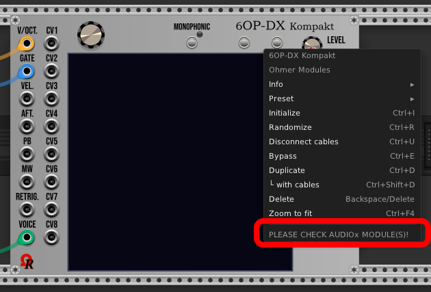

It's an old (never fixed) VCV Rack 1 & VCV Rack 2 issue. The culprit are in most situations VCV AUDIO (2-channel), VCV AUDIO8, or/and VCV AUDIO16 modules present in the current rack. When they're badly configured, the DSP process is "stucked" (this may potentially crash VCV Rack 2 application or plugin). I encourage you to send an email to support@vcv.com. This **stucked DSP issue** affects ANY MODULE, ANY BRAND (including other VCV-branded modules), not OhmerPrems modules specifically.

Also, if your current rack doesn't use any VCV AUDIO module, timing issues (visible on erratic blinking displayed messages, or LED) are possible!

---

*OhmerPrems* is a commercial plugin designed for VCV Rack 2, it embeds both **Premium** modules (**full version** modules for customers who have a valid license keyfile, or as "Free/Trial" with limitations, otherwise), and also some free modules for everyone (license keyfile is not required to run them as full version). Source code is closed (not published).

:warning: Please check both **Free version** and **Full version** topics, by following [this link](#freevsfull) (near bottom of this page).

*OhmerPrems* plugin is a set of 7 modules (5 are fully operational), plus 5 as _expander_ modules:
- **FranKe** is a 80HP 16-step 8-track 64-pattern analog sequencer module. [**FranKe User's Manual**](docs/modules/FranKe/Manual.md) (this long manual remains under construction, but it's ready for basic usage of this sequencer and good starting point!).
- **Vektor** is a 16HP polyphonic digital quad-oscillator (VCO) module, using Vector Synthesis (VS) technique. New module (introduced by **release v2.6.13**). [**Vektor User's Manual** (incl. VX expander)](docs/modules/Vektor/Manual.md)
- **VX** is a 3HP **right-side expander** for Vektor. It brings 7 discrete outputs (LFO, joystick position, MIX ENVelope).
- **6OP-DX** is a **Work In Progress** 117HP 6-operator 32-algorithm phase modulation (PM) synthesizer voice module (**Panel display issues on MacBook computers vs. custom UI Scale factors - see details below + NO OUTPUT SOUND AT THE MOMENT**). Its [**User's Manual**](docs/modules/6OP-DX/Manual.md) is under construction, too.
- **6OP-DX Kompakt** will be the compact player-like version of 6OP-DX, significantly thinner (34HP), but without any DX7 edit features (except **MONOPHONIC** toggle, and modulation matrix). Current selected voice settings can be viewed (access from MENU button), but can't be changed (except MONOPHONIC state, and modulation matrix). Like 6OP-DX, this compact "player" will be fully compatible with DX7 SysEx files (import only), and **.6opdx** file format (32-voice cartridge with extended features, generated by the _6OP-DX_ module only). Its [**User's Manual**](docs/modules/6OP-DX-Kompakt/Manual.md) is under construction, too!
- **FroeZe** is a 68HP 64-step 16-track 128-pattern drum-based sequencer module (triggers, or direct-audio outputs by using 15x internal QuadPercs engines). [**FroeZe Specifications & Quick Guide** (incl. expanders)](docs/modules/FroeZe/Manual.md)
- **FroeZe-X** is a 12HP **right-side expander** for FroeZe sequencer. It brings additional outputs for ACcents, plus useful editing features.
- **FroeZe-SX** is a 14HP **left-side expander** for FroeZe sequencer. It brings 15 additional CV inputs (one per instrument track) for **track-based SWING**. NOTE: by using at least one CV - can be enabled by left mouse button click over relevant box(es) on expander's touchscreen - the FroeZe's internal **%SWING CV** input jack becomes disabled (its LED is red, and its two-digit mini-display shows **-** **-**).
- **QuadPercs** is a 10HP quad-channel drum machine module.
- **KordZ** is a 16HP mono-/polyphonic notes/intervals/triads *visual/display* module (V/Oct. based).
- **KlokSpid MkII**, the versatile 16HP clocking source and LFO. [**KlokSpid MkII Specifications & User's Manual** (incl. KX expander)](docs/modules/KlokSpidMkII/Manual.md)
- **KX** is a 3HP **left-side expander** for KlokSpid MkII. It brings discrete **CLK**, **RUN**, and **RESET** inputs. Also, it adds two dedicated CV inputs, exclusively for outputs' quantizers, as pre-offsets.

---

Lastest stable version **v2.6.13** is available directly from [_here_](https://github.com/DomiKamu/OhmerPrems/releases/tag/v2.6.13) (Release section), for manual download + install/update. This release is also available from [**VCV Library**](https://library.vcvrack.com/OhmerPrems), for automatic installation/update (whole OhmerPrems plugin, or per selected modules).

**Daily** Pre-release v2.6.14 ALPHA offers **W.I.P./in development** _6OP-DX_ synth voice module, for testing purposes only. **It doesn't output sound  at the moment!**

Download & manual install/update from [_Pre-release v2.6.14 ALPHA ("Daily" builds)_](https://github.com/DomiKamu/OhmerPrems/releases/tag/v2.6.14) section.

## [CHANGELOG - v2.6.13 (stable)](docs/CHANGELOG.txt)

---

## **FranKe**

[Please click here to read the **FranKe User's Manual**](docs/modules/FranKe/Manual.md) (this long manual remains under construction, but it's ready for bases of this sequencer usage & good starting, however).

Developed to OhmerPrems member (since 2019), needs for his specific projects, FranKe is a **16-step 8-track 64-pattern analog step-sequencer**, who are using versatile tracks: a track can have one role (from possible three, can be changed anytime you'll want):
- as melodic track, who are using quantized notes, octaves, accidentals, and velocities.
- as modulation track (CV OUT track) to offering voltages (-10V to +10V range, 0.01V steeping, or random inside same voltage range) for sequenced modulations.
- as 16-bit Turing Machine track, useful for generative/random patches! (Turing Machine states are always saved and recalled).

Following animation is showing **all 8 models** (panel themes) of _FranKe_ module:

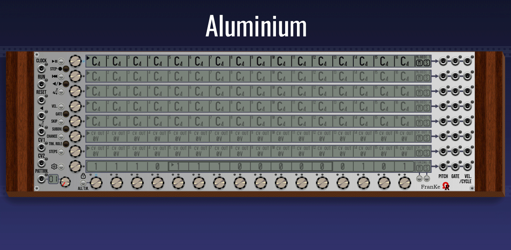

---

## **Vektor (and VX expander)**

[Please click here to read the **Vektor User's Manual**](docs/modules/Vektor/Manual.md)

Vektor is a **16HP digital quad-oscillator VCO** module, using **Vector Synthesis** (VS). This module comes with **VX**, a 3HP "right-side" expander module, offering seven extra output jacks.

Following animation is showing **all 8 models** (panel themes) of _Vektor_ module (with its _VX_ expander):

:information_source: _Vektor_ and _VX_ modules are **free for everyone**, meaning they work as full version, whatever you're owner of a license V2 keyfile, or not, like KlokSpid MkII/KX, KordZ, and (future) 6OP-DX and 6OP-DX Kompakt modules.

---

## **6OP-DX: Work In Progress / currently in development!**

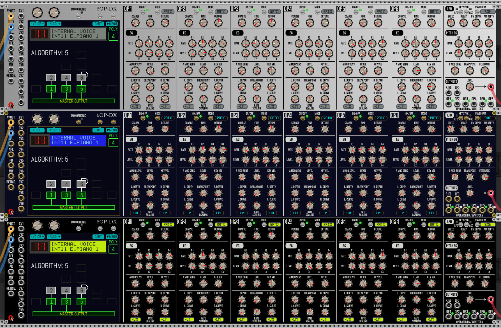

The _6OP-DX_ synth voice module is not yet included in the OhmerPrem plugin v2.6.13, but why?
- Some MacBook users continue to suffer about missing panel SVG textures with some combined zoom levels & UI scale factors. This concern all large modules, not only 6OP-DX, I suspect it's a **graphic renderer bug caused by VCV Rack 2 v2.6.6**. So please be sure to set **UI Scale** (from **View** menu) factor to **Auto** (or **100%**) for more reliable graphical rendering (confirmed by three MacBook users)!
- This synth voice module **doesn't output sound at the moment**, because PM synthesis part is not yet developed. Please consider I have a lot of features to implement first, prior to implement PM synthesis routines, like envelope generators, LFO, matrix modulation, and so on! 

6OP-DX is scheduled for future stable release v2.6.15, **but no given delay at the moment**. Please apologize again for this important delay!

However, during development, I'll publish **Pre-release v2.6.14 ALPHA ("Daily" builds)** every day morning in France (UTC+2). When this module is finished and stable, the plugin version will be v2.6.15 (I assume v2.6.14 as daily pre-releases only).

You'll can download fom [_Pre-release v2.6.14 ALPHA ("Daily" builds)_](https://github.com/DomiKamu/OhmerPrems/releases/tag/v2.6.14), for manual download & install/update.

:information_source: _6OP-DX_ module will be **free for everyone**, meaning it will operate as full version (whatever you're owner of a license V2 keyfile, or not, exactly like 6OP-DX Kompakt, Vektor & VX, KlokSpid MkII & KX, and KordZ modules).

[**6OP-DX User's Manual**](docs/modules/6OP-DX/Manual.md) is also under construction (as "draft" status).

---

## **6OP-DX Kompakt: Work In Progress / currently in development!**

The _6OP-DX Kompakt_ synth voice module is - in development - the little brother of 6OP-DX.

6OP-DX Kompakt module is also scheduled for future stable release v2.6.15, **but no given delay at the moment**. Please apologize again for this important delay!

However, during development, I'll publish **Pre-release v2.6.14 ALPHA ("Daily" builds)** every day morning in France (UTC+2). When this module is finished and stable, the plugin version will be v2.6.15 (I assume v2.6.14 as pre-release only), exactly like _6OP-DX_ module (parallel development).

You'll can download fom [_Pre-release v2.6.14 ALPHA ("Daily" builds)_](https://github.com/DomiKamu/OhmerPrems/releases/tag/v2.6.14), for manual download & install/update.

:information_source: _6OP-DX Kompakt_ module will be **free for everyone**, meaning it will operate as full version (whatever you're owner of a license V2 keyfile, or not, exactly like 6OP-DX, Vektor & VX, KlokSpid MkII & KX, and KordZ modules).

[**6OP-DX Kompakt User's Manual**](docs/modules/6OP-DX-Kompakt/Manual.md) is also under construction (as "draft" status).

---

## **KlokSpid MkII (and KX expander)**

[Please click here to read **KlokSpid MkII/KX Specifications & User's Manual**](docs/modules/KlokSpidMkII/Manual.md)

KlokSpid MkII is the successor of *KlokSpid* module, from Open Source [*Ohmer*](https://github.com/DomiKamu/Ohmer) plugin:

Following animation is showing **all 8 models** (panel themes) of _KlokSpid MkII_ module:

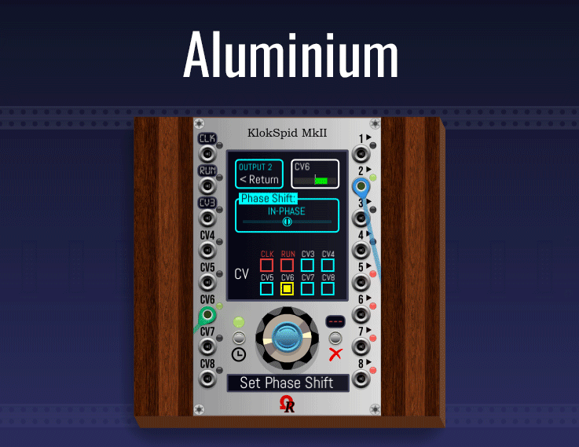

**KX expander** module inherits KlokSpid MkII model as soon as it placed along (left-side, without space) KlokSpid MkII module.

:information_source: _KlokSpid MkII_ and _KX_ modules are **free for everyone**, meaning they work as full version, whatever you're owner of a license V2 keyfile, or not, like Vektor/VX, KordZ, and (future) 6OP-DX and 6OP-DX Kompakt modules.

---

## **FroeZe (and FroeZe-X / FroeZe-SX expanders)**

:warning: **No sound (by Audio Engine) is meaning you don't have a license (V2) keyfile (the module is running as "Free/Trial", instead of as full version). Free/Trial version is limited to edit fourth first tracks (BD, SD, CH, and OH), and/or only Oberheim DMX, Drumulator, LinnDrum, Roland 707, and Roland 808 drum machines are allowed (all other drum machines are muted).** Also, without license V2 keyfile, FroeZe module (and expanders) may have more feature limitations (indicated in the Quick Guide).

[Please click here to read FroeZe/FroeZe-X/FroeZe-SX specifications & **Quick Guide**](docs/modules/FroeZe/Manual.md)

Below this is the _Creamy_ model - as presented from Rack's module browser (_Absolute Night_ is presented, instead of _Creamy_, if **Use dark panels if available** option is enabled from **View** menu). Not connected CLK source (the black "NO CLOCK" indicator is blinking). After a right mouse click over a cell - step 8 track CH - here it's a ratchet event: the OSD context menu permits to edit the ratchet pattern (clikable square boxes - bottom of menu):

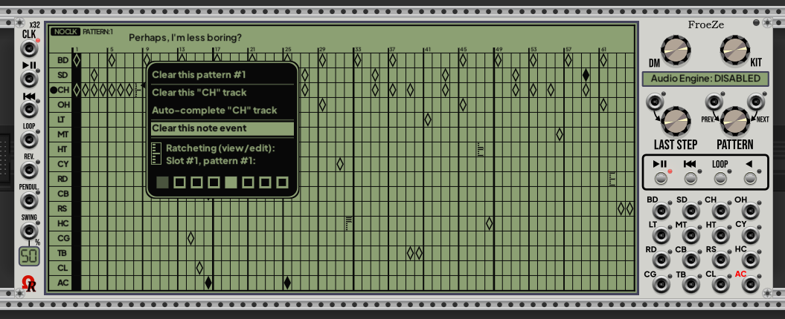

FroeZe sequencer and its companion, FroeZe-X expander, _Absolute Night_ model (panel theme), playing audio sequence (all outputs are direct-connected to the audio mixer). Per instrument track (AC to CL tracks, AC/accent isn't an instrument track), you can select drum machine and related drum kit by using both DM and KIT continuous encoders (wheels):

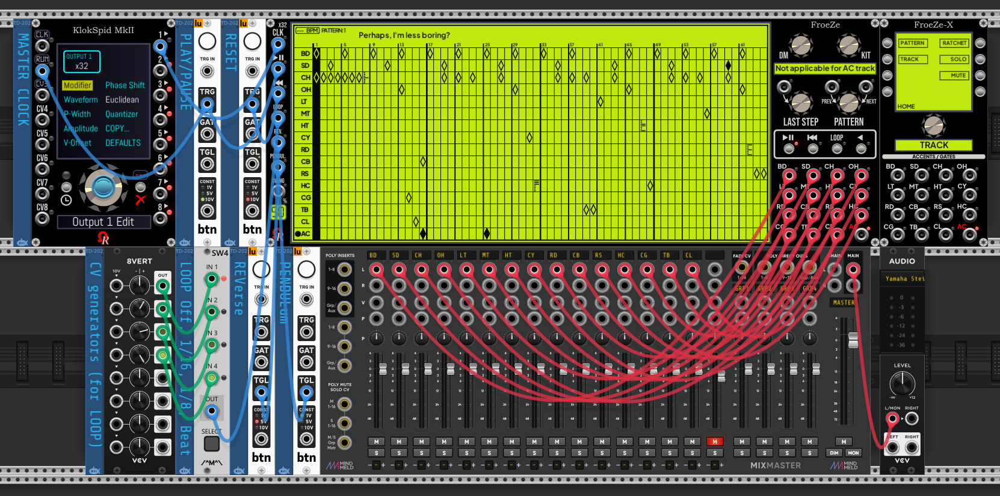

Patch using FroeZe... but here without FroeZe-X expander. On AC'd note(s), without this expander, the sequencer delivers a **-10V** (1ms) triggers! by this way, you'll must "filter" the -10V signal in order to invert it to +10V, then route it to alternate way. It is exactly the role of **[Polarity Switch](https://github.com/DomiKamu/Ohmer)** dual module (free Open Source module) - like the tiny red module located at the left of red QuadPercs modules group...

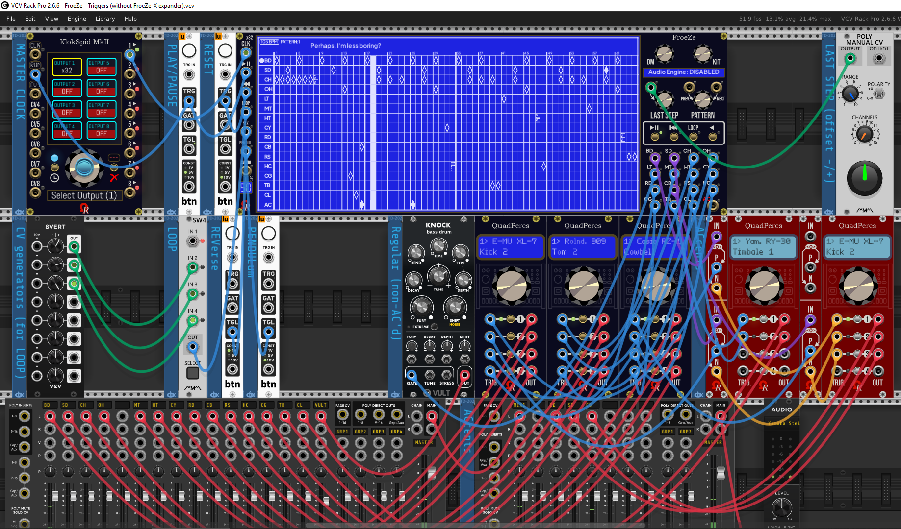

## FroeZe "Quicky Guide" - tips:

- Instrument tracks refer to BD to CL tracks (last AC track isn't an instrument track, only ACcents).
- Main screen (display) is working like a tablet-touchscreen.
- FroeZe module requires a **X32 pulse-based external source clock** (32 PPQN) to work correctly. KlokSpid MkII (see above), or Impromptu's CLOCKED modules are perfect!
- Left mouse click on track header (near track name) selects the track, **or**, if already selected, toggles its SOLO state.
- SOLO indicator (below BPM / NO CLK indicator) is blinking while at least one instrument track is SOLO.
- Right mouse click on track header (near track name) selects the track, **or**, if already selected, toggles its MUTE state (MUTEd tracks are entirely highlighted, song pointer doesn't run over them).
- Left mouse click on cell to add a simple (normal) note event (unfilled diamond) - if previously was empty (silence).
- Left mouse click again on the note event to transform it to **AC'd note** event (plain diamond).
- Left mouse click again on the plain diamond to transform it to 1st (of 8) of ratchet pattern (its representation is from top to bottom).
- Using left **Ctrl** (left **Command** on Mac) key while left mouse click on cell erases its content (step becomes silence).
- Right mouse click in any cell brings an OSD context menu.
- Top of display: left click to name or rename the current (displayed) pattern. An OSD indicates instructions, please follow them carefully!
- Top of display: right click on pattern name blanks the pattern name, and enters pattern name edit.
- While you name a pattern simply press **Esc** or **Enter** key (main or keypad), or just move the mouse cursor outside the edit box to finish!
- For models having **brightness displays** (all, except _Creamy_ and _Stage Repro_), left mouse click on the **Ohmer logo** (it's a hotspot) near bottom-left screw - toggles bright/dim all displays, including displays on attached expanders!
- Please take attention about module's context menu option (right mouse click over module, but outside the main screen)...
- AC track accepts only silence or accent event (to accent/mark all note events located into same step/column).
- SWING input port applies a global swing (all instrument tracks) on even steps. 50% is meaning no swing. Max is 75% (dotted 16th followed by 32th).
- Top-right area of display is empty at the moment (this area is reserved for possible future usage).
- LAST STEP can be independent (useful for Euclidean and polyrhythms), to set LAST STEP for certain instrument track(s), set the track(s) as SOLO first, adjust LAST STEP by continuous encoder.
- ** SOLO and MUTE states are pattern-dependent.

FroeZe-X expander:

- As soon as you attach the expander at right side of FroeZe sequencer, the expander inherits both model and displays dim settings from FroeZe!
- When attached, FroeZe-X displays are turned on (turned off when unattached).
- You can left mouse click on buttons (labelled L1 to L4, and R1 to R4), or left mouse click on the related menu boxes on touchscreen, you have the choice!
- Message below continuous encoder (like TRACK, PATTERN, STEPS, PULSES, OFFSET,...) indicates the contextual role of the continuous encoder.
- TRACK/COPY actions works on tracks who having same nature: you can copy instrument track to another instrument track (any), but not to AC track. Also, you cannot copy AC track to instrument track.
- You can copy track to another track, even to another pattern if you want. In this case, use TRACK encoder from FroeZe-X expander (or mouse click in track name box), and PATTERN encoder from FroeZe module, prior clicking PASTE (L1 button). On CANCEL (R1 button), the FroeZe sequencer returns immediately to source pattern and track.
- You can copy AC track to another AC track (different pattern).
- If you move any pattern (PATTERN/MOVE) to pattern 128, in fact you can, but the destination pattern 128 becomes... 127: it's not an issue, because "source" pattern is removed after the move operation, by this way, all following patterns are "moved by -1".
- TRACK/EUCLID. menu: euclidean rhythm feature erases the current track as soon as you change any euclidean parameter via continuous encoder (STEPS, PULSES or OFFSET), so proceed with caution (if necessary, save the pattern first, from module context menu, or make a backup of it by using PATTERN/COPY from expander to any empty pattern).
- TRACK/EUCLID. menu: sets regular notes only (no AC'd or ratchets). However, it sets ACcent events on AC track.
- TRACK/COMPLT. menu (track auto-completion feature): this feature also may "cover" existing track events, so proceed with caution (save the pattern first, from module context menu, or make a backup of pattern by using PATTERN/COPY from expander to an empty pattern).
- RATCHET. menu permits to save, open, edit and "reset to factory" the 8  ratchet slots (presets) for current pattern.

More infos "on-the-fly" in [FroeZe/FroeZe-X/FroeZe-SX **Specifications & Quick Guide**](docs/modules/FroeZe/Manual.md) document.

FroeZe (and FroeZe-X / FroeZe-SX expanders) comes in 6 models (panel themes):
- _Creamy_ (default/browser view if **Use dark panels if available** option is disabled from **View** menu)
- _Stage Repro_
- _Absolute Night_ (default/browser view if **Use dark panels if available** option is enabled from **View** menu)
- _Dark "Signature"_
- _Fort Knox "Signature"_
- _Titanium "Signature"_

---

## **QuadPercs**

:warning: **No sound for particular drum machine + drum kit is meaning you don't have a license (V2) keyfile (while the module is running as "Free", instead of "Full"). Free version is limited to only Oberheim DMX, Drumulator, LinnDrum, Roland 707 and Roland 808 (all other drum machines are muted, it's normal)**.

However, you are able to _preview_ ANY sound, but by **disconnecting trigger input cable first** on related channel. While the cable is disconnected, you can preview selected drum kit sound when you select another drum kit or another drum machine. It's a good way, for non-OhmerPrems members who are using QuadPercs as "Free/Trial", to have a chance to listen all drum machines/drum kits sounds, at any engine's samplerate inside 44.1kHz to 192kHz range. When the channel input is patched, the preview feature is disabled for related channel.

All 6 models (panel themes): _Creamy_, _Stage Repro_, _Absolute Night_, _Absolute Night_ (bypassed/dimmed), _Dark "Signature"_, _Deepblue "Signature"_, and _Titanium "Signature"_:

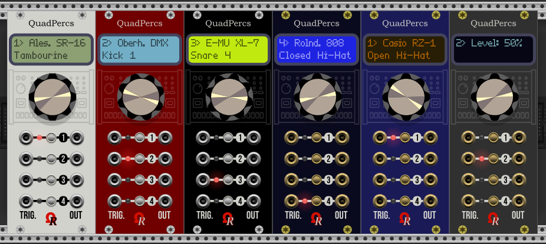

Depending **Use dark panels if available** Rack's global option, the default model will be _Creamy_ if this option is disabled (aka default light panels), or _Absolute Night_ if this option is enabled, either from module browser and new module instanciation (when you bring the module in rack, as new fresh module). All QuadPercs modules already in the rack aren't affected by **Use dark panels if available** setting (even if changed later).

Some YouTube videos (made from old VCV Rack v0.6, but they're still valid), here:

[**VIDEO**: QuadPercs module presentation/tutorial from my YouTube channel "DoMiNo-MAO" (English, 1080p, 13 min.)](https://youtu.be/K51tFtwiisY) 

[**VIDEO**: Présentation/tutoriel du module QuadPercs sur ma chaîne YouTube "DoMiNo-MAO" (Français/French, 1080p, 13 mins.)](https://youtu.be/bAZPvrXWTXg)

[**VIDEO**: QuadPercs module in action, YouTube video made by Omar Brown (**thanks Omar!**)](https://www.youtube.com/watch?v=SBbM-12xc2w)

## Quicky Guide - How to use QuadPercs module

QuadPercs module is, in fact, very easy to use!

The main key are... four buttons (one per drumming channel), and the continuous encoder. Default channel is always 1.

For each channel (labeled 1 to 4, from top to bottom), you can find, from left to right:

- An ***input*** "TRIG." jack, to trigger drum sound for related channel. Minimum trigger voltage is +1.7V.
- Green or red LED, indicating selected channel (when lit), or when editing channel (while blinking). Red LED indicates the sound isn't allowed from Free version (not allowed drum machines, and/or samplerate greater than 44.1kHz).
- Volume level (from 0% to 100%, default is always 50%) can be changed by turning the **continuous encoder** (while the channel LED isn't blinking). By approaching the mouse cursor near the encoder, the current level is indicated in the dot-matrix display (DMD).
- Momentary button to select active channel (if its LED is off). When pressing button on **already active channel**, its LED blinks, indicating channel edit. The related item to edit also blinks in dot-matrix display. When the drum machine name is blinking, press the channel button again to change its related instrument (drumkit). Turn the encoder clockwise or counter-clockwise to select next or previous drum machine, or the instrument (drumkit). No need to validate anything, your choice is *immediately applied!* Also, please notice while channel LED is blinking (meaning you're editing active channel), and in case you don't touch the encoder or any button, the edit mode exits automatically after 30 seconds timeout.
- An ***output*** jack delivers monophonic audio, it can be connected to output of VCV's AUDIO module, mixer, audio effect, envelope generator or any modulator you want...

The dot-matrix display reports the current selected channel (number indicated at top-left, channel LED is doing exactly the same thing), the current loaded drum machine for active (selected) channel, and its current instrument.

Despite one channel can be selected at time (for level changing, or instrument selection), all four channels are able to play simultaneously, obviously.

This module supports monophonic cables only (because polyphony is never required for drum element).

Both *Initialize*, *Randomize* and *Preset* (via .vcvm preset file, or via copy/paste) commands, from module's context-menu (right-click, keyboard shortcuts), are fully supported.

QuadPercs can operate **from 44.1kHz up to 192kHz**, thanks to external pre-computed PCM sample tables - made by fabulous iZotope softwares suite - who permit to keep the sound quality at highest sample rates!

---

## **KordZ**

KordZ is a visual/decorative module for your rack. It displays played single note (unison) or chord (up to 3 notes) in coloured Circle of Fifth.

All 6 models (panel themes), reduced room brightness:

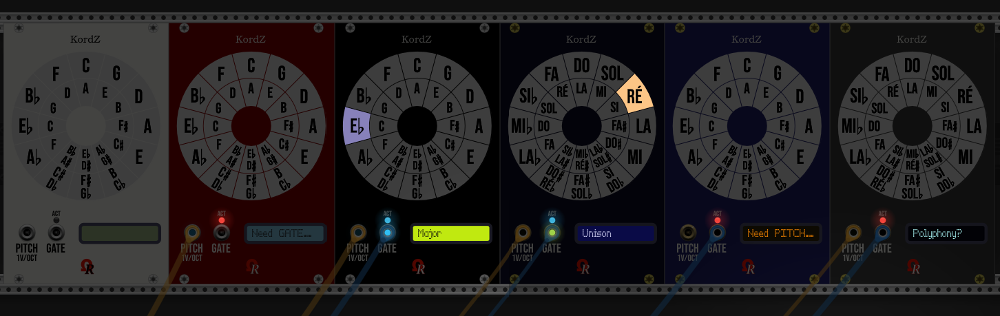

[**VIDEO**: KordZ module in action (monophonic track) from Bitwig Studio (uncommented, 1080p, 1'17")](https://www.youtube.com/watch?v=EyG_Tz8sP3c)

Modules by night: QuadPercs and KordZ modules are designed for VCV Rack's *Room brightness* feature (often named _Night mode_):

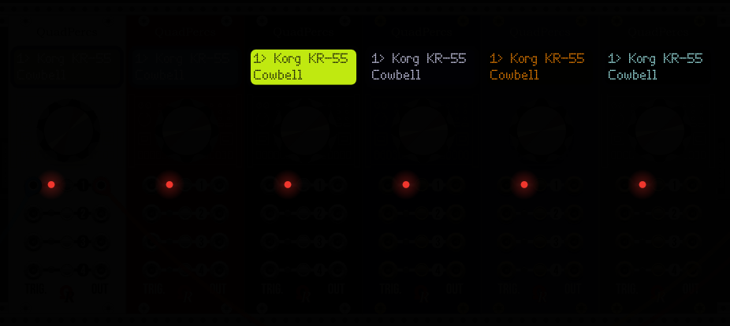

You can notice the _Absolute Night_ model is the lone embedding a yellow backligth dot-matrix display (DMD). "Signature"-line luxury models (Dark "Signature", Deepblue "Signature" and Titanium "Signature") are using plasma-gas dot-matrix display (DMD) instead of LCD, visible in dark room/night. The first two models, _Creamy_ and _Stage Repro_, use a standard LCD-based without backlight (by this way, they're not visible by night!).

The KordZ modules by night (VCV Rack 2's *Room brightness* feature sets to... 0%):

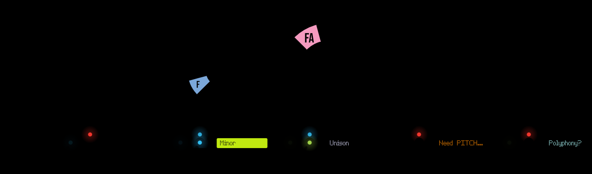

KordZ module comes in 6 models (panel themes):
- _Creamy_ (default/browser view if **Use dark panels if available** option is disabled from **View** menu)
- _Stage Repro_
- _Absolute Night_ (default/browser view if **Use dark panels if available** option is enabled from **View** menu)
- _Dark "Signature"_
- _Deepblue "Signature"_
- _Titanium "Signature"_

:information_source: _KordZ_ module is **free for everyone**, meaning it works as full version, whatever you're owner of a license V2 keyfile, or not, like Vektor/VX, KlokSpid MkII/KX, and (future) 6OP-DX and 6OP-DX Kompakt modules.

---

"***OhmerPrems***" subdirectory hosts either free/full version (built package is strictly identical), but without personal license key, some modules work as free/trial version (with limitations, depending the module), for evaluation purposes. Except "free modules for everyone", other modules require a personal (paid-once) license keyfile to work as full unlimited. The license key is sent by email exclusively to OhmerPrems member, after PayPal payment confirmation.

---

## HOW TO CHECK YOUR PERSONAL LICENSE KEYFILE INSTALLATION?

Over **FroeZe** (and **FroeZe-SX**, **FroeZe-X** expanders), or **QuadPercs**, just do a right-mouse click to bring its contextual menu. At the bottom of this menu, if the grayed entry indicates **License (V2):** (followed by your partial license key - most digits are masked by 4-star characters) - first (before "stars") must be **six digits**, then **four digits as trailing** after the stars - that meaning your license keyfile is valid for all OhmerPrems modules.

Otherwise, the same grayed menu entry indicates **Free** (or **Free/Trial**), followed by limitation/restriction summary between brackets.

Do not forget **Vektor**, its **VX** expander, **6OP-DX**, **6OP-DX Kompakt**, **KlokSpid MkII**, its **KX** expander, and **KordZ** modules always mention **License: full version (for everyone)**, whatever a valid license V2 keyfile is installed, or not!

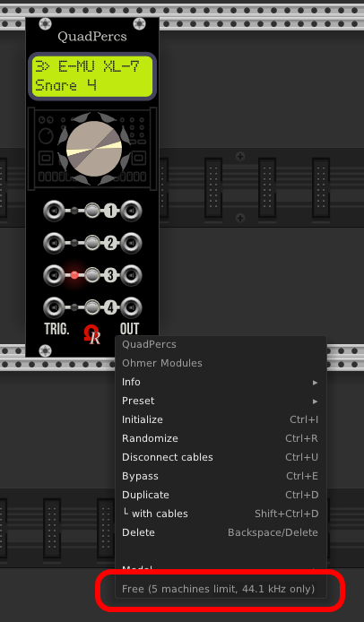

Hi! I'm enjoyed to present you my first *OhmerPrems* module: **QuadPercs**

Basically, QuadPercs is a 10HP **quad-channel drum** module, providing 4 independent drum machine channels, each having its own (sample-based) drum machine, and its related instrument.

QuadPercs module is available from OhmerPrems plugin, as both:

- free version (limited to **5** fully working drum machines, from 44.1kHz up to 192kHz engine's samplerates) to any who want to evaluate the module (they're no other limitation). Other drum machines can be selected, but are muted (no audio output), LED channel glows red, instead of green.
- full version (all 16 drum machines, from 44.1kHz up to 192kHz engine's samplerates), reserved to *OhmerPrems* members exclusively, requires a personal license key to remove all limitations. LED channels glow always green.

Free version: Oberheim DMX, Drumulator, LinnDrum, Roland 707, and Roland 808, for a total of 102 instruments, from 44.1kHz up to 192kHz engine's samplerates.

Full version: Oberheim DMX, Drumulator, Korg KR-55, Korg Minipops, LinnDrum, Roland R8, Roland 606, Roland 626, Roland 707, Roland 808, Roland 909, Yamaha RX5, Yamaha RY-30, Casio RZ-1, Alesis SR-16, and E-MU XL-7, for a **total of 369 drum kits!**, from 44.1kHz up to 192kHz engine's samplerates.

---

## Free version

Unlike via VCV Store where you'll must to buy without the ability to test prior to buy, free/trial *OhmerPrems* plugin is always available to everyone, for Windows, MacOS X (Intel & ARM), and Linux platforms, and can be downloaded directly from ["Releases"](https://github.com/DomiKamu/OhmerPrems/releases) section from this GitHub repository (for **manual** installation/update, by download + copy the **.vcvplugin** package file).

Also, lastest stable plugin release is always available from VCV Library, for assisted installation (and updates). You'll can subscribe for the whole OhmerPrems plugin, or per favorite module(s):

- [Whole OhmerPrems plugin](https://library.vcvrack.com/OhmerPrems)
- [Per module (all Ohmer/OhmerPrems are listed)](https://library.vcvrack.com/?query=&brand=Ohmer+Modules&tag=&license=)

Without a personal license keyfile, _FranKe_, _FroeZe_ / _FroeZe-X_ / _FroeZe-SX_, and _QuadPercs_ modules run as "Free/Trial", with some features limitations (instead of as full unrestricted version).

---

## Full version (OhmerPrems members only)

A personal license keyfile is sent to OhmerPrems members (by email exclusively), including detailled instructions to install it (by the body of email). The presence of valid license keyfile unlocks (immediately) all concerned modules to **full version**. However, _Vektor_ (and its expander, _VX_), _KlokSpid MkII_ (and its expander, _KX_), future _6OP-DX_ and _6OP-DX Kompakt_, and _KordZ_ modules always work as full version, whatever the license V2 keyfile is installed or not, because these modules are free for everyone, without any feature limitation!

All *OhmerPrems* members will benefit all **lifetime** updates/upgrades, but also all future *OhmerPrems* modules, always as full version, without any additional charge!

To become *OhmerPrems* member, simply send **15 euros** via PayPal.Me. If required, please convert your local currency first, to fit with 15 (or a bit more) euros, otherwise your payment will not be accepted (and refurbished). Payment via [my "PayPal.Me" (Dominique CAMUS @DominiqueCAMUS - BARJAC)](https://www.paypal.com/paypalme/DominiqueCAMUS).

:warning: as often asked in private, **you'll cannot buy a license keyfile directly via the VCV Store!**

## Summer 2026: please consider the 15 euros fee remains very fair! this fee will not change during 2026, however.

**Very important: do not forget to indicate:**
- your first and last name (personal name only, **company name / nickname aren't accepted**).
- your email address (preferably used to access to your VCV Library account, or a reliable permanent email address), required to send your personal license key, instructions to install it, and possible future communications about major updates. Your name and email address stays strictly private, and I never spam!
- also in the body of the message, please indicate **OhmerPrems** (or something similar), to avoid possible confusions!

New subscription requires max. 24 hours for processing (generally less, often couple of hours, sometimes delivered after... minutes!), after PayPal payment notification. Please consider **incomplete/not regular fee informations or/and payment less than 15 euros equivalent will be refurbished**. Thanks for your understanding!

---

## License Clauses

All ***OhmerPrems*** modules (even free) remain under **proprietary license**.

License (V2) keyfile for full version is granted for each OhmerPrems member, and of course, **cannot be shared, sold or distributed** to any third party (obviously, the license keyfile can be used on ALL personal computers). Please read "LICENSE-FULL.txt" enclosed in your downloaded package for licensing conditions.

All graphic materials, the "Ohmer" logo and related resources cannot be altered and/or used for derivative works and remains the proprietary of Dominique Camus (Ohmer Modules & OhmerPrems developer).

All SVG graphics named **XB_*.svg** are designed by **Xavier Belmont** (ask him the permission if you'll want to use them in your developments). Thanks a lot, Xavier!

Thanks to **Marc Boulé** (author of excellent ImpromptuModular/Geodesics/MindMeld plugins) for C++ code who permit to swap ports textures (silver, gold) "on-the-fly" when changing model, exactly like momentary buttons and screws.

Thanks to **Paul Bacon** (author of excellent Bacon Music plugin, and working hard on SurgeXT) for C++ coding tips who permit to display coloured textures (Kordz's circle of fifths) in dark/night mode.

Big big big thanks to beta testers!

Feature requests, suggestions, and bug reports are welcome on this GitHub repository (or via VCV Rack Community forum).
