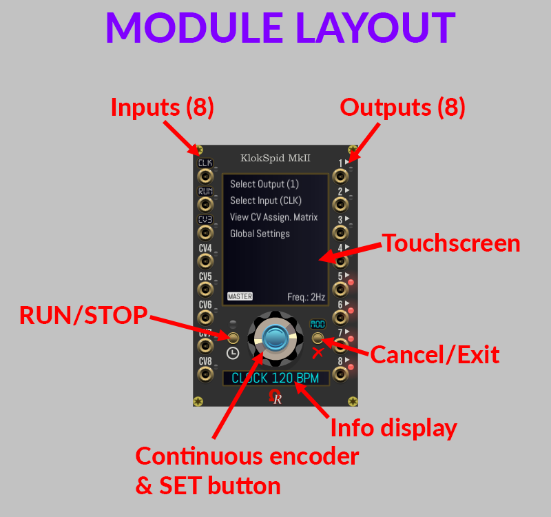
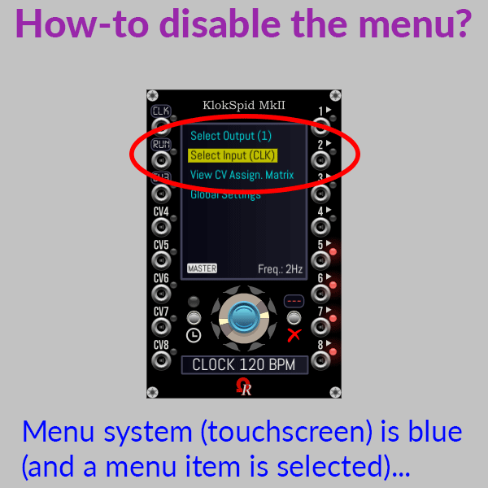
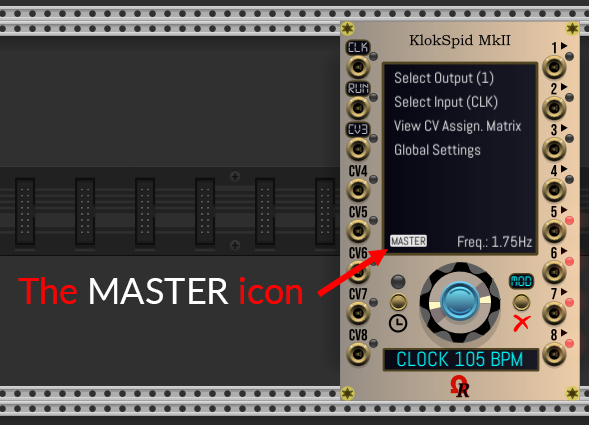
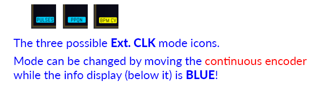
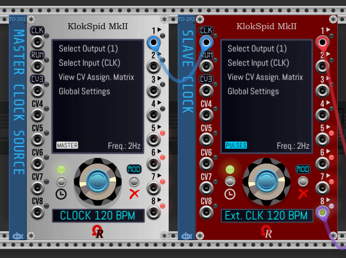
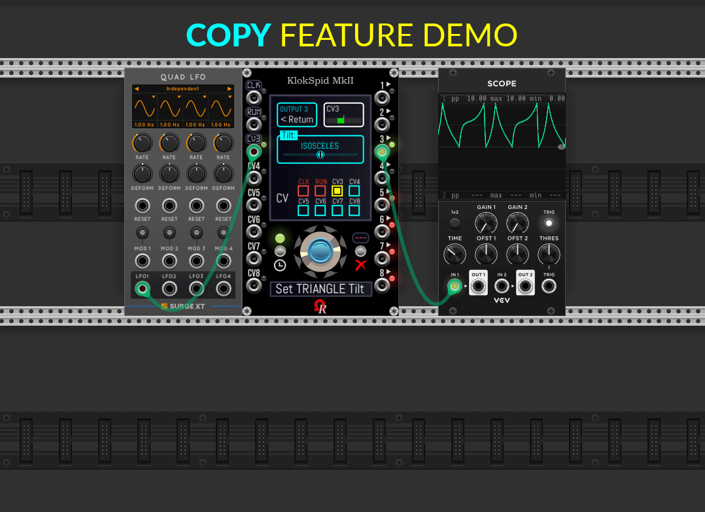
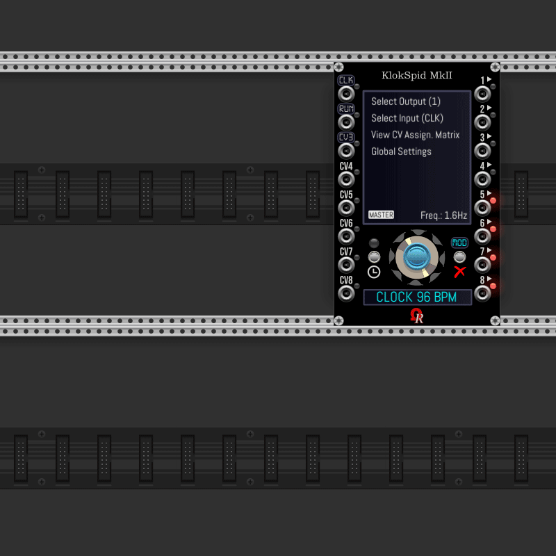
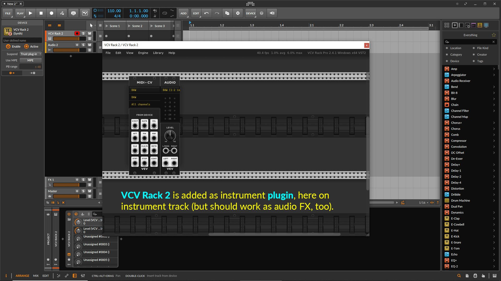

**KLOKSPID MKII MODULE SPECIFICATIONS & USER'S MANUAL**
--

**KlokSpid MkII** is a **16HP** versatile clock source module. It's the successor of _2017 KlokSpid_ module (free & open source [Ohmer plugin](https://github.com/DomiKamu/Ohmer)).

Typically, KlokSpid MkII is:

- Totally free: all features are available for everyone, including non-OhmerPrems members.

- "CPU-controlled"-like versatile **clock generator** (standalone, master clock mode), **clock modulator** (slave clock mode, when **CLK** input is patched to another clocking source), **low-frequency oscillator** (aka **LFO**, capable from **1 BPM / 0.02Hz** upto **500Hz**), clocked **envelope generators (EXPonential/LOGarithmic and LOGarithmic/EXPonential built-in envelope generators)**, and **custom wavetables** to bring no limit concerning curves! It offers 8 independent programmable outputs, 8 inputs (five of them, CV4 to CV8, are always CV inputs, but first three, CLK/CV1, RUN/CV2, and CV3/RESET, are versatile inputs). The main part of KlokSpid MkII module is a large **touchscreen** (like smartphone/tablet), an **info display** located below the continuous encoder, who display tempo (or frequency), external clock mode, and the current menu page name, while you're browsing menu system. The module can be controlled either by touchscreen (left mouse button click on most cases) and/or by **continuous encoder** + **SET** + **Cancel/Exit** buttons _combo_.. They're three _triple-character 14-segment_ tiny white displays just above first, second, and third input jacks, who can display respectively their current roles, such **CLK** or **CV1** above first, **RUN** or **CV2** above second, and **CV3"** or **RST** (RESET)" above third jack.

- 8 independent programmable outputs. Please notice, by default, when you add a new KlokSpid MkII instance in your rack (or after a **reset to factory**), only outputs 1 to 4 are enabled (all 1-4 are default, with identical settings: 1ms pulse, 10V as voltage amplitude, 0V for voltage offset, amplitude above offset, in-phase, x1 as ratio **modifier**). Also, outputs 5-8 have their LED lit as red, because these outputs are turned off / disabled, in order to save CPU/resources (despite KlokSpid MkII is fair vs. CPU). Obvisouly, any output you'll need can be enabled, depending your needs. The fastest way is to connect it, by this way, the output will switch automatically from **OFF** to **x1** modifier (**this trick will be applicable from next v2.4.1 beta 12** - otherwise, do a left mouse button click **over its LED**, then select **Modifier** menu item, then select the output modifier you'll need from multipage list).

- For any output, they're existing three special "service" modifiers, also named **utility modifiers**, such **GATE** who send a continous +5V / +10V high-state gate while the clock is running (0V when stopped), **START** who fire (once) a short 1ms +5V / +10V trigger when clock is starting, or **STOP** who fire (once) a short 1ms +5V / +10V trigger when clock is stopped. These utility modifiers may be useful to control external modules. As indicated in previous section, **OFF** modifier simply shutdown/disable the output - in this case, it always "deliver 0V" on its jack, all internal processing for the output are ignored. Unused output(s) can be turned off if you want, depending your computer performances, patch complexity, your needs... About clocking modules, major usages are, in general, 1 to 4 outputs, rarely more, it's the main reason why the extra outputs 5-8 are, natively, disabled.

- 8 inputs: **CLK** is designed, by default, to receive pulses (or gates) from external clock source module. When patched (and "CLK" is set as external clock input - its default role setting - as indicated above the jack by a _triple-character 14-segment_ tiny display), the module becomes **slave** (clock modulator), because the clock frequency/tempo is imposed by the external source clock. In case you're using KlokSpid MkII module as standalone (**master**, also clock generator) in your rack, "CLK" input can be turned to bipolar -5V/+5V or unipolar 0V/10V **CV1** input. On the same principle, **RUN** input can be turned to bipolar -5V/+5V or unipolar 0V/10V **CV2** input. Native CV3 (by default: bipolar -5V/+5V CV input) can become unipolar 0V/+10V CV, or **RESET** (pulse-based) input. Finally, CV4 to CV8 inputs (default **bipolar -5V/+5V**, optionally **unipolar 0V/10V**) are CV sources only. Use **Select Input...** second menu item (from _home_ menu) by touchscreen, or do a **left mouse click on its LED**, to access a particular input to be configured, or press SET (blue) button to enable the menu system, then turn continuous encoder and use SET / Cancel/Exit buttons to browse menus.

- **In your mind, PLEASE never associate CV1 with output 1, CV2 with output 2,... CV8 with output 8, anyway!** Any valid CV source/input (see below) can be assigned to modulate a particular output parameter, for **any** output(s) you'll want! As simple example, CV4 can modulate the waveform morph on output 2, and at the same time, it can modulate phase shift on output 7, and so on. On the same time, CV2 (if RUN is assigned as bipolar or unipolar CV) can modulate the voltage offset on output 1. Please notice by default (new fresh module added in the rack, or after a **Factory Reset** / Initialize / Ctrl+I / Command+I on Mac), CV aren't assigned, so you'll must assign them explicitly, regardling your needs.

- **Not valid CV** possible scenarios: "CLK" input, when set as external clock input: in this case, the first input isn't assumed as valid CV, because the input jack is designed to receive clocking pulses - or BPM CV voltage - from another module. "RUN" input, when set as "RUN/STOP toggle" or "RUN while hi-gate": in both cases, the second input handles the clock transport (kind of remote), by this way, this input is,'t assumed as valid CV). Native "CV3" remains a valid CV input as long as it will not assigned as "RESET" input. Not valid CV inputs are indicated by red color checkboxes (instead of blue, for valid), or by flashing red boxes from _View CV Assign. Matrix_ information page.

- Voltages required for **CLK**, **RUN** and **RESET** inputs (internal & KX expander): minimum +2V rising edge to trigger, maximum +0.1V falling edge to release. Pulse/trigger signal is highly recommended.

- Output waveform can be either **PULSE** (default), **TRIANGLE** (including ramp/saw down and ramp/saw up, via _Tilt_ parameter, who can be modulated by any valid CV), **SINE** (including half sine, and humps), and **SAMPLE & HOLD** (S&H, its _Density_ parameter defines the number of random samples per beat, from 1 upto 64). On second page, **CONSTANT** voltage (send "V-Offset" voltage, CV-modulable, can be pitch-quantized), **ONE-SHOT** (single 1ms pulse is fired on **second beat only**, no more until clock is stopped/restarted), **EXP/LOG EG** and **LOG/EXP EG** clocked envelope generators (not yet available). Pages 3 and 4 are dedicated to optional custom wavetables (WAVETABLE 1 ~ 4 at page 3, and WAVETABLE 5 ~ 8 at last page 4). At the moment, wavetable support remains in implementation (not yet operational), _Morph_ parameter (can be modulated by any valid CV) will controls the position in the table (like "WT POS", "WT INDEX", or "MORPH" on most hardware/virtual synthesizers, are doing for their wavetable-based oscillators).

- KlokSpid MkII module can be controlled either by continuous encoder + **SET** (blue) button + **Cancel/Exit** button _"combo"_ (on the module's chassis), and/or by "touchscreen"-like, at you convenience! However, some controls (like arrows to select previous/next page, or notes rotations in output-related _Quantizer_ page) are usable by touchscreen only (continuous encoder isn't supported). Also, in some situations, the page may don't have a clickable "RETURN" menu entry/box, as example, Input and Output selectors (both having 8 boxes), also from _home_ menu to disable it (who permit to change the BPM tempo or frequency). In this situation, the only way is to press "Cancel/Exit" button. In general, you can combine touchscreen actions and encoder+buttons actions.

- The continuous encoder permits to select next or previous selectable "blue items", such menu items, boxes, checkboxes, buttons, piano keys from Quantizer - **selected item is always highlighted by yellow color, so you cannot miss it ;)** - also can be used to increase/decrease a parameter value (by moving the horizontal slider). **SET** button (the blue button seating over the continuous encoder) permits to validate the selected (yellow) menu/box item, check/uncheck a selected checkbox, activate the parameter slider (parameter edit mode), or entering in the menu system. **Cancel/Exit** button leaves a parameter edit, return to previous menu, cancel BPM/Hz edit, cancel Ext. CLOCK mode edit, and from home menu, it disables the menu system (the whole menu becomes gray, instead of blue)... Please notice both input and output selection screens (who have eight clickable boxes) don't have a touchscreen control to go back, so please use the **Cancel/Exit** button. Most parameters are immediately validated, even when you click **Cancel/Exit** button, or top-left box/menu on most pages.

**ANIMATION: HOW TO DISABLE MENU SYSTEM (to change BPM, frequency, or Ext. CLK sync mode)**

NOTE: if the module is already into "deep menu", simply press **Cancel/Exit** button many times to return to _home_ menu, until it displays the menu as gray in touchscreen, and the info display is showing  **CLOCK xxxx** (master clock mode) or **Ext. CLK xxxx** (slave clock mode), **blue color**. When done, you'll can change BPM or frequency (master clock mode), or external clock mode (slave clock mode) by moving the continuous encoder.

- On displays/menus, colorscheme is mainly: blue = selectable item (editable item for CLOCK BPM/Hz and Ext CLOCK BPM/Hz), yellow = current selection/active menu item/selected box/button/checkbox, while editing CLOCK tempo/frequency (master clock), editing Ext CLOCK mode (slave clock), parameter currently edited by horizontal slider, piano keys from quantizer setting... Gray = disabled item (locked), depending the current context.

- At bottom left of touchscreen, only from "home" menu, a small indicator icon show the mode of KlokSpid. White MASTER stands the module acts as standalone clock generator (when CLK input isn't connected). Others are while KlokSpid MkII is acting as "slave clock" (when CLK is connect), such yellow "BPM CV", blue "PULSES" or "PPQN" (depending selected external clock sync mode), and fast blinking red "SYNC" indicator during sync operation.

- **Prefer frequency (Hz) rather than BPM** option, from context menu (MISCELLANOUS section), when enabled, forces to display and edit master frequency, in Hz (whatever the frequency/tempo setting). This option is useful to use the module as LFO. When this option is disabled, the BPM tempo is used while its value is into 1 - 900 BPM range (beyond 900 BPM, aka 15Hz, the frequency is always used).

- As master clock, while editing BPM, possible values are into 1 to 900 range (equivalent frequency, in Hz, is indicated at the bottom-right on touchscreen while BPM unit is indicated in the info display, useful to know the equivalent frequency whithout using calculator for conversions). Beyond 900 BPM (= 15Hz), the BPM display is replaced by frequency (Hz), instead. From 15Hz to 25Hz, the stepping during edit is 0.1Hz (while turning the continuous encoder). From 25Hz to 500Hz limit, the stepping is 1Hz). **Minimum tempo is 1 BPM (0.01666Hz, displayed 0.02Hz), maximum frequency is 500Hz**. Tempo/frequency can be set by moving the continuous encoder while the info display is blue. While editing, the tempo or frequency value is yellow. Pressing **SET** button validates the value immediately (otherwise, the value is automatically validated after 1/**3**/5-second timeout). Pressing **Cancel/Exit** button while editing (yellow) will restore the previous registered value. While **Prefer frequency (Hz) rather than BPM** option is enabled, minimum frequency is **0.02Hz** (50-second beat duration).

- **HINT**: while modifying the CLOCK BPM (or frequency) by turning the continuous encoder, **doing a right mouse click on yellow BPM (or Hz) readout** returns immediately to default BPM 120 (or 2Hz). Holding SHIFT key while moving the continuous encoder changes the value faster. While editing the **CLOCK BPM**, **Frequency Hz**, or **Ext CLK** mode (slave clock), the edited parameter is automatically saved after 3-second timeout (yellow readout returns to blue color when validated). Auto-validation delay can be changed from **Global Settings** menu (this setting may accept short 2 second, default normal 3 seconds, or long 5 seconds). By clicking **Cancel/Exit** button during the edit delay, this will restore the previous registered setting.

- As external clock mode (slave clock), possible **Ext CLK** sync modes are by received consecutive **Pulses** (or gates), by **PPQN** (they're 13 possible PPQN settings, from 2 upto 192 - see animation below), or by **BPM CV** to be compatible behind some clock source modules who provide **BPM by voltage**, such [ImpromptuModular CLOCKED](https://github.com/MarcBoule/ImpromptuModular) is capable to provide (merci Marc!). **KlokSpid MkII can operates from 1 BPM (or 0.02Hz), upto 500Hz** (the frequency is automatically limited to minimum 1 BPM / 0.02Hz, or maximum 500Hz, if required).

**ANIMATION: SELECTING EXTERNAL CLOCK SYNC MODE (UNCOMMENTED)**

- A lot of pre-built modifier ratios (exactly 87 ratios, to be precise), including many **exotic/even/prime/fractional** and of course, **most common** dividers and multipliers, from slowest **/16384** (by using this modifier, KlokSpid MkII may become an **extremely slow LFO** source: at 1 BPM, divided by 16384, beat will occur every... 11 days, 9 hours, and 4 minutes), upto fastest **x192** who permits to control modules who need/accept 192 PPQN as clock high-resolution. These pre-built ratios can be _picked_, in realtime, by any valid CV source, thanks to **CV Ratio** modifiers (from output **Modifier** menu, these modifiers are located in lastest page). Please consider custom ratio isn't supported by KlokSpid MkII module (it's a developer choice). Please notice by using high multiplier values, the related outputs hosting the BPM/frequency multiplier permits to enter into the **full audio domain** (no 500Hz limitation in this case, but limited to 22,050Hz).

- CV input can be manually set as **bipolar -5V/+5V** (it's the default setting for all CV inputs for this module), or optionally be set as **unipolar 0V/10V** (depending your needs), via input on-screen menu (Select Input, choose the relevant input by clicking its box). Also, CV1, CV2, and CV3 can be changed "on-the-fly" via context menu (**INPUT ROLES** section). The menu can be opened quickly by doing a left mouse button click over relevant input LED!

- For some parameters who can be modulated by CV, in case of input isn't set-up as CV source, this will be notified as red color on display. As example, if you select **CV1** (indicated as **CLK**) to modulate Amplitude parameter, the **CLK** checkbox is red (and the CV indicator at top-right of touchscreen indicates **red blinking "Not a CV"** message). Simply set **CLK** role to become **CV1** (either bipolar -5V/+5V, or unipolar 0V/+10V, depending the source, and your needs), otherwise, select another CV input.

**KlokSpid MkII can't use multiple CV sources to modulate the same output-specific parameter! in this case, simply use a mixer module (like VCV Mix) upstream the CV input jack, to "mix" your CV signals.** Said differently, by example, you cannot modulate output 5 Phase Shift parameter by using CV4 and CV7 at the same time - you are able to choose only one.

- Output voltage supports customizable **Amplitude** setting (minimum 0.2V, maximum 10V, resolution 0.05V), this setting can be modulated by any valid CV source.

- Each output can receive a particular modifier ratio, _'morphable'_ waveform (depending waveform shape, 'morph' have specific alternate names, such _P-Width_ for pulse, _Tilt_ for triangle, _Deform_ for sine, _Density_ for sample & hold, _Attack_ for exp/log & log/exp envelope generators, and _Morph_ for wavetables), voltage amplitude (default 10V, resolution 0.05V), voltage offset (default 0V, resolution +/-0.05V, amplitude can be above offset - default, or spread around offset, by unchecking/checking **Bipolar around offset** checkbox), phase shift (from -180° to +180° - except S&H and CONSTANT don't have phase shift, due to the nature of these signals). Except quantizer, all user-defined (or default) settings may be modulated by any valid CV source of your choice.

- Before output the voltage to relevant jack, it may crosses (or bypass) **euclidean sequencer** (user-defined settings, all can be modulated by CV), then crosses (or bypass) pitch-based **Quantizer** (voltage can be _pre-offset_ by **KX** expander **OFS.1** or **OFS.2** CV-like input prior pitch/voltage quantization), **either the clock is running or stopped** (when the clock is stopped, output may have a voltage other than 0V, depending "V-Offset" setting, then optional _pre-offset_, then pitch quantization).

- An option from context menu permits to output the module's master phase (**M.PHASE**) to output 8 (ramp up signal shape, 0V to +10V, based on master tempo, frequency, or slave clock). May be useful for rack debugging features, time reference in your rack... When you enable this option, the previous output settings are saved, then restored as soon as you disable this option.

- RUN input: when set as **HI-GATE** (default setting), the clock runs while a high gate voltage is applied on RUN input jack. When set as **RUN/STOP**, the input acts as transport toggle, everytime the jack receives a pulse (trigger), at least +0.2V rising front.

- RESET input: when the CV3 input is set as **RESET**, incoming +0.2V (rising front) pulse/gate will reset the module's master phase, and also all 8-outputs dedicated phases.

- All embedded LED on module's chassis are RGB.

- **HINT**: Input and output LED are "finger sensitive" (clickable, like momentary buttons), either by left or right mouse button. By left mouse click over LED, the menu system jumps directly to related input configuration (input role and voltage ranges), or to related output setting (base) menu. By doing a right mouse click over LED, this will open a scope to monitor the evolution of input/output voltage (use "Cancel/Exit" button to return and resume to previous situation before scope display (scope feature is not yet implemented).

- Transport (START/STOP button) - LED is **off** when clock is stopped, **green** while clock is running and controlled by button on module's chassis, **cyan** while clock is running and controlled by "RUN" input jack (either via held gate or toggle by incoming pulses), **blinking red** during sync operation against source clocking module - while slave. For your information, during sync operation, KlokSpid MkII uses "last known BPM/frequency" during this degraded situation, until new stable frequency is established!

- Input LED color scheme: **cyan** for pulse/gate-based inputs (CLK, RUN, and CV3 when set as RESET input). **Gradient green** for CV-compliant voltage (voltage into allowed range). **Red** in case of undervoltage/overvoltage (in this case, the voltage is limited/clipped to allowed boundaries, regardling CV polarity setting). **Yellow** for CLK input only, during slave mode and sync mode set as "BPM CV".

- Output LED color scheme: **red** while output is disabled (its modifier is set to "OFF", as explained above). **Gradient green** for regular output usage. **Cyan** for _service voltage_ (modifier is set to an "utility": GATE, START, or STOP). **Gradient purple** is used by output LED 8 exclusively, while output 8 sends the module's master phase (aka **M.PHASE**) - this option can be enabled/disabled from context menu (MISCELLANEOUS section).

- While **Output 8: master phase (M.PHASE) 0V/+10V ramp up @ tempo/freq.** option is enabled (from context menu), the output 8 can't be selected/edited, either from _Select Output_ page (its box is grayed) or by left mouse button click over its LED. If output 8 is the current/selected output when you enable this option from context menu, the output 7 becomes current/selected output, instead. Previous output 8 settings are restored when you disable this option.

- READY FOR NEXT BETA 14 (FULLY OPERATIONAL): all settings for current (last selected) output can be copied to another output, by single operation, simply by using **COPY** menu item from output menu. When the copy is done, the "target" output becomes current (last selected) output, except if output 8, set as M.PHASE, was the target: in this case, "source" is staying current output.

- **ANIMATION: HOW TO "COPY" OUTPUT SETTINGS, TO ANOTHER OUTPUT**

- All settings for current output can be erased and restored to default settings (other outputs aren't affected), by using **DEFAULTS** from output-related menu. **BE CAREFUL** - please do not confuse with **Initialize** command (from context menu), or **Ctrl**+**I** (**Command**+**I** on MacOS systems) keystrokes, or from **Global Settings** / **Factory Reset** touchscreen menus: this will reset the module entirely (full reset), all customizations (except model) are lost! During 'factory reset', the module is playing a short "LEDs sequence" animation (approx. during 1.5 seconds).

- KlokSpid MkII comes with a little brother, **KX** expander (3HP, left-side module). KX brings discrete "CLK", "RUN", and "RESET" pulse/gate-based inputs (exactly like KlokSpid MkII internal inputs can do). But, as soon as you place the KX expander along KlokSpid MkII module (left side only), **all internal "CLK", "RUN" and "RESET" (RST)** inputs, if applicable, become respectively **"CV1", "CV2", and "CV3" inputs** (bipolar -5V/+5V, except if one was previously set as unipolar 0V/+10V, in this case it stays unchanged), because **CLK**, **RUN** and **RESET** are now handled by jacks on KX expander module. Please take attention about _triple-character 14-segment_ tiny displays just above three first input jacks, on KlokSpid MkII module's chassis. Another two inputs, below "QUANT." label on panel, are **OFS.1** and **OFS.2** special inputs: _OFS_ stands for... "offset", or more precisely, **pre-offset**, both are discrete CV inputs (bipolar -5V/+5V only) but exclusively dedicated to **output quantizers** (per output, a quantizer can be enabled and set). When assigned, OFS.1 or OFS.2 CV inputs can increase/decrease the output voltage prior quantization (please notice the process is ignored if quantizer is disabled - aka no active note on its piano). You can access to OFS.1/OFS.2 assignments (by checkboxes), either by using **KX Expander** menu item (from home menu, below **Global Settings** - the **KX Expander** menu item is displayed while KX expander module is connected to KlokSpid MkII module). Another way is using a shortcut: by **doing a left mouse clicking over OFS.1 LED, or OFS.2 LED**.

- From home menu, **View Assign CV Matrix** displays in a grid how CV are assigned, for every output (except OFS.1 and OFS.2 from KX expander aren't reported here). **Green pill** indicates a valid voltage applied on CV input jack, **red pill** indicates under-/overvoltage (voltage is clipped), **gray pill** indicates assigned CV, but its associated jack is not connected, and **blinking red square** indicates the input is not a valid CV (concerns internal **CLK**, **RUN**, and **RST** inputs only).

- **ANIMATION: HOW TO REACH THE 'WAVETABLE MANAGER'**

- Six models (GUI theme variations) are available, like most Ohmer & OhmerPrems modules: compliant with **Prefer dark panels if available** feature (from **View** menu, since VCV Rack v2.4.0). Possible models are **Aluminium** (it's the default model if _Prefer dark panels if available_ option is disabled), **Stage Repro**, **Absolute Night** (it's the default model if _Prefer dark panels if available_ option is enabled), **Dark "Signature"**, **Fort Knox "Signature"**, and **Titanium "Signature"**.

---

**ANIMATION: KLOKSPID MKII & DAW SYNC (VCV RACK 2 PRO ONLY, AS VST2 PLUGIN)**

