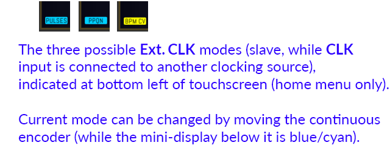
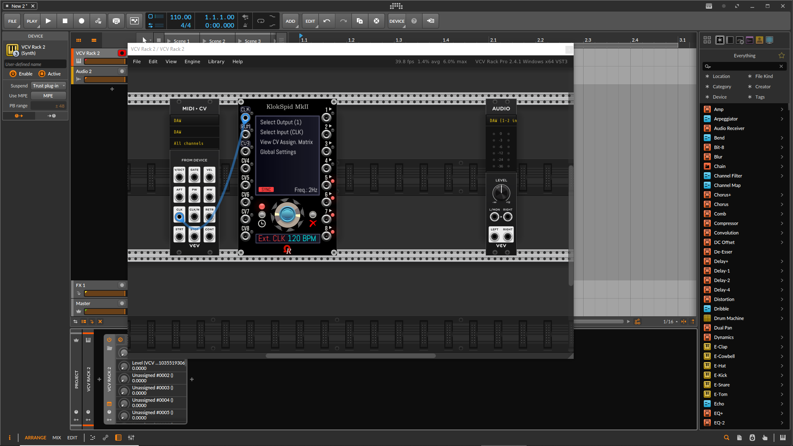
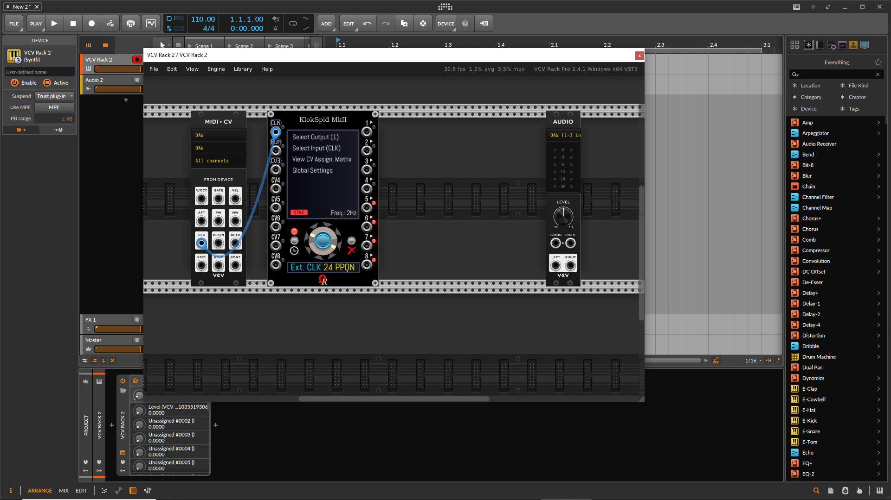
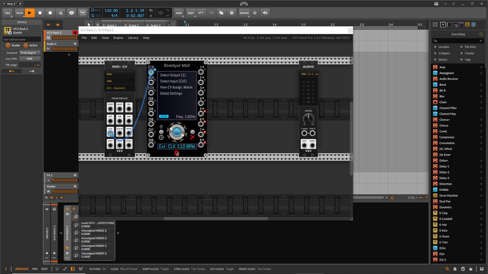

**KLOKSPID MKII MODULE SPECIFICATIONS & QUICK GUIDE**

This **16HP** versatile clock source, named **KlokSpid MkII**, will be the successor of _2017 KlokSpid_ module, offered by Ohmer (free / open source) plugin (original KlokSpid is staying alive, however).

Typically, KlokSpid MkII is:

- Totally free, all features are available for everyone, including non-OhmerPrems members!

- "CPU-controlled"-like versatile **clock generator** (standalone, master clock mode), **clock modulator** (slave clock mode, when "CLK" input is patched to another clocking source), **low-frequency oscillator** aka **LFO** (capable from **1 BPM or 0.02Hz**, upto **500Hz**), clocked **envelope generators (logarithmic & exponential curves)**, offering 8 independent programmable outputs, 8 inputs (five of them are "pure" CV inputs, first three are versatile inputs). It embeds a main touchscreen-like display (like tablet), a display below the continuous encoder who display tempo or frequency, and some informations while you're browsing menus. The module can be controlled either by touchscreen (left mouse click on most cases, sometimes by right mouse click) and/or by **continuous encoder** + **SET** button (blue) + **Cancel/Exit** button _combo_., and three _triple-character 16-segment_ tiny displays just above first three inputs (who can display either "CLK" or "CV1" above 1st/top input jack, either "RUN" or "CV2" above 2nd input jack, and either "CV3" or "RST" above 3rd input jack).

- 8 independent outputs. Please notice, by default, when you add a new KlokSpid MkII instance in your rack, only outputs 1 to 4 are enabled (all are default, with identical settings: 1ms pulse, voltage amplitude set to 10V, voltage offset set to 0V, amplitude is above offset, in-phase, x1 as ratio **modifier**). By default, outputs 5 to 8 have their LED lit as red, because these four outputs are turned off / disabled, in order to save CPU/resources (despite KlokSpid MkII is fair vs. CPU). Obvisouly, any output you'll want can be enabled (depending your needs), via touchscreen **Select Output** menu, then clicking related output box (the selected output becomes **selected ouput** for further parameters edit) -- **OR BY DOING LEFT MOUSE CLICK OVER ITS LED** to do the same action but more quickly! Then enter in **Modifier** menu. By using mouse, click left and right arrows (located at top-right side of display) in order to select previous or next "page" (by using continous encoder, the page changes when the selected item is first or last of the page), and use SET (or Cancel/Exit) over the output modifier you'll need!

- For any output, they're existing three "service" modifiers, named **utility modifiers**, such **GATE** who send a continous +5V / +10V high-state gate while the clock is running (0V when stopped), **START** who send (once) a short 1ms +5V / +10V pulse (trigger) when clock is starting, **STOP** who send (once) a short 1ms +5V / +10V pulse (trigger) when clock is stopped. These utility modifiers may be useful to control external modules. As indicated in previous section, **OFF** modifier simply shutdown/disable the output - in this case, it always deliver 0V on jack, all internal processing for the output are bypassed, for CPU save. Unused output(s) can be turned off if you want, depending your computer performances, patch complexity, your needs... About clocking modules, major usages are 1 to 4 outputs, rarely more, it's the main reason why the extra outputs 5-8 are natively disabled!

- 8 inputs: **CLK** is designed, by default, to receive pulses (or gates) from external clock source module. When patched (and "CLK" is set as external clock input - its default role setting - as indicated above the jack by a _triple-character 16-segment_ tiny display), the module becomes **slave** (may be named clock modulator), because the clock frequency/tempo is imposed by the external source clock. In case you're using KlokSpid MkII module as standalone (**master**, also clock generator) in your rack, "CLK" input can be turned to bipolar -5V/+5V or unipolar 0V/10V **CV1** input. On the same principle, **RUN** input can be turned to bipolar -5V/+5V or unipolar 0V/10V **CV2** input. Native CV3 (by default: bipolar -5V/+5V CV input) can become unipolar 0V/+10V CV, or **RESET** (pulse-based) input. Finally, CV4 to CV8 inputs (default **bipolar -5V/+5V**, optionally **unipolar 0V/10V**) are CV sources only. Use **Select Input...** second menu item (from _home_ menu) by touchscreen, or do a **left mouse click on its LED**, to access a particular input to be configured, or press SET (blue) button to enable the menu system, then turn continuous encoder and use SET / Cancel/Exit buttons to browse menus.

- **In your mind, PLEASE never associate CV1 with output 1, CV2 with output 2,... CV8 with output 8!** Any "valid" CV source/input can be assigned to modulate a particular output parameter, for any output(s) you'll want. As simple example, CV4 can modulate the waveform morph on output 2, and at the same time, it can modulate phase shift on output 7, and so on. On the same time, CV2 (if its role is set as bipolar or unipolar CV2) can modulate the voltage offset on output 1. Please notice by default (new fresh module added in the rack), CV aren't assigned, so you'll must assign them, explicitly, regardling your needs.

- **Not valid CV** possible scenarios: "CLK" input, when set as external clock input: in this case, the first input isn't assumed as valid CV, because the input jack is designed to receive clocking pulses - or BPM CV voltage - from another module. "RUN" input, when set as "RUN/STOP toggle" or "RUN while hi-gate": in both cases, the second input handles the clock transport (kind of remote), by this way, this input is,'t assumed as valid CV). Native "CV3" remains a valid CV input as long as it will not assigned as "RESET" input. Not valid CV inputs are indicated by red color checkboxes (instead of blue, for valid), or by flashing red boxes from _View CV Assign. Matrix_ information page.

- Output waveform can be either PULSE (default), TRIANGLE (including ramp/saw down and ramp/saw up, via _Tilt_ parameter, who can be modulated by any valid CV), SINE (including half sine, and humps), and Sample & Hold (S&H). On second page, CONSTANT voltage (V-Offset CV-modulable setting), ONE-SHOT (only one trigger occurs on second beat only, then no more until clock is stopped then restarted), EXP/LOG and LOG/EXP clocked envelope generators (not yet available). Pages 3 and 4 are dedicated to optional custom wavetables (WAVETABLE 1 - WAVETABLE 4 at page 3/4, and WAVETABLE 5 - WAVETABLE 8 at page 4/4). At the moment, wavetable support remains in implementation (not yet operational), _Morph_ parameter (can be modulated by any valid CV) will controls the position in the table (such "WT POS" or "WT INDEX" on some hardware/virtual synthesizers, like Xfer Serum, Vital, Arturia Pigments, Synapse Audio DUNE 2/3, Parawave RAPID, kiloHeart Phase Plant... are doing for their wavetable-based oscillators).

- Any output can use its waveform.

- KlokSpid MkII module can be controlled either by continuous encoder + **SET** (blue) button + **Cancel/Exit** button _"combo"_ (on the module's chassis), and/or by "touchscreen"-like, at you convenience! However, some controls (like arrows to select previous/next page, or notes rotations in output-related _Quantizer_ page) are usable by touchscreen only (continuous encoder isn't supported). Also, in some situations, the page may don't have a clickable "RETURN" menu entry/box, as example, Input and Output selectors (both having 8 boxes), also from _home_ menu to disable it (who permit to change the BPM tempo or frequency). In this situation, the only way is to press "Cancel/Exit" button. In general, you can combine touchscreen actions and encoder+buttons actions.

- The continuous encoder permits to select next or previous selectable "blue items", such menu items, boxes, checkboxes, buttons, piano keys from Quantizer - **selected item is always highlighted by yellow color, so you cannot miss it ;)** - also can be used to increase/decrease a parameter value (by moving the horizontal slider). **SET** button (the blue button seating over the continuous encoder) permits to validate the selected (yellow) menu/box item, check/uncheck a selected checkbox, activate the parameter slider (parameter edit mode), or entering in the menu system. **Cancel/Exit** button leaves a parameter edit, return to previous menu, cancel BPM/Hz edit, cancel Ext. CLOCK mode edit, and from home menu, it disables the menu system (the whole menu becomes gray, instead of blue)... Please notice both input and output selection screens (who have eight clickable boxes) don't have a touchscreen control to go back, so please use the **Cancel/Exit** button. Most parameters are immediately validated, even when you click **Cancel/Exit** button, or top-left box/menu on most pages.

- On displays/menus, colorscheme is mainly: blue = selectable item (editable item for CLOCK BPM/Hz and Ext CLOCK BPM/Hz), yellow = current selection/active menu item/selected box/button/checkbox, while editing CLOCK tempo/frequency (master clock), editing Ext CLOCK mode (slave clock), parameter currently edited by horizontal slider, piano keys from quantizer setting... Gray = disabled item (locked), depending the current context.

- At bottom left of touchscreen, only from "home" menu, a small indicator icon show the mode of KlokSpid. White MASTER stands the module acts as standalone clock generator (when CLK input isn't connected). Others are while KlokSpid MkII is acting as "slave clock" (clock modulator), such yellow "BPM CV", blue "PULSES" or "PPQN" (depending selected Ext. CLK mode), and fast blinking red "SYNC" indicator during sync operation.

- **Prefer frequency (Hz) rather than BPM** option, from context menu (MISCELLANOUS section), when enabled, forces to display/edit master frequency, in Hz, never mind the frequency/tempo setting. This option is useful to use the module as LFO. When this option is disabled, the BPM tempo is used while its value is into 1 - 900 BPM range (beyond 900 BPM, the frequency is always used).

- As master clock, possible BPM is from 1 upto 900 (equivalent frequency, in Hz, is indicated at the bottom-right on touchscreen while BPM unit is indicated in the mini-display below continuous encoder, useful to know the equivalent frequency whithout using a calculator). Beyond 900 BPM (15Hz), the BPM display is replaced by frequency, displayed in hertz/Hz (below 25Hz, the stepping is 0.1Hz while turning the continuous encoder, above 25Hz, the stepping is 1Hz, until 500Hz limit). **Minimum tempo is 1 BPM (0.01666Hz), maximum frequency is 500Hz**. Tempo/frequency can be set by moving the continuous encoder while the display below encoder is "blue". While editing, the tempo/frequency value is yellow. Pressing "SET" button validates the value immediately (otherwise, automatically saved after 1/3/5-second timeout). Pressing "Cancel/Exit" button, while editing (yellow), will restore the previous registered value. When **Prefer frequency (Hz) rather than BPM** option is enabled, minimum frequency is 0.02Hz.

- **HINT**: while modifying the CLOCK BPM / Frequency, by turning the continuous encoder, **doing a right mouse click on yellow BPM / Hz readout** returns immediately to default BPM 120 (2Hz). Holding SHIFT key while moving the continuous encoder changes the value faster. While editing the **CLOCK BPM** (or the **Ext CLK** sync mode, when slave), the edited parameter is automatically saved after 3-second timeout (yellow readout returns to blue color when validated). Auto-validation delay can be changed from **Global Settings** menu (this setting may accept short 1 second, default 3 seconds, or long 5 seconds). By clicking Cancel/Exit button during the edit delay, this will restore the previous registered setting.

- As slave clock, possible **Ext CLK** sync modes are by received **pulse** trains, by **PPQN** (unfortunately, many unstabilities/jitters are noticed on Windows rigs who are using USB audio interfaces, and VCV's **MIDI-CV** module), or by **BPM CV** to be compatible behind [ImpromptuModular CLOCKED](https://github.com/MarcBoule/ImpromptuModular), providing this amazing feature! (merci Marc). **KlokSpid MkII can operates from 1 BPM upto 500Hz** (the frequency is automatically limited to minimum 1 BPM or maximum 500Hz, if required).

- A lot of pre-built ratios (exactly 86 pre-defined ratios, to be precise), including many **exotic/even/prime/non-integer** and **most common** dividers and multipliers, from slowest **/16384** (by using this ratio modifier, KlokSpid MkII becomes a extremely slow LFO: at BPM 1, beat will occur every... 11 days, 9 hours, and 4 minutes), upto fastest **x128** who can enter into full audio domain! These pre-built ratios can be "picked" - in realtime - by any valid CV source, thanks to **CV Ratio** modifier (from **Modifier** output menu, lastest page). Please consider custom ratios aren't supported by KlokSpid MkII module. Please notice by using high multipliers, the related outputs hosting the multiplier may enter into the **full audio domain** (no 500Hz limitation), it's a possible way to use KlokSpid MkII as oscillator!

- CV input can be manually set as **bipolar -5V/+5V** (it's the default setting for all CV inputs for this module), or optionally set as **unipolar 0V/10V**, depending your needs, via input on-screen menu (Select Input, choose the relevant input by clicking its box). Also, CV1, CV2, and CV3 can be changed "on-the-fly" via context menu (**INPUT ROLES** section).

- For some parameters who can be modulated by CV, in case of input isn't set-up as CV source, this will be notified as red color on display. As example, if you select "CV1" (indicated as "CLK") to modulate Amplitude parameter, the "CLK" checkbox is red (and the CV indicator at top-right of display indicates **red blinking "Not a CV"** message). Simply set "CLK" role to become "CV1" (either bipolar -5V/+5V, or unipolar 0V/+10V, depending the source and your needs), otherwise use another CV input.

**KlokSpid MkII can't use multiple CV sources to modulate an output-specific parameter.**

- Output voltage supports customizable **Amplitude** setting (minimum 0.2V, maximum 10V, 0.05V stepping), this setting can be modulated by any CV source. An option (via context menu, MISCELLANEOUS section) permits to force the amplitude to 20V (-10V/+10V range) for the current/selected output (other outputs are not affected) - in this case, original settings are kept (but CV modulation is disabled while amplitude is forced to 20V).

- Each output can receive a particular ratio, _'morphable'_ waveform (depending waveform shape, 'morph' have specific alterate name, such _P-Width_ for pulse, _Tilt_ for triangle, _Deform_ for sine, _Density_ for sample & hold, _Attack_ for envelope generators, and _Morph_ for wavetables), voltage amplitude (default 10V, resolution 0.05V), voltage offset (default 0V, resolution +/-0.05V, amplitude can be above offset - default - or spread around offset, by checking/unchecking **Bipolar around offset** option checkbox), phase shift (from -180° to +180° - except S&H doesn't have phase shift, due to random nature of the signal). Except quantizer, all user-defined / default settings may be modulated by any CV source.

- Before output the voltage to relevant jack, it may crosses (bypassable) **euclidean sequencer** (user-defined settings, all can be modulated by CV), then (bypassable) pitch-based **Quantizer** (not CV controllable at the moment, **perhaps** CV8 for notes rotation down/up). Either the clock (transport) is running, or stopped (when the clock is stopped, output may have a voltage other than 0V, depending V-Offset and pitch quantization).

- An option from context menu permits to output the module's master phase to output 8 (ramp up signal shape, 0V to +10V, based on master tempo - clock / slave BPM). May be useful for rack debugging features, time reference in your rack... When you enable this option, the previous output settings are saved, then restored when you disable this option.

- RUN input: when set as **HI-GATE** (default setting), the clock runs while a high gate voltage is applied on RUN input jack. When set as **RUN/STOP**, the input acts as transport toggle, everytime the jack receives a pulse (trigger), at least +0.2V rising front.

- RESET input: when the CV3 input is set as **RESET**, incoming +0.2V (rising front) pulse/gate will reset the main (master) module's phase, also all eight dedicated output phases.

- All embedded LED on module's chassis are RGB.

- **HINT**: Input and output LED are "finger sensitive" (clickable, like momentary buttons), either by left or right mouse button. By left mouse click over LED, the menu system jumps directly to related input configuration (input role and voltage ranges), or to related output setting (base) menu. By doing a right mouse click over LED, this will open a scope to monitor the evolution of input/output voltage (use "Cancel/Exit" button to return and resume to previous situation before scope display.

- Transport (START/STOP button) - LED is **off** when clock is stopped, **green** while clock is running and controlled by button on module's chassis, **cyan** while clock is running and controlled by "RUN" input jack (either via held gate or toggle by incoming pulses), **blinking red** during sync operation against source clocking module - while slave. For your information, during sync operation, KlokSpid MkII uses "last known BPM/frequency" during this degraded situation, until new stable frequency is established!

- Input LED color scheme: **cyan** for pulse/gate-based inputs (CLK, RUN, and CV3 when set as RESET input). **Gradient green** for CV-compliant voltage (voltage into allowed range). **Red** in case of undervoltage/overvoltage (in this case, the voltage is limited/clipped to allowed boundaries, regardling CV polarity setting). **Yellow** for CLK input only, during slave mode and sync mode set as "BPM CV".

- Output LED color scheme: **red** while output is disabled (its modifier is set to "OFF", as explained above). **Gradient green** for regular output usage. **Cyan** for _service voltage_ (modifier is set to an "utility": GATE, START, or STOP). **Gradient purple** is used by output LED 8 exclusively, while output 8 sends the module's master phase (M.PHASE) - this option can be enabled/disabled from context menu (MISCELLANEOUS section).

- While **Output 8: Master PHASE (0V/+10V ramp up @ tempo/freq.)** option is enabled (from context menu), the output 8 can't be selected/edited, either from _Select Output_ page (its box is grayed) or by left mouse button click over its LED. If output 8 is the current/selected output when you enable this option from context menu, the output 7 becomes current/selected output, instead. Previous output 8 settings are restored when you disable this option.

- NOT OPERATIONAL AT THE MOMENT: all settings for current (selected) output can be copied to another output, by single operation, simply by using **COPY** menu item from output menu.

- All settings for current output can be erased and restored to "default factory" (other outputs aren't affected), by using **DEFAULT** from output-related menu. BE CAREFUL - **Initialize** command from module's context menu (or Ctrl+I, or Command+I on Mac platforms), or from **Global Settings** menu, will reset the module entirely (full reset), all customizations are lost!

- KlokSpid MkII comes with a little brother, **KX** expander (3HP, left-side module). KX brings discrete "CLK", "RUN", and "RESET" pulse/gate-based inputs (exactly like KlokSpid MkII internal inputs can do). But, as soon as you place the KX expander along KlokSpid MkII module (left side only), **all internal "CLK", "RUN" and "RESET" (RST)** inputs, if applicable, become respectively **"CV1", "CV2", and "CV3" inputs** (bipolar -5V/+5V, except if one was previously set as unipolar 0V/+10V, in this case it stays unchanged), because "CLK", "RUN" and "RESET" are now handled by KX expander module. Please take attention about _triple-character 16-segment_ tiny displays just above three first input jacks, on KlokSpid MkII module's chassis. Another two inputs, below "QUANT." label on panel, are **OFS.1** and **OFS.2** special inputs: _OFS_ stands for... "offset", or more precisely, **pre-offset**, both are discrete CV inputs (bipolar -5V/+5V only) but exclusively dedicated to **output quantizers** (per output, a quantizer can be enabled and set). When assigned, OFS.1 or OFS.2 CV inputs can increase/decrease the output voltage prior quantization (please notice the process is ignored if quantizer is disabled - aka no active note on its piano). You can access to OFS.1/OFS.2 assignments (by checkboxes), either by using **KX Expander** menu item (from home menu, below **Global Settings** - the **KX Expander** menu item is displayed while KX expander module is connected to KlokSpid MkII module). Another way is using a shortcut: by **doing a left mouse clicking over OFS.1 LED, or OFS.2 LED**.

- From home menu, **View Assign CV Matrix** displays in a grid how CV are affected, for each output (except OFS.1 and OFS.2 from expander). **Green pill** indicates a valid voltage applied on CV input jack, **red pill** indicates undervoltage or overvoltage (voltage is clipped), **gray pill** indicates assigned CV, but its jack is not connected, and **blinking red square** indicates the input is not set as CV (concerns "CLK", "RUN", and "CV3" inputs only). KX expander usage isn't reported in this page.

- Six models (GUI theme variations) are available, like most Ohmer & OhmerPrems modules: compliant with **Prefer dark panels if available** feature (from **View** menu, since VCV Rack v2.4.0). Possible models are **Aluminium** (it's the default model if _Prefer dark panels if available_ option is disabled), **Stage Repro**, **Absolute Night** (it's the default model if _Prefer dark panels if available_ option is enabled), **Dark "Signature"**, **Fort Knox "Signature"**, and **Titanium "Signature"**.

---

**KLOKSPID MKII & DAW SYNC (VCV RACK 2 PRO ONLY, AS PLUGIN)**

- From your DAW, add VCV Rack 2 as **plugin** (here, as instrument inside Bitwig Studio track - but must work inside any DAW).
- From KlokSpid MkII module, select **Global Settings** menu item, then **External clock PPQN**.
- Choose **24** (please notice 24 PPQN is the default setting).

- Press **Cancel/Exit** button (many times) until the menu system is disabled (grayed) - the display below continuous encoder now is blue, displaying **CLOCK 120 BPM** (or something similar).
- Connect both **CLK** jacks (**VCV MIDI-CV** module, and KlokSpid MkII module, together).
- When connected, the red SYNC is blinking: it's normal, because DAW transport is stopped, KlokSpid MkII doesn't receive pulses while DAW transport is stopped.

- Now, turn the continuous encoder (clockwise or counter-clockwise) until it displays **Ext. CLK 24 PPNQ** below encoder (yellow color during choice, like shown below).

- Press **SET** button to validate (or wait couple of seconds, for automatic validation).
- Now start the DAW transport: KlokSpid MkII is using same BPM/frequency than your DAW (here, 110 BPM).

