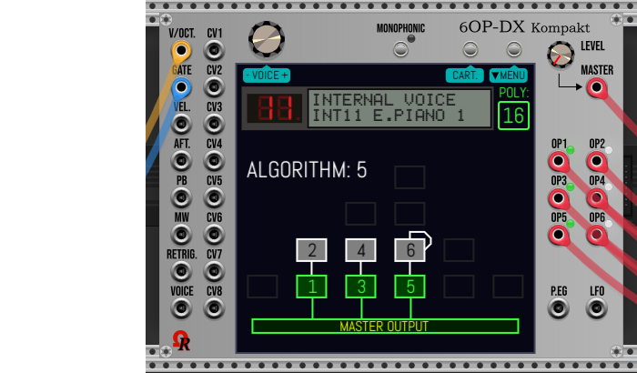

# 6OP-DX KOMPAKT USER'S MANUAL (UNDER CONSTRUCTION)

_The 6OP-DX Kompakt module, Aluminium model, DX7-emulated genuine LCD display:_

This will be the User's Manual for _6OP-DX Kompakt_ module, **34HP** 6-operator algorithm-based FM (PM, phase modulation) synthesizer voice, as "player".

:warning: This manual will be built for future v2.6.15. **As draft at the moment, and may change many times everyday!**

---

### TOPICS

- [**HISTORY**](#history)
- [**TERMINOLOGY**](#terminology)
- [**INTRODUCTION & FIRST WORDS**](#intro)
- [**MODULE SPECIFICATIONS**](#techspecs)

---

### HISTORY

_From English Wikipedia_: The DX7 is a synthesizer introduced by the Japanese Yamaha Corporation in 1983. It was the first successful digital synthesizer and is one of the best-selling synthesizers in history, selling more than 200,000 units.

_The Yamaha DX7 synthesizer_:

Unlike other synthesizers prior it, who are mostly analog synthesizers using substractive synthesis, like the Minimoog (Moog Music), the Prophet 5 (Sequential Circuits), or the Jupiter-8 (Roland), the Yamaha DX7 was the first affordable synthesizer using FM (Frequency Modulation) synthesis.

In fact, the Yamaha DX7 is using a very close FM variant, named **PM** (**Phase Modulation**).

The _6OP-DX Kompakt_ module for VCV Rack 2 will attempt to recreate - as closest as possible - the essence of the DX7 synthesizer (without edit features), but by using modernized technologies, in particular powerful CPUs, and improved sound quality offered by the most recent audio interfaces.

---

### TERMINOLOGY

This topic explains some "unfamiliar" terms and accronyms. Most of them was used by Yamaha company for DX-family synthesizers:

- **Voice** stands for synthesizer preset. Please do not confuse with VCV Rack 2 preset file!
- **Bank** may refer to internal memory or a specific cartridge, hosting 32 voices each.
- **SysEx** stands for MIDI System Exclusive files (.syx extension), can host a whole 32-voice bank (VMEM), or a single voice (VCED).
- **VMEM** is a particular DX7 SysEx _packed_ file format (defined by Yamaha) to store a whole 32-voice bank.
- **VCED** is a particular DX7 SysEx file format (defined by Yamaha) to store a single voice.

---

### INTRODUCTION & FIRST WORDS

Due to its reduced size (regardling its big brother), the _6OP-DX Kompakt_ module doesn't permit to do sound design (voices can't be edited, except **MONOPHONIC** state by its dedicated button above the touchscreen, and the modulation matrix).

To use altered sounds, or make yours from scratch, please use _6OP-DX_ module instead, then save your sound design session to .6opdx file (or export as SysEx), then import the file to _6OP-DX Kompakt_ module.

Also, you'll can use third party software/plugin (or a real DX7 synthesizer) like freeware Dexed (or paid chipsynth OPS7) to create SysEx file, then import it into _6OP-DX Kompakt_ module.

So you'll can consider:
- 6OP-DX (the big) as sound (voice) editor.
- 6OP-DX Kompakt as player, for production in your racks.

Do not forget both _6OP-DX Kompakt_ and _6OP-DX_ modules are **free for everyone** (license keyfile isn't required).

---

### MODULE SPECIFICATIONS

- Designed to operate in VCV Rack 2 (v2.6.6, or higher), "Free" and "Pro" editions.
- Width: 34HP.
- Available models (panel themes): 8 (Aluminium, Stage Repro, Cobalt, Absolute Night, Dark "Signature", Fort Knox "Signature", Oxide "Signature", and Titanium "Signature").
- DX7-emulated display, may be genuine LCD, yellow-backlit LCD retrofit, or OLED retrofit (via right click menu).
- Emulated DX7 v1.8 firmware.
- Full DX7 SysEx files support (either for VMEM 32-voice banks, and VCED single-voice), as import only.
- 32 algorithms (all come from the real DX7 synthesizer), but not selectable.
- 6 operators (each can be enabled or disabled). Extended waveforms (sine, triangle, saw, ramp, square) for voices located in CART3/C3.
- Polyphony: min. 1 channel/monophonic, max. 16 channels.
- Simplified panel.
- Large color OLED **touchscreen** display.
- One multipurpose continuous encoder (above the left-side of the touchscreen).
- MONOPHONIC toggle button, with purple LED (above the center of the touchscreen).
- Two multipurpose momentary buttons (above the right-side of the touchscreen).
- LFO waveforms: triangle, sawtooth (down), sawtooth up (ramp), square, sine, sample & hold.
- Input jacks: 16 (V/OCT, GATE, VELocity, AFTertouch, PB/pitch wheel, MW/modulation wheel, RETRIGger, VOICE, CV1 to CV8).
- FM mode: Phase Modulation (PM) only.
- Frequency response: from 27.5Hz (DX7 A-1 / standard A0), to 8372.018Hz (DX7 C8 / standard C9).
- Band-limiting: up to Nyquist frequency (half of sample rate).
- DAC resolution: advanced 16-bit high-resolution DAC (original 12-bit DAC will be implemented in the future).
- Operational sample rate: recommended 44100Hz/48000Hz, or higher.
- Output jacks: 9 (MASTER output, OP1, OP2, OP3, OP4, OP5, OP6, P.EG, LFO).
- Output voltage ranges: -5V to +5V (10V peak-to-peak).
- Stereo: none (all outputs are mono).
- Polyphonic outputs: yes (up to 16 channels).
- Banks: 4 (named INT, CART1/C1, CART2/C2, CART3/C3), each holds 32 voices.
- Voices: 32 per bank. Individual voice can be imported from external VCED SysEx file.
- SysEx (and .6opdx) files can be imported/opened via right click menu, or by drag and drop (over the touchscreen).
- Bank/voice select by voltage: supported via VOICE input jack (0V to +10V unipolar CV).
- View DX7 settings for selected voice (the viewer displays up to 8 pages, browse by rotating the continuous encoder).
- Global Preferences (via dedicated page, from MENU button), but more restrictive.
- Modulation Matrix (via dedicated page, also from MENU button).
- 8 assignable independent CV input jacks.
- "Keyboard" split and response range (adjustable from Preferences page).
- Quick boot feature: on first installation in the rack, on full reset to factory (**Initialize** command, from right click menu).

---
---
---

## DRAFT

The 6OP-DX Kompakt offers four banks, named **INT**, **CART1**, **CART2**, and **CART3**. Each bank holds 32 voices:
- **INT** (as internal memory). Every operator is using sine waveform only (like the real DX7 synthesizer).
- **CART1** (displayed **C1.**), as cartridge #1. Every operator is using sine waveform only (like the real DX7 synthesizer).
- **CART2** (displayed **C2.**), as cartridge #2. Every operator is using sine waveform only (like the real DX7 synthesizer).
- **CART3** (displayed **C3.**), as cartridge #3. Each operator may use custom waveform: sine (default), triangle, sawtooth, ramp, or square.

:warning: Due to DX7 compatibility, when you import a SysEx file to cartridge #3 (CART3/C3.), affected voice(s) is/are automatically set to **sine** waveform, for all 6 operators.

---

When you bring a fresh 6OP-DX Kompakt module in your rack (from module browser), or after **Initialize** command from right click menu, or via **Ctrl+I** keys shortcut (**Command+I** on MacOS X computers), the internal memory (INT) and all three cartridges (CART 1, CART2, and CART3) are filled by "INIT" voices, after a quick boot sequence.

However, from right click menu, by using VCV Rack 2's **Presets**, then **Factory Presets**, you'll can load prefilled ready-to-play banks (INT, C1/CART1, C2/CART2, and C3/CART3) with official Yamaha DX7 soundbanks (SysEx files).

First preset file (.vcvm) is using respectively **Rom1a** (to **INT**ernal memory), **Rom1b** (to **CART**ridge 1), **Rom2a** (to **CART**ridge 2), and **Rom2b** (to **CART**ridge 3). Selected voice is E.PIANO 1, as INT11 (internal memory, voice number 11).

Second preset file (.vcvm) is using respectively **Rom3a** (to **INT**ernal memory), **Rom3b** (to **CART**ridge 1), **Rom4a** (to **CART**ridge 2), and **Rom4b** (to **CART**ridge 3). Selected voice is E.ORGAN 1, also as INT11.

By loading a proposed factory preset, the default selected voice is automatically switched to **INT 11 E.PIANO 1** (it's the most used factory voice by numerous artists), or **INT 11 E.ORGAN 1**, as indicated by the DX7-emulated display.

The two proposed factory presets are using _Aluminium_ model (panel theme), and genuine DX LCD, exactly like shown below. Obviously, everything can be changed later, including model (panel theme), the DX7-emulated display (may be genuine LCD, yellow-backlit LCD retrofit, or OLED retrofit), global preferences, and the modulation matrix for current selected voice.

You'll can assume these factory presets can be a good start point for your projects who are using one or many 6OP-DX synth voice module(s), without effort.

Of course, you'll can create your own **User Presets** (.vcvm files) and modules selections (.vcvs files), for later reuse.

_Factory Presets, access from right click context menu_:

---
