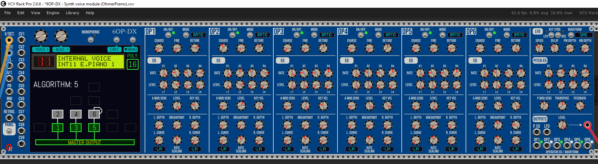

# 6OP-DX MODULE - SPECIFICATIONS & QUICK GUIDE

This is a **117HP** 6-operator algorithm-based FM (PM, phase modulation) synthesizer voice.

:warning: like the 6OP-DX module (as "Alpha" pre-release v2.6.10), this manual is under construction!
