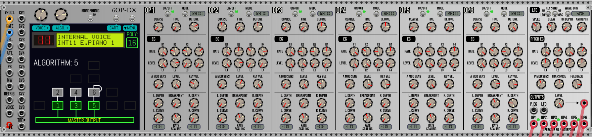
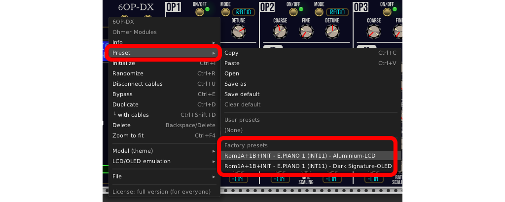

# 6OP-DX USER'S MANUAL (UNDER CONSTRUCTION)

_Both **Factory Presets**, using identical banks and settings. Except models (panel themes) and DX7-emulated display:_

This will be the User's Manual for 6OP-DX module, **117HP** 6-operator algorithm-based FM (PM, phase modulation) synthesizer voice.

:warning: This manual will be built for future v2.6.14. **As draft at the moment!**

---

The 6OP-DX offers 4 soundbanks, named INT., C1./CART1, C2./CART2, and C3./CART3, each bank can hold 32 voices:
- INT (as internal memory). Each operator is using sine waveform only (like the real DX7 synthesizer).
- C1 (CART1), as cartridge #1. Each operator is using sine waveform only (like the real DX7 synthesizer).
- C2 (CART2), as cartridge #2. Each operator is using sine waveform only (like the real DX7 synthesizer).
- C3 (CART2), as cartridge #3. Each operator can use custom waveforms: sine (default), triangle, sawtooth, ramp, or square.

:warning: Due to DX7 compatibility, when you import a SysEx file to CART3 (cartridge #3), affected voices are automatically set to **sine** waveforms.

---

When you bring a new 6OP-DX module instance in your rack (from module browser), the internal memory (INT) and all three cartridges (CART 1, CART2, and CART3) are empty, the four banks are filled by 32 "INIT" voices).

However, by using VCV Rack 2's **Presets** feature from right click menu, then **Factory Presets**, you'll can load prefilled ready-to-play banks (INT, C1/CART1, C2/CART2, and C3/CART3) with official Yamaha DX7 soundbanks (from official DX7 SysEx), respectively **Rom1a** (to **INT**ernal memory), **Rom1b** (to **CART**ridge 1), **Rom2a** (to **CART**ridge 2), and **Rom2b** (to **CART**ridge 3). This is useful in case you'd like to use the official DX7 voices/presets quickly, without sound design sessions!

:warning: By loading a proposed factory preset, please notice all banks of 32 voices are replaced by Rom1a, Rom1b, Rom2a, and Rom2b! So, don't forget to save your stuff prior to open a VCV Rack preset file!

By loading a proposed factory preset, the default selected voice is set to **INT 11 E.PIANO 1** (the most used factory voice by numerous artists), as indicated by the DX7-emulated display. 

You'll can choose either _Aluminium_ model (with genuine DX LCD), or _Dark "Signature"_ model (with OLED DX display), like shown at the top of this page. Of course, everything can be changed later, including model (panel theme) and DX7-emulated display (may be genuine LCD, backlit LCD, or OLED retrofit). You'll can assume any factory preset as a good start point for your project who are using 6OP-DX synth voice module.

---
