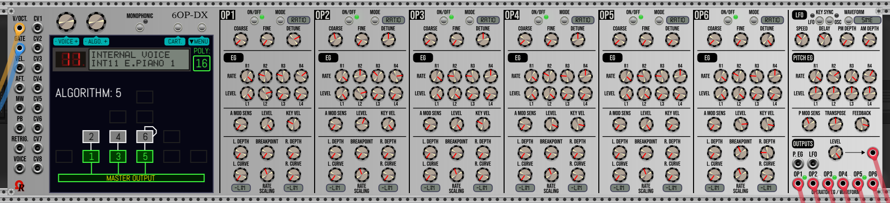
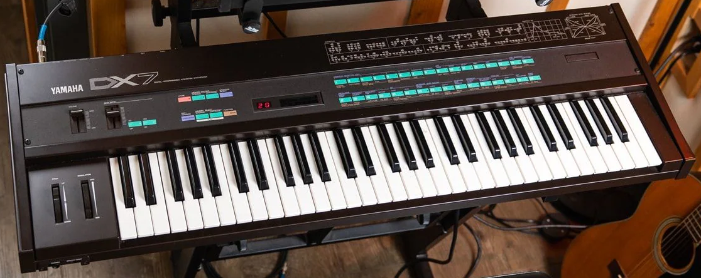

:warning:

Empty displays, all LED always turned off, no extra right click menu, module is looking "dead", [**PLEASE CLICK HERE!**](https://github.com/DomiKamu/OhmerPrems/blob/v2/README.md) (top of page).

:warning: **MacBook users:** in case the main panel isn't displayed (look as missing panel texture), please set **UI Scale** setting to **Auto** (or **100%**), and **Zoom** level to **100%**, from **View** menu. It's a not a DeXtral specific graphic issue, this bug occurs on any large module, whatever the module brand!

---

# DEXTRAL USER'S MANUAL (UNDER CONSTRUCTION)

_The DeXtral module, Aluminium model, DX7-emulated genuine LCD display:_

This will be the User's Manual for DeXtral module, **117HP** polyphonic 6-operator algorithm-based FM (PM, phase modulation) synthesizer voice.

:warning: This manual will be built for future v2.6.15. **As draft at the moment, and may change many times everyday!**

---

### TOPICS

- [**HISTORY**](#history)
- [**TERMINOLOGY**](#terminology)
- [**INTRODUCTION & FIRST WORDS**](#intro)
- [**MODULE SPECIFICATIONS**](#techspecs)

...below temporary draft section...

- [**MOD. KEY**](#modkey)
- [**MODULATION MATRIX: NOT SUPPORTED TARGETS**](#notsupptargs)
- [**MODULATION MATRIX: FAST TARGET ASSIGNMENT**](#fastassign)

---

### HISTORY

_From English Wikipedia_: The DX7 is a synthesizer introduced by the Japanese Yamaha Corporation in 1983. It was the first successful digital synthesizer and is one of the best-selling synthesizers in history, selling more than 200,000 units.

_The Yamaha DX7 synthesizer_:

Unlike other synthesizers prior the DX7, who are mostly analog synthesizers (using substractive synthesis), like the Minimoog (Moog Music), the MS-20 (Korg), the ARP 2600 (ARP Instruments), the Prophet 5 (Sequential Circuits), the Jupiter-8 (Roland), and many more, the Yamaha DX7 becomes the first affordable synthesizer using FM (Frequency Modulation) synthesis during 1983.

Frequency modulation (FM) synthesis was developed mainly by [John Chowning](https://en.wikipedia.org/wiki/John_Chowning) since 1967. The first synthesizer who have used the FM synthesis was the Synclavier, manufactured by New England Digital Corp.

In fact, the Yamaha DX7 is using a very close FM variant, named **PM** (**Phase Modulation**).

The DX7 synthesizer was used by many famous artists, like Phil Collins, Michael Jackson, Elton John, George Michael, Sade, A-ha, Prince, Tina Turner, Whitney Houston, Chicago, Billy Ocean, Harold Faltermeyer (Beverly Hills Cop theme, Top Gun Anthem), Genesis, Bon Jovi, Madonna, Stevie Wonder, Level 42, Queen, Berlin (Take My Breath Away), Brian Eno, and more!

The _DeXtral_ module for VCV Rack 2 will attempt to recreate - as closest as possible - the essence of the DX7 synthesizer, but by using modernized technologies, in particular powerful CPUs, and improved sound quality offered by the most recent audio interfaces.

---

### TERMINOLOGY

This topic explains some "unfamiliar" terms and accronyms. Most of them was used by Yamaha company for DX-family synthesizers:

- **Voice** stands for "synthesizer preset" (please do not confuse with VCV Rack 2 preset file).
- **Bank** may refer to internal memory or a specific cartridge, hosting 32 voices each.
- **SysEx** stands for MIDI System Exclusive files (.syx extension), can host a whole 32-voice bank (VMEM), or a single voice (VCED).
- **VMEM** is a particular DX7 SysEx _packed_ file format (defined by Yamaha) to store a whole 32-voice bank.
- **VCED** is a particular DX7 SysEx file format (defined by Yamaha) to store a single voice.

Proprietary binary file formats provided by both _DeXtral_ and _DeXtral Kompakt_ modules, are useful to store and recall DX7 synthesizer parameters, plus **extended features** (who are not supported by DX7 SysEx):

- **.dexvoice** can be used to store a single-voice, including OP ON/OFF states, and its modulation matrix.
- **.dexcart** can be used to store a 32-voice cartridge (soundbank), including OP ON/OFF states, and all modulation matrices.
- **.dexsynth** can be used to store **all synthesizer settings**, including OP ON/OFF states, all modulation matrices, and global preferences.

---

### INTRODUCTION & FIRST WORDS

The _DeXtral_ module is the "control tower" of DX7 in the OhmerPrems ecosystem!

Despite its very huge size for an Eurorack module (117HP wide), its avantage is to propose all DX7 parameters behind your eyes, without need to navigate between ton of menus/submenus... Most DX7 parameters are potentiometers (few of them are momentary buttons to toggle a state (on/off), one to select the LFO waveform).

This _DeXtral_ module is mainly useful to prepare your DX7 synthesizer file(s) you'll need in your project (can be single-voice files, 32-voice cartridge files, or full synthesizer files). When your sound design session is completed (and of course, saved), you'll can replace the huge _DeXtral_ module by its compact variant, the _DeXtral Kompakt_, in order to save signifiant space in your rack. Of course, you'll must open appropriate file(s), either **.dexsynth** file (single-voice), **.dexcart** file (32-voice cartridge), or **.dexsynth** file (entire synthesizer), previously made by any _DeXtral_ module. Please read [DeXtral Kompakt User's Manual](https://github.com/DomiKamu/OhmerPrems/blob/v2/docs/modules/DeXtral-Kompakt/Manual.md) for more details about this thinner module!

Also, you'll can prepare your custom DX7 soundbank or single-voice, then export it as _VMEM_ SysEx (32-voice soundbank) or _VCED_ SysEx (single-voice), in order to import it to real DX7 synthesizer (the DX7 always uses MIDI channel 1 for SysEx transfers, also, MEMORY PROTECT must be disabled prior to import), or to another DX7-compatible software capable to interpret DX7 SysEx files, like freeware [**Dexed**](https://asb2m10.github.io/dexed/), or commercial [**Arturia's DX7 V**](https://www.arturia.com/products/software-instruments/dx7-v/overview) / [**Plogue's chipsynth OPS7**](https://www.plogue.com/products/chipsynth-ops7.html).

You can consider:
- **DeXtral** (the huge module) either as voice synthesizer **AND** as full DX7 voice (sound) editor for sound design.
- **DeXtral Kompakt** module, as voice synthesizer for final production in your rack (mainly to save space!).

:information_source: Both _DeXtral_ and _DeXtral Kompakt_ modules are capable to create/edit the modulation matrix, for each voice, save/load single-voice **.dexvoice** files, save/load 32-voice cartridge **.dexcart** files, and save/load full synthesizer **.dexsynth** files. However, the _DeXtral Kompakt_ module cannot edit DX7 synthesizer parameters, and cannot export to DX7 SysEx files, otherwise, they're no more signifiant differences between both modules!

---

:information_source: Do not forget both _DeXtral_ and _DeXtral Kompakt_ modules are **free for everyone** (license V2 keyfile isn't required).

---

### MODULE SPECIFICATIONS

- Designed to operate in VCV Rack 2 (v2.6.6, or higher), "Free" and "Pro" editions.
- Width: 117HP.
- Synthesis: Phase Modulation (PM), based on sine waveforms only (like the original DX synthesizer).
- Available models (panel themes): 8 (Aluminium, Stage Repro, Cobalt, Absolute Night, Dark "Signature", Fort Knox "Signature", Oxide "Signature", and Titanium "Signature").
- DX7-emulated display, may be genuine LCD, yellow-backlit LCD retrofit, or OLED retrofit (via right click menu).
- Emulated DX7 v1.8 firmware.
- 32 algorithms (all come from the real DX7 synthesizer).
- 6 operators (each can be enabled or disabled).
- Polyphony: min. 1 channel/monophonic, max. 16 channels.
- All synthesizer settings are accessible on single panel (no DX7 menus/submenus).
- Large color OLED **touchscreen** display.
- Two multipurpose continuous encoders (above the left-side of the touchscreen).
- MONOPHONIC toggle button, with purple LED (above the center of the touchscreen).
- Two multipurpose momentary buttons (above the right-side of the touchscreen).
- LFO waveforms: triangle, sawtooth (down), sawtooth up (ramp), square, sine, sample & hold.
- Input jacks: 16 (V/OCT, GATE, VELocity, AFTertouch, PB/pitch wheel, MW/modulation wheel, RETRIGger, VOICE, CV1 to CV8).
- Frequency response: from 27.5Hz (DX7 A-1 / international A0), to 8372.018Hz (DX7 C8 / international C9).
- Band-limiting: up to Nyquist frequency (half of sample rate).
- Output jacks: 9 (MASTER output, OP1, OP2, OP3, OP4, OP5, OP6, P.EG, LFO).
- Output voltage ranges: -5V to +5V (10V peak-to-peak).
- Stereo: none (all outputs are mono, but polyphonic).
- Polyphonic outputs: yes (up to 16 channels).
- Operational sample rate: recommended 44100Hz/48000Hz, or higher.
- DAC resolution: 24-bit high-resolution DAC (original 12-bit DAC will be implemented in future release).
- Banks: 4 (named INT, CART1/C1, CART2/C2, CART3/C3), each holds 32 voices.
- Voices: 32 per bank, all are fully customizable (can be imported/exported from/to VMEM SysEx file, or loaded/saved from/to DeXtral binary file).
- Individual voice can be exported/imported to/from VCED SysEx file.
- Full DX7 SysEx files support (either for VMEM 32-voice banks, and VCED single-voice), as import and as export.
- Full DeXtral files support (**.dexsynth** for entire synthesizer, **.dexcart** for 32-voice cartridge, with extended features such modulation matrices and operator ON/OFF switch states - these features are not supported by DX7 SysEx).
- DX7 SysEx, **.dexvoice**, **.dexcart**, and **.dexsynth** files also can be imported/loaded by drag and drop (drop the file on the touchscreen).
- Bank/voice select by voltage: supported via discrete VOICE input jack (0V to +10V unipolar CV).
- 8 assignable CV input jacks (assigments via modulation matrix).
- Modulation Matrix (via MENU button): each voice can use up to 28 customizable modulations.
- Modulation sources: 12, via input jacks (VEL., AFT., MW, PB, CV1, CV2, CV3, CV4, CV5, CV6, CV7, CV8).
- Modulation targets: 118 (most DX7 parameters, plus EG BIAS).
- Modulation ranges: -100% to +100% (applying an offset), or 0 to 100% (absolute modulation, replace the parameter given by its potentiometer).
- Modulation effect can be inverted (via. INV. checkbox), and can be temporary disabled.
- Global preferences (via dedicated screen). Access from MENU button.
- Intuitive graphic envelope editor (OP AMP envelopes, PITCH envelope).
- Learnable (by using V/OCT and GATE attached to an external MIDI controller) OPerator BREAKPOINT setting (per operator).
- Optional pitch split point, and virtual keyboard response part (above or below split point), adjustable from "Preferences" screen.
- Mod key (default is left Control / left Command on MacOS X computers), can be changed from "Preferences".
- Touchscreen brightness: adjustable from "Preferences" screen.
- Motorized potentiometers, adjustable from "Preferences". OUTPUT LEVEL potentiometer isn't motorized.
- VCV Rack 2 Presets (.vcvm) support: Not supported (due to very huge amount of saved datas).
- VCV Rack 2 Modules Selections (.vcvs) support: Not supported (due to very huge amount of saved datas).
- Quick boot feature: on first installation in the rack, on full reset to factory (**Initialize** command, from right click menu).

---
---
---

## DRAFT

The DeXtral module can host 4 banks at the same time, named **INT**, **CART1**, **CART2**, and **CART3**. Each bank hosts 32 voices:
- **INT** (as internal memory).
- **CART1** (displayed **C1.**).
- **CART2** (displayed **C2.**).
- **CART3** (displayed **C3.**).

---

When you bring a fresh DeXtral module in your rack (from module browser), or after **Initialize** command from right click menu, or via **Ctrl+I** keys shortcut (**Command+I** on MacOS X computers), the internal memory (INT) and all three cartridges (CART 1, CART2, and CART3) are filled by "INIT" voices.

However, you can download (and extract anywhere you'd like) two whole synthesizer binary files with prefilled banks (**.dexsynth** files).

First **.dexsynth** file is using respectively **Rom1a** (to **INT**ernal memory), **Rom1b** (to **CART**ridge 1), **Rom2a** (to **CART**ridge 2), and **Rom2b** (to **CART**ridge 3). Selected voice is BASS 1, as INT 1 (internal memory, voice number 1).

Second **.dexsynth** file is using respectively **Rom3a** (to **INT**ernal memory), **Rom3b** (to **CART**ridge 1), **Rom4a** (to **CART**ridge 2), and **Rom4b** (to **CART**ridge 3). Selected voice is FLUTE 1 (also as INT 1, the first voice of the bank).

All modulation matrices are empty.

You'll can assume these factory **.dexsynth** files can be a good start point for your projects who are using one or many DeXtral synth voice module(s), without effort.

:warning: **Due to very large amount of saved datas (approx. 300 kilobytes in "json", for full synthesizer), both DeXtral and DeXtral Kompakt modules don't support VCV Rack 2 Presets (.vcvm files) nor modules selections (.vcvs files).** Unfortunately it's due to VCV Rack 2 technical limitation. Both modules are using binary packed files to hold datas in saves, instead!

---

### MOD. KEY

**Mod. key** stands for **modifier key**, but also... considered as **modulation key** shortcut!

Default factory is the **Tab** key, because **left Control** (**left Command** on MacOS X computers) are used by VCV Rack 2 core to do fine potentiometer adjustments, when held, also **Alt** keys (**Option** keys on MacOS X computers) are reserved by VCV Rack 2 core to scroll the view in the rack by moving the mouse cursor, and **left Shift** is used by VCV Rack 2 core to do coarse (high speed rotation) potentiometer adjustments.

:information_source: Mod. key can be changed from **Preferences** screen. Instead of default **Tab** key, mod. key would be, as 2nd choice, **left Control** (**left Command** on MacOS X computers) but it's not recommended due to potential conflict vs. VCV Rack 2 _fine potentiometer adjust_ feature. Other possible key, as 3rd choice, would be the **T** letter key (unfortunately, **M** - for **M**odulation - is not possible, due to different mappings between localized keyboards).

The _DeXtral_ module can use the mod. key in three situations:

- By hovering a supported DX7 parameter (potentiometer), then by pressing/hold the mod. key, then touching the potentiometer, this add the related DX7 parameter as modulation "target" in first available modulation "slot" (if, at least, one modulation is available). Please read [**MODULATION MATRIX: FAST TARGET ASSIGNMENT**](#fastassign) topic for more details...

- Either _DeXtral_ and _DeXtral Kompakt_ module accepts the **mod. key** (can be also **left Control** / **left Command** on MacOS X computer) usage from **Modulation Matrix** screen, over **SOURCE** and **TARGET** boxes: when the source or target box is hovered by mouse cursor, its box (and parameter name inside) are highlighted as **yellow** color (instead of cyan): by "touching" the box (left-mouse button click) **while the mod. key (or left Control / left Command) is held**, this jump to the next pertinent "group" (e.g. for targets: EG BIAS, first operator COARSE, first LFO speed, first PITCH envelope RATE1, P MOD SENS, TRANSPOSE, FEEDBACK, then cycle to "not set", then EG BIAS again, an so on), instead of browsing all 90 possible DX7 parameters, sequentially, who is a tedious task. It's not the best way, but a better way to reach the desired target more quickly (and reduce the required amount of left-mouse button clicks over the target box!)

- Either _DeXtral_ and _DeXtral Kompakt_ module accepts the **mod. key** (can be also **left Control** / **left Command** on MacOS X computer) usage from **Modulation Matrix** screen (as touchscreen), over the **min./max. ranges fader** (when hovered by mouse cursor, the fader group is highlighted as **yellow** color, instead of cyan when the focus is lost): **while the mod. key (or left Ctrl / left Command) is held**, this will force the module's logic to edit the **min.** value, instead of the nearest (regardling mouse cursor position vs. mix. and max. settings), or the max. value in case of doubt!

---

### MODULATION MATRIX: NOT SUPPORTED TARGETS

Following DX7 parameters cannot be possible modulation target:

- OP SWITCH (operator on/off toggle button).
- OP MODE (RATIO/FIXED toggle button).
- OP EG LEVELs (L1, L2, L3, L4) potentiometers.
- OP BREAKPOINT potentiometer (displayed as "BREAK POINT=" on DX7-emulated LCD/OLED display).
- OP L. CURVE potentiometer.
- OP R. CURVE potentiometer.
- LFO KEY SYNC toggle button.
- OSC KEY SYNC toggle button.
- LFO WAVEFORM selector button.
- PITCH EG LEVELs (L1, L2, L3, L4) potentiometers.
- OUTPUT LEVEL potentiometer (master volume).

---

### MODULATION MATRIX: FAST TARGET ASSIGNMENT

:warning: **The following procedure is applicable to _DeXtral_ module only (_DeXtral Kompakt_ module doesn't embed DX7 potentiometers!)**

To do a quick assign of DX7 parameter as "target" into a new modulation slot:

- Place the mouse cursor over the DX7 parameter (related potentiometer) you'll want to assign as modulation target.
- Press & hold the mod. key: a **fast blinking purple square** surrounding the potentiometer confirms the selected DX7 parameter.
- Touch the potentiometer (left-mouse button click) to create new modulation, by using it as modulation target.

By doing this action, the module's logic adds a new modulation "slot" (operation is ignored if the limit of existing modulations - 28 - was previously reached), then the **Modulation Matrix** screen is automatically invoked. New modulation is always located at the bottom of the display (the lastest who have a red cross touchable icon). The selected DX7 parameter is defined as modulation target (instead of empty). However, you'll must define the modulation source, the amount (via its fader), the 'behavior' of the modulation (by default, **ABSOLUTE**, but can be **RELATIVE**, or temporary... **DISABLED**), and optionally the **INV.** checkbox state, all as required.

In the event that the mouse cursor leaves the potentiometer, the mod. key is automatically disarmed: by this way, you'll must release the mod. key, then press it again over relevant DX7 potentiometer.

The **fast blinking purple square** doesn't appear if the hovered DX7 potentiometer can't be modulated (can't be modulation target), when you press the mod. key over it.

:warning: Please remember all button-based DX7 parameters, any envelopes **LEVEL**, **OP BREAKPOINT**, **OP L. CURVE** and **OP R. CURVE** potentiometers (for any operator), and the **OUTPUT LEVEL** (master) potentiometer, cannot become a modulation target!
