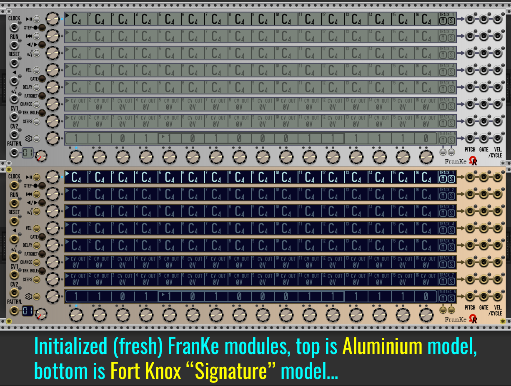

**FRANKE MODULE - SPECIFICATIONS & QUICK GUIDE (UNDER CONSTRUCTION)**

As kind of complement of _FroeZe_ trigger-based sequencer (used mainly for drum machines, percussions and trigger outputs), _FranKe_ module is a 80HP analog step-sequencer, as requested by an (2019) OhmerPrems member!

_FranKe_ (a tribute to [Christopher Franke](https://en.wikipedia.org/wiki/Christopher_Franke), member of Tangerine Dream band during best-known mid-1970s lineup) - is providing 64 patterns, 8 tracks per pattern, 16 steps per track.

Tracks are versatile, any track may be "melodic" (by using notes, from C-1 to G9 with possible flat/sharp accidentals), free-to-use CV voltages (named **CV OUT** track) who can send voltages of your choice (from -10V to +10V range, by 0.01V resolution), or a 16-bit Turing Machine. Please consider a track role is always common to all patterns.

By default as fresh module added in your rack, or after **Initialize** command from module's contextual menu (**Ctrl**+**I** / **Cmd**+**I** on Mac, as keyboard shorcut), tracks 1 to 5 are melodic (all steps are filled by C4 notes with 100% maxed velocities, 50% gates, no delay, no ratchet, 100% chance), tracks 6 and 7 are **CV OUT** to send sequenced modulations (all steps are filled by 0V, 50% gates, no delay, no ratchet, 100% chance), and track 8 is set as 16-bit Turing Machine (TM) with a random (locked) sequence (16 as sequence lenght, 100% voltage scale, floor octave is 4, no quantization, 50% gate, no delay, speed is x1).

To change a track role anytime, first select the track (either by touching its **TRACK encoder**, or by touchine its related **touchscreen**), then press **TRK. ROLE** (track role) momentary button (located near "CV1" input jack) once, or many times as required, in order to switch between roles, with cycles (melodic -> CV OUT -> Turing Machine -> melodic ...).

Each track (row, or "line") have its **PITCH**, +10V **GATE**, and (optional to use) **VELocity** (or +10V 1ms **CYCLE** trigger) output jacks, all are located at the right side of _Franke_ module. Please consider **VEL**ocities are applicable only for melodic (notes-based) tracks, for other roles, a **+10V 1ms** trigger is send as **CYCLE** when the related track is restarting (repeat) its own sequence, instead.

:warning: **FranKe module is not an instrument**, but a voltage-based (analog) step-sequencer, who sends pitch voltages ("V/Oct" compliant) or free voltages, 0V/+10V gates, and possibly velocities voltages, in order to control other modules, such VCO, synth voice, enveloppe generator, VCA, and any module you'll want:
- **PITCH** to any sound source module, like oscillator (VCO), synth voice, sampler, etc... who have **V/OCT** (or **PITCH**) input jack, or CV input of any module you'd like.
- **GATE** who output 0V or +10V gate voltages, mainly to control an envelope generator, or any module can be controlled by +10V gate voltage.
- **VEL./CYCLE** (usage is optional), who output additional CV regardling the velocity of related note event (melodic track only, green LED), otherwise the jack outputs cycle **+10V 1ms trigger** (blue LED, instead).

Like future (still in development) [6OP-DX synth voice module](../6OP-DX/Manual.md), FranKe provides 8 different models (aka GUI theme variations), shown above, compliant with **Prefer dark panels if available** VCV Rack's global setting (from **View** menu, since VCV Rack v2.4.0), as proposition from module's browser. Existing models are **Aluminium** (it's the default model if _Prefer dark panels if available_ is unchecked), **Stage Repro** (red theme), **Cobalt** (blue theme), **Absolute Night** (it's the default model if _Prefer dark panels if available_ is checked), **Dark "Signature"**, **Fort Knox "Signature"**, **Oxide "Signature"**, and **Titanium "Signature"**.

All four "Signature" models embed gold metal jacks, momentary buttons, and screws, and eight OLED touchscreens.

All four Non-"Signature" models embed silver metal jacks, momentary buttons, and screws, and eight LCD touchscreens (_Absolute Night_ model provides a - dimmable - yellow backlit LCD, however).

Obviously, all models are offering exactly the same features!

:warning: _FranKe_ module is under development, it will be available "soon" (planned as public release Friday April 17th, 2026).

----

Free version (without license V2 keyfile) is working as **full player** (meaning it can play any patch made by OhmerPrems member, without restrictions). However, without a valid license V2 keyfile, **only track 1 can be edited on patterns 01 and 02 only**, all other tracks (and whole patterns from 03 to 64) are locked against edition, including "Randomize" feature for selected pattern (from module's contextual menu ** Randomize** command, or **Ctrl**+**R** / **Cmd**+**R** on Mac keyboard shortcuts). Also, Turing sequence on track 1 (pattern 01 and 02) can be edited, exported, and imported (to track 1 only), all others still locked, until you'll become OhmerPrems member. Track role (via **TRK. ROLE** momentary button) can be changed on track 1 only (from any pattern), as testing purposes!

All stuff made on _Franke_ module is always saved and recalled.

----

Following explanations in this _FranKe user's guide_ will assume a **full version** with a valid license V2 keyfile (reserved to OhmerPrems members exclusively).

Due to limitation by current VCV Rack 2 API (today v2.6.6), _FranKe_ module doesn't support _preset_ (.vcvm) and _module selection_ file (.vcvs) features, as long as _onSave()_ and _onAdd()_ C++ methods aren't supported for preset files and module selection files. However, you'll can save and load whole sequencer state to/from separate file (like you can do for a document). Due to important amount of saved datas, _FranKe_ module uses a **packed & encrypted binary file** (instead of json), also for datas integrity (file is always checked after save), and protection against "file patching" (by file encryption and strong cryptographic hashings).
