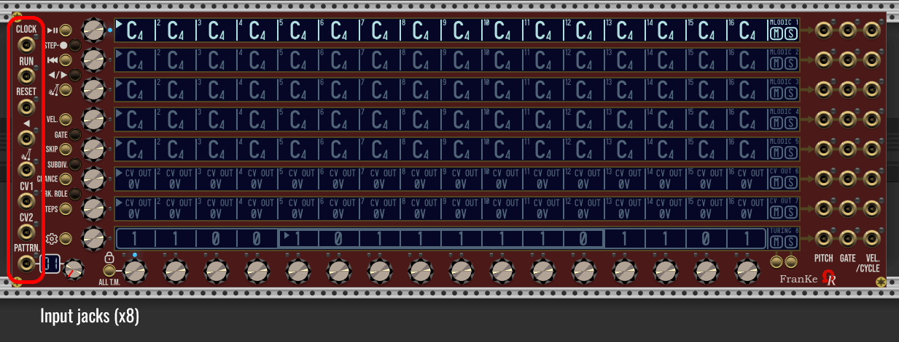
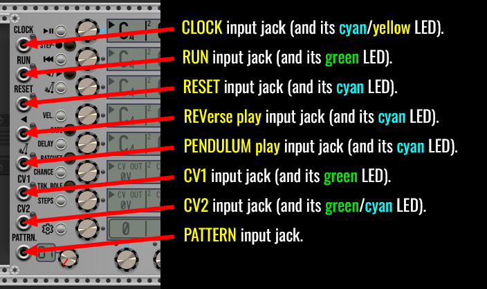
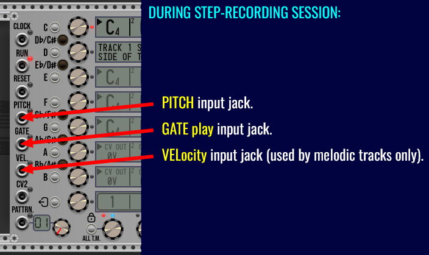
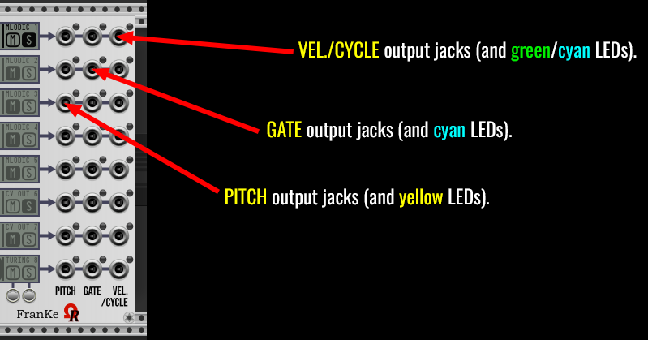
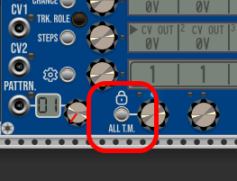

# FRANKE: USER'S MANUAL (UNDER CONSTRUCTION)

As kind of "complement" of _FroeZe_ trigger-based sequencer (used mainly for drum machines, percussions and trigger outputs), _FranKe_ module is a 80HP analog step-sequencer, as requested by an (2019) OhmerPrems member, for particular projects!

_FranKe_ (a tribute to [Christopher Franke](https://en.wikipedia.org/wiki/Christopher_Franke), member of Tangerine Dream band during best-known mid-1970s lineup) - is providing **64 patterns**, **8 tracks** per pattern, **16 steps** per track.

Tracks are versatile, any track may be "melodic" (by using notes, from **C-1** to **G9** with possible flat/sharp accidentals), free-to-use CV voltages (named **CV OUT** track) who can send voltages of your choice (from -10V to +10V range, by 0.01V resolution) for sequenced modulations, or a 16-bit Turing Machine (useful for generative patches).

Please consider a track role is always common to all 64 patterns.

By default as fresh module added in your rack, or after **Initialize** command from module's contextual menu (**Ctrl**+**I** / **Cmd**+**I** on Mac, as keyboard shorcut), tracks 1 to 5 are melodic (all steps are filled by C4 notes with 100% maxed velocities, 50% gates, no delay, no ratchet, 100% chance), tracks 6 and 7 are **CV OUT** to send sequenced modulation voltages (all steps are filled by 0V, 50% gates, no delay, no ratchet, and 100% chance), and track 8 is set as 16-bit Turing Machine (TM) with a random (locked) sequence (16-bit as sequence lenght, 100% voltage scale, floor octave 4, no quantization, 50% gate, no delay, speed x1 of tempo).

To change a track role anytime, first select the track (either by touching its **TRACK encoder**, or its related **touchscreen**), then press **TRK. ROLE** (track role) momentary button (located near "CV1" input jack) once, or many times as required, in order to switch between roles (with cycles), like melodic -> CV OUT -> Turing Machine -> melodic ...

While the sequencer is running, all tracks (including unused roles) are impacted, despite 8 are active ("audible", aka active role), a total of 24 tracks are sequenced at the same time (8 tracks x 3 roles).

Each track (row, or "line") have its **PITCH**, +10V **GATE**, and (optional to use) **VELocity** (or +10V 1ms **CYCLE** trigger) output jacks, all are located at the right side of _Franke_ module. Please consider **VEL**ocities are applicable only for melodic (notes-based) tracks, for other roles, instead, a **+10V 1ms** trigger is send as **CYCLE** when the related track is restarting its sequence (this feature is useful to control a sequential switch module, for example).

:warning: **FranKe module is not an instrument**, but a voltage-based (analog) step-sequencer, who sends pitch voltages ("V/Oct" compliant) or free voltages, 0V/+10V gates, and possibly velocities voltages, in order to control other modules, such VCO, synth voice, enveloppe generator, VCA, VCF cutoff/resonance, and... any module you'll want to control via sequenced velocities. Please consult OUTPUT JACKS section for more details.

Like future (still in development) [6OP-DX synth voice module](../6OP-DX/Manual.md), FranKe provides 8 different models (aka GUI theme variations), shown as animation on the top of this manual. Model is compliant against **Prefer dark panels if available** VCV Rack's setting (from **View** menu) as proposition from module's browser. Existing models are **Aluminium**, (it's the default model if _Prefer dark panels if available_ setting is disabled/unchecked), **Stage Repro** (red theme), **Cobalt** (blue theme), **Absolute Night** (it's the default model if _Prefer dark panels if available_ setting is enabled/checked), **Dark "Signature"**, **Fort Knox "Signature"**, **Oxide "Signature"**, and **Titanium "Signature"**.

All four "Signature"-line models embed **gold metal** jacks, momentary buttons, and screws, 8 **OLED** touchscreens, OLED mini-display for pattern.

All four Non-"Signature" models embed **silver metal** jacks, momentary buttons, and screws, and 8 **LCD** touchscreens, LCD mini-display for pattern. _Absolute Night_ is a lone model who provides a **dimmable yellow-backlit LCD** displays, however. Bright/dim can be toggled by clicking over the "Ohmer logo" as hotspot - indicated by the animation above).

Obviously, all models are offering exactly the same features!

:information_source: _FranKe_ module is under development. Now available as **BETA pre-release (v2.6.9)**.

----

### Free/Trial version (without a valid license V2 keyfile) have many limitations (restrictions)!

:information_source: The following information about Free/Trial don't concern OhmerPrems members (owner of a valid license V2 keyfile).

They're two scenarios:

- Scenario 1/ In case you're loading a shared patch (.vcv file) made by OhmerPrems member (who are using full version for him/her), and if the patch file embeds one (or many) _FranKe_ module instance(s), all of these instances are working as **full player**, meaning these modules are able to playback without any restriction. However, **everything** is locked against edition, including MUTE and SOLO states (individual and global), CV assignments (from module's SETUP), reverse and pendulum playback by momentary button (who affect selected track only), track role, randomization, module reset (via **Initialize** command from module's contextual menu, or **Ctrl**+**I** / **Cmd**+**I** on MacOS X, as keyboard shortcut), pattern/track copy/paste operations, and any file operation.

- Scenario 2/ In case you add a new instance of _FranKe_ module in the rack, from the "fresh" added module, patterns from 03 to 64 can't be selected/reached (either by potentiometer, or by voltage). From patterns 01 and 02, **only tracks 1 and 2 can be edited**, all other tracks (from 3 to 8) are locked against edition, including "Randomize" (from module's contextual menu ** Randomize** command, or **Ctrl**+**R** / **Cmd**+**R** on MacOS X, as keyboard shortcut), **PITCH outputs for tracks 3 to 8 are constant -10V**, CV1 and CV2 may be assigned, but their actions are restricted to tracks 1 and 2 only. Turing Machine sequences on tracks 1 or track 2 can be edited and saved (and later, loaded to track 1 or 2). Track role (via **TRK. ROLE** momentary button) can be changed for tracks 1 and 2 only. Also, many contextual menu entries concerning track, pattern, copy/paste and file operations may be disabled (grayed), depending the module's context when the contextual menu is pulled down (by right-mouse button click over the module). All others still locked/disabled, until you'll become OhmerPrems member!

All stuff made on _Franke_ module is always saved and recalled, including Turing Machine states (whatever locked, or not, as explained in TURING MACHINE section, later).

----

Following explanations from this _FranKe module User's Manual_ assume you're using the **full version of the OhmerPrems plugin** (by using a valid license V2 keyfile, exclusively reserved to OhmerPrems members).

:warning: Due to limitation by current VCV Rack 2 API (v2.6.6, today), unfortunately _FranKe_ module doesn't support _presets_ (.vcvm) and _module selections_ (.vcvs) files features, as long as _onSave()_ and _onAdd()_ C++ methods aren't natively supported for both preset and module selection files. However, you'll can save (and load) whole sequencer state "as-is" to/from separate file, like you can do for any document (also, as explained later in this manual, you'll can save/load a particular pattern. Also, you'll can save (and load) any track to/from separate file, whatever its role (this include any Turing Machine track).

:information_source: Due to important amount of saved datas, _FranKe_ module is using a **packed binary file** (instead of json who are causing signifiant lags during autosave feature, every 15 seconds). Also, for data integrity checkings (the binary file is always checked after save, and saved again if necessary). To avoid intentional "binary file patching" (to attempt to bypass editing limitations by Demo/Trial), all file operations are using file encryption algorithms, and strong _cryptographic hashing_ checking functions! Any corrupter file will reset the module entirely (all of its datas are lost).

----

### TOPICS

- [**THE MODULE LAYOUT**](#layout)
- [**INPUT JACKS**](#inputs)
- [**OUTPUT JACKS**](#outputs)
- [**LEFT-SIDE MOMENTARY BUTTONS**](#lsmbuttons)
- [**LOCK ALL T.M. MOMENTARY BUTTON**](#tmlockmbutton)
- [**CLOCK SOURCE**](#clocking)

---

### THE MODULE LAYOUT

Following animation is showing major parts of the _FranKe_ module (5 seconds per image):

---

### INPUT JACKS

All 8 input jacks are located at the left side of the module (arranged vertically).

Description of each, from top to bottom:

**CLOCK** input jack can be patched (connected) to any clocking source module, or similar (may be a LFO, manual CV source, master or slave clock module), who produces +10V 1ms triggers (also named _pulses_), or analog voltage (BPM-CV technique, more stable and instant for variations). Clock source nature can be changed from module's SETUP, by pressing the SETUP button (located just above PATTERN mini-display, the button have a printed "gear" on module's plate), by using TRACK 2 continuous encoder (bold setting at left side of display is always the current setting).

**RUN** input jack can be patched to any digital module capable to send +10V 1ms triggers, or +10V gate. From module's SETUP, the TRACK 4 display is indicating how the RUN input is set: as transport toggle (by triggers) - as default setting, or by continuous (held) +10V gate (the sequencer runs while +10V gate is applied on RUN jack, then pauses as soon as the gate voltage falls below +0.1V).

:warning: While RUN jack is patched, and configured as **RUN WHILE +10V GATE**, the transport (PLAY/PAUSE) momentary button becomes inoperative. This behavior is normal!

**RESET** input jack can be patched to any digital module capable to send +10V 1ms triggers. When the RESET jack receives a trigger signal, all tracks return to the beginning of their respective sequences (this will be explained in the sequencer topic, below).

**REVerse play** input jack can be patched to any digital module capable to send +10V gate. While the voltage is held at +10V, the direction of playing for all tracks is inverted from forward to reverse (already reverted individual tracks will play as normal/forward, in this case). Reverse play is applicable for any track role, including any Turing Machine line.

**PENDULUM play** input jack can be patched to any digital module capable to send +10V gate. While the voltage is held at +10V, all tracks (except Turing Machine tracks) are playing like "pendulum" between first and last step limits (also named "ping pong"). Pendulum play is applicable for melodic and modulation (CV OUT) tracks only, Turing Machine tracks don't support pendulum.

**CV1** and **CV2** input jacks can be patched to any analog or digital module, depending the role given to CV input jack (assignments from module's SETUP, tracks 5 for CV1, track 6 for CV2), the nature of the voltages are different regardling assignment. From module's SETUP, while assigning a role for CV1 and CV2, the hint system is displaying explanations about selected role, and the voltages requirement.

**PATTRN.** input jack can be patched to any analog module (or digital, if CV2 is assigned as PATTRN- / previous pattern select), in order to select the current pattern by voltage. In this case, the pattern's potentiometer is inoperative. However, if CV2 is assigned as **PATTRN-** (previous pattern select), in this case both **CV2** and **PATTRN.** input jacks are listening for +10V 1ms triggers, to select respectively previous or next pattern (relatively from current pattern).

While STEP-RECORDING is engaged (applicable for melodic tracks only), the module's plate reflects the temporary jacks assignments for these three jacks (and left side buttons):

- _REVerse play_ input becomes **PITCH** input, patched to **PITCH** output of MIDI-CV module to record pitches from MIDI controller.
- _PENDULUM play_ input becomes **GATE** input, patched to **GATE** output of MIDI-CV module to detect monophonic keypresses from MIDI controller.
- _CV1_ input becomes **VEL**ocity input, (optionally) patched to **VEL.** output of MIDI-CV module, to record KEY ON velocities from MIDI controller. If not patched, _FranKe_ module doesn't alter existing velocities.

---

### OUTPUT JACKS

All 3x8 output jacks are located at the right side of the module. Each "line" is associated to relevant track (by its vertical position, indicated by printed arrows on the module's plate).

Description, from left to right:

- As melodic or Turing Machine track role, **PITCH** outputs "V/Oct" (pitch) voltage-compliant to be used by an oscillator (VCO) or similar module who embeds **V/OCT** (or **PITCH**) input jack (or any module you'll want, of course). As modulation (**CV OUT**) track role, sequenced voltages (between -10V and +10V, 0.01V stepping, or RANDOM voltages) are sent to **PITCH** output jack.
- **GATE** outputs 0V or +10V gate-compliant voltages, mainly to control an envelope generator (EG), or any other module who can be controlled by +10V gate.
- **VEL./CYCLE** (optional usage) outputs additional voltage regardling the velocity of related played note event (melodic track only, green LED), may be useful to control additional VCA, filter cutoff, or any you'll want (controllable by analog unipolar voltage from 0V to +10V). Otherwise the same jack sends **+10V 1ms triggers** (cyan LED) as **CYCLE**, instead of VELocity, when the track's sequence is restarted during playback (valid for both modulation and **Turing Machine** tracks).

---

### LEFT-SIDE MOMENTARY BUTTONS

Depending the context (as primary "function", or specifically while step-recording is engaged), the left-side momentary buttons have particular functions.

As primary function (aka while step-recording isn't engaged), from top to bottom:

- Transport toggle (play or pause the sequencer). TIP: **RUN** LED is on, green, while the sequencer is running.
- Engage step-recording (applicable for melodic tracks only (otherwise the step-recording button press is ignored). While step-recording is engaged, the **RUN** LED is turned on, red (instead of green while playing), and the current TRACK / STEP LEDs are turned on, also red (instead of cyan).
- Reset all sequences (all tracks) to their respective beginning points (no trigger occur to **CYCLE output jacks** when reset is done via RESET button and/or RESET input jack).
- Reverse play toggle: forward-to-reverse, or reverse-to-forward playing direction, **for selected track only** (including Turing Machine track).
- Pendulum play toggle, **for selected melodic or modulation (CV OUT) track only** (Turing Machine doesn't support pendulum play).
- VEL. to edit velocity for each step, for selected melodic track only (not applicable for modulation and Turing Machine tracks).
- GATE to edit gate for each step on selected melodic or modulation track (not applicable for Turing Machine, who have its independent GATE setting).
- SKIP to edit step skip(s), any step, on selected melodic or modulation track (not applicable for Turing Machine tracks). However, **at least one "not skipped" (OFF) step** must remains between first and last steps (this is handled by the module's logic), where the track's "playhead" can stay.
- SUBDIV. to edit subdivisions for each step (eighteenths, sixteenths, and rest-equivalents), selected melodic / modulation track (not applicable for Turing Machine).
- CHANCE to edit chance (to be played, or muted) for each step, selected melodic or modulation track (not applicable for Turing Machine).
- TRACK ROLE (labelled **TRK. ROLE** on module's plate) to select next track role (from melodic to modulation/CV OUT, then to Turing Machine, then come back to melodic, and so on).
- STEPS to edit either **first step** and **last step** for selected melodic or modulation track (not applicable for Turing Machine track), by using STEP 1 encoder to set the first step, and STEP 2 encoder to set the last step encoders. Press STEPS button again (or another function button) when done.
- Enter and exit the module's SETUP.

While step-recording is engaged, as visible on the module's plate, each button enters a related note (semitone), exactly like a "piano" (clear and dark buttons).
Every pressed button registers the related note (semitone), in the current displayed octave, then advances the sequencer by **one step forward** or return to the first possible step in the same track and pattern. Step-recording by using buttons doesn't alter existing velocities.

During step-recording session, you'll can select another melodic track on the same pattern, also you'll can select different pattern by turning the **PATTRN.** potentiometer.

:information_source: Step-recording is immediately disengaged as soon as you'll select a non-melodic track (modulation track, or Turing Machine track), or if you'll start the sequencer's transport via the **RUN** input jack!

To finish (disengage) an active step-recording session, simply press the EXIT button (it's the same button used to enter/exit the module's SETUP), during step-recording the "gear" symbol on module's plate (alongside the button) is replaced by... "exit" symbol!

---

### LOCK ALL T.M. MOMENTARY BUTTON

The momentary button located alongside **STEP 1** encoder, surrounded by a **lock** icon and **ALL T.M.** (on module's plate) like shown above, is designed to **lock all Turing Machine** sequences, by a simple press.

---

### CLOCK SOURCE

As indicated above, _FranKe_ sequencer requires a (well-configured) external clock source module, in order to work properly. _FranKe_ sequencer module is able to accept either digital pulses (+10V 1ms triggers, or square waveform) or analog voltage (named BPM-CV), in order to establish its working frequency (Hz) - and by this way, the current tempo (in BPM / Beats Per Minute).

Depending the nature of the external clock signal, probably you'll must set it from module's SETUP, in order to match, by selecting the nature of the source clock (by turning the TRACK 2 encoder). Current setting is the leftmost indicated value, bold (at right side, they're other possible settings).

As soon as frequency of the external clock source is established, the new frequency is registered in the module's memory as "last known" frequency. This registered frequency will be used by _FranKe_'s standalone (internal) clock in case of the CLOCK input jack is disconnected, later.

From module's SETUP, when external clock is set to **BY VOLTAGE (BPM-CV)**, and the CLOCK input jack is patched, the LED turns on, **fixed yellow** color. The internal frequency (and global tempo) is, in this case, based by voltage conversion (exactly like V/Oct does), so 0V gives 120 BPM, +1V gives 240 BPM, -1V gives 60 BPM, and so on. Any voltage applied on CLOCK input jack into -6V / +6V range is considered as valid voltage, prior to be converted as frequency (Hz) equivalent (and by this way, as BPM global tempo). Minimum frequency is **0.02Hz (1 BPM)**, maximum (given by +6V) is **64Hz (7680 BPM)**!

When external clock is set to **BY PULSES (32 PPQN)** (it's the default setting), or **BY PULSES (24 PPQN)**, and patched, the LED turns on, **fixed cyan** color. The CLOCK input jack needs to receive **at least two consecutive triggers** in order to establish the frequency (Hz) / global tempo. 32 PPQN resolution was choosen as default to be coherent with _FroeZe_ sequencer module (also part of OhmerPrems plugin), who are using the same clocking resolution. 24 PPQN is useful when VCV Rack (Pro) is used as plugin from your DAW, because the VCV DAW module provides 24 PPQN as maximum resolution. By pulses, either 32 or 24 PPQN, maximum supported frequency by _FranKe_ module is **16Hz (960 BPM)**, because they're too many signifiant clocking unstabilities above, due to bandwith limitation. For the external clock module, it's highly recommended it delivers proper and stable triggers/pulses (or square waves) at +10V (as specified in VCV Rack 2 manual). Avoid sine/triangle/saw/ramp/noise/S&H waveforms delivered  by the clock source module (like a LFO does).

:information_source: For realtime variable tempo, it will better to consider analog **BPM-CV** rather than "by pulses/triggers", in order to avoid possible timing issues while the sequencer is running! Also, analog **BPM-CV** is always considered as smooth and reliable. By using BPM-CV method, an excellent technique is to use a LFO (low-frequency oscillator) module as clock source (who deliver any waveform type, like sine, triangle, saw/ramp, or noise/S&H/random).

On new instance of _FranKe_ module in your rack, standalone (internal) tempo is automatically set as **2Hz (120 BPM)**, as "factory" setting, until the CLOCK input jack will register a new frequency from an external clock source module.

:warning: Standalone (internal) module's frequency/tempo cannot be manually changed!

From module's SETUP, current clock/tempo informations/status is displayed on TRACK 3 display.
