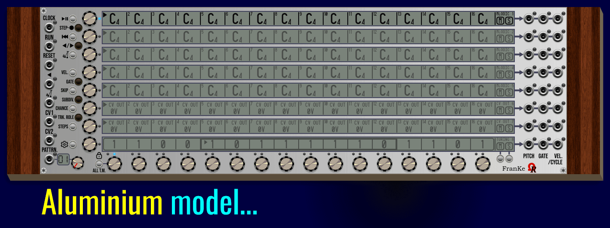

# FRANKE MODULE - USER'S MANUAL (UNDER CONSTRUCTION)

As kind of "complement" of _FroeZe_ trigger-based sequencer (used mainly for drum machines, percussions and trigger outputs), _FranKe_ module is a 80HP analog step-sequencer, as requested by an (2019) OhmerPrems member, for particular projects!

_FranKe_ (a tribute to [Christopher Franke](https://en.wikipedia.org/wiki/Christopher_Franke), member of Tangerine Dream band during best-known mid-1970s lineup) - is providing **64 patterns**, **8 tracks** per pattern, **16 steps** per track.

Tracks are versatile, any track may be "melodic" (by using notes, from **C-1** to **G9** with possible flat/sharp accidentals), free-to-use CV voltages (named **CV OUT** track) who can send voltages of your choice (from -10V to +10V range, by 0.01V resolution) for sequenced modulations, or a 16-bit Turing Machine (useful for generative patches).

Please consider a track role is always common to all 64 patterns.

By default as fresh module added in your rack, or after **Initialize** command from module's contextual menu (**Ctrl**+**I** / **Cmd**+**I** on Mac, as keyboard shorcut), tracks 1 to 5 are melodic (all steps are filled by C4 notes with 100% maxed velocities, 50% gates, no delay, no ratchet, 100% chance), tracks 6 and 7 are **CV OUT** to send sequenced modulation voltages (all steps are filled by 0V, 50% gates, no delay, no ratchet, and 100% chance), and track 8 is set as 16-bit Turing Machine (TM) with a random (locked) sequence (16-bit as sequence lenght, 100% voltage scale, floor octave 4, no quantization, 50% gate, no delay, speed x1 of tempo).

To change a track role anytime, first select the track (either by touching its **TRACK encoder**, or its related **touchscreen**), then press **TRK. ROLE** (track role) momentary button (located near "CV1" input jack) once, or many times as required, in order to switch between roles (with cycles), like melodic -> CV OUT -> Turing Machine -> melodic ...

While the sequencer is running, all tracks (including unused roles) are impacted, despite 8 are active ("audible", aka active role), a total of 24 tracks are sequenced at the same time (8 tracks x 3 roles).

Each track (row, or "line") have its **PITCH**, +10V **GATE**, and (optional to use) **VELocity** (or +10V 1ms **CYCLE** trigger) output jacks, all are located at the right side of _Franke_ module. Please consider **VEL**ocities are applicable only for melodic (notes-based) tracks, for other roles, instead, a **+10V 1ms** trigger is send as **CYCLE** when the related track is restarting its sequence (this feature is useful to control a sequential switch module, for example).

:warning: **FranKe module is not an instrument**, but a voltage-based (analog) step-sequencer, who sends pitch voltages ("V/Oct" compliant) or free voltages, 0V/+10V gates, and possibly velocities voltages, in order to control other modules, such VCO, synth voice, enveloppe generator, VCA, VCF cutoff/resonance, and... any module you'll want to control via sequenced velocities. Please consult OUTPUT JACKS section for more details.

Like future (still in development) [6OP-DX synth voice module](../6OP-DX/Manual.md), FranKe provides 8 different models (aka GUI theme variations), shown as animation on the top of this manual. Model is compliant against **Prefer dark panels if available** VCV Rack's setting (from **View** menu) as proposition from module's browser. Existing models are **Aluminium**, (it's the default model if _Prefer dark panels if available_ setting is disabled/unchecked), **Stage Repro** (red theme), **Cobalt** (blue theme), **Absolute Night** (it's the default model if _Prefer dark panels if available_ setting is enabled/checked), **Dark "Signature"**, **Fort Knox "Signature"** (show above, too), **Oxide "Signature"**, and **Titanium "Signature"**.

All four "Signature" models embed **gold metal** jacks, momentary buttons, and screws, and eight **OLED** touchscreens.

All four Non-"Signature" models embed **silver metal** jacks, momentary buttons, and screws, and eight **LCD** touchscreens (_Absolute Night_ is a lone model who provides a **dimmable yellow-backlit LCD**, however, can be dimmed/undimmed by clicking over Ohmer logo as hotspot - shown in the animation).

Obviously, all models are offering exactly the same features!

:warning: _FranKe_ module is under development, it will be available "soon" (planned as public release from Saturday April 18th, 2026).

----

Free version (without valid license V2 keyfile) is working as **full player** (this meaning it can play any patch made by any OhmerPrems member, as full player without any restriction except locked editing). However, from new module instance in your rack, without a license keyfile, **only track 1 can be edited in patterns 01 and 02 only**, all other tracks (and whole patterns from 03 to 64) are **locked against editing**, including "Randomize" feature for selected pattern (from module's contextual menu ** Randomize** command, or **Ctrl**+**R** / **Cmd**+**R** on MacOS X, as keyboard shortcut), and other pattern / track features. Turing Machine sequence on track 1 (pattern 01 and 02) can be edited and exported without limitation (import on track 1 only), but all others still locked, until you'll become OhmerPrems member. Track role (via **TRK. ROLE** momentary button) can be changed only for track 1 (from any pattern, because **track role is common to all patterns** of the sequencer).

All stuff made on _Franke_ module is always saved and recalled, including Turing Machine states (locked, or not).

----

Following explanations in this _FranKe module User's Manual_ will assume a **full version of the OhmerPrems plugin** by using a valid license V2 keyfile (reserved to OhmerPrems members, exclusively).

:warning: Due to limitation by current VCV Rack 2 API (v2.6.6, today), unfortunately _FranKe_ module doesn't support _presets_ (.vcvm) and _module selections_ (.vcvs) files features, as long as _onSave()_ and _onAdd()_ C++ methods aren't supported for both preset and module selection files. However, you'll can save (and load) whole sequencer state "as-is" to/from separate file, like you can do for any document (also, as explained below, you'll can save/load a particular pattern, and a particular track whatever its role).

:information_source: Due to important amount of saved datas, _FranKe_ module uses a **packed binary file** (instead of json who are causing signifiant lags during autosave feature), also for data integrity checkings (the binary file is always checked after save, and saved again if necessary). Also, to avoid intentional "binary file patching" (to attempt to bypass editing restrictions by Demo/Trial), all save and load routines are using file encryption algorithms, and strong _cryptographic hashing_ functions!

----

### TOPICS

- [**MODULE LAYOUT**](#layout)
- [**INPUT JACKS**](#inputs)
- [**OUTPUT JACKS**](#outputs)
- [**LEFT-SIDE MOMENTARY BUTTONS**](#lsmbuttons)

---

### MODULE LAYOUT

Following animation is showing parts of the _FranKe_ module:

---

### INPUT JACKS

All 8 input jacks are located at the left side of the module (arranged vertically).

Description of each, from top to bottom:

**CLOCK** input jack can be patched (connected) to any clocking source module, or similar (may be a LFO, manual CV source, master or slave clock module), who produces +10V 1ms triggers (also named _pulses_), or analog voltage (BPM-CV technique, more stable and instant for variations). Clock source nature can be changed from module's SETUP, by pressing the SETUP button (located just above PATTERN mini-display).

When set as analog BPM-CV, and patched, the LED is yellow. The internal frequency (and global tempo) is based by voltage conversion, like V/Oct, but 0V gives 120 BPM, +1V gives 240 BPM, -1V gives 60 BPM, and any voltage from -5V to +5V is considered as valid voltage prior to convert as internal frequency (Hz), and by this way, the global tempo.

When set as pulse (either 32 PPQN, or 24 PPQN), and patched, the LED is cyan. The CLOCK input jack needs to receive **at least two consecutive triggers** in order to establish its internal frequency (Hz), and by this way, the global tempo. 32 PPQN resolution was choosen as default to be coherent with _FroeZe_ sequencer module. 24 PPQN is useful when VCV Rack is used as plugin from DAW.

:information_source: For variable tempos, in realtime, it will better to consider analog BPM-CV rather than by pulses (digital), in order to avoid timing issues in your patch!

As soon as any frequency is established, this frequency is registered as "last known frequency", and will be used for standalone clock (when the CLOCK input jack is disconnected). By default, standalone clock is assumed as 2Hz / 120 BPM.

:warning: Standalone (internal) module's frequency can't be set manually! (but can be displayed from module's SETUP, track 3 display, not editable).

**RUN** input jack can be patched to any digital module capable to send +10V 1ms triggers, or +10V gate. From module's SETUP (access by pressing the SETUP button, located just above PATTERN mini-display), the TRACK 2 is indicating how the RUN input is working: as transport toggle (by triggers), or by continuous (held) +10V gate (the sequencer runs while +10V gate is held, then pauses as soon as the gate voltage falls below +2V).

:warning: While RUN jack is patched, and set as held gate mode (from module's SETUP), the transport (PLAY/PAUSE) momentary button becomes inoperative. This behavior is normal.

**RESET** input jack can be patched to any digital module capable to send +10V 1ms triggers. When the RESET jack receives a trigger signal, all tracks return to the beginning of their respective sequences (this will be explained in the sequencer topic, below).

**REVerse play** input jack can be patched to any digital module capable to send +10V gate. While the voltage is held at +10V, the direction of playing for all tracks is inverted from forward to reverse (already reverted individual tracks will play as normal/forward, in this case). Reverse play is applicable for any track role, including any Turing Machine line.

**PENDULUM play** input jack can be patched to any digital module capable to send +10V gate. While the voltage is held at +10V, all tracks (except Turing Machine tracks) are playing like "pendulum" between first and last step limits (also named "ping pong"). Pendulum play is applicable for melodic and modulation (CV OUT) tracks only, Turing Machine tracks don't support pendulum.

**CV1** and **CV2** input jacks can be patched to any analog or digital module, depending the role given to CV input jack (assignments from module's SETUP, tracks 5 for CV1, track 6 for CV2), the nature of the voltages are different regardling assignment. From module's SETUP, while assigning a role for CV1 and CV2, the hint system is displaying explanations about selected role, and the voltages requirement.

**PATTRN.** input jack can be patched to any analog module (or digital, if CV2 is assigned as PATTRN- / previous pattern select), in order to select the current pattern by voltage. In this case, the pattern's potentiometer is inoperative. However, if CV2 is assigned as **PATTRN-** (previous pattern select), in this case both **CV2** and **PATTRN.** input jacks are listening for +10V 1ms triggers, to select respectively previous or next pattern.

While STEP-RECORDING is active (applicable for melodic tracks only), the module's panel reflects the temporary jacks assignments (for these three jacks):

- _REVerse play_ input becomes **PITCH** input, patched to **PITCH** output of MIDI-CV module to record pitches from MIDI controller.
- _PENDULUM play_ input becomes **GATE** input, patched to **GATE** output of MIDI-CV module to detect monophonic keypresses from MIDI controller.
- _CV1_ input becomes **VEL**ocity input, (optionally) patched to **VEL.** output of MIDI-CV module, to record KEY ON velocities from MIDI controller. If not patched, _FranKe_ module is assuming velocities at maximum 100% (MIDI 127 equivalent).

---

### OUTPUT JACKS

All 3x8 output jacks (arranged as matrix) are located at the right side of the module. Each "line" is associated to relevant track (by its vertical position, indicated by printed arrows on module's plate).

Description, from left to right:

- **PITCH** outputs V/Oct / Pitch voltage-compliant (or free voltage, as "CV OUT" as modulation voltage), like oscillator (VCO), synth voice... having **V/OCT** (or **PITCH**) input jack, or any module you'll want! As **CV OUT** role, free voltages between -10V and +10V (0.01V resolution) is sent to **PITCH** output jack (instead of note-based V/Oct voltage).
- **GATE** outputs 0V or +10V gate-compliant voltages, mainly useful to control an envelope generator (EG), or any other module who can be controlled by +10V gates.
- **VEL./CYCLE** (its usage is optional) outputs additional voltage regardling the velocity of related played note event (melodic track only, green LED), may be useful to control additional VCA, filter cutoff (and so on). Otherwise the jack outputs **+10V 1ms trigger** (cyan LED) as **CYCLE** (instead of VEL.), when the track's sequence is restarted (valid for both **CV OUT** modulation tracks, and **Turing Machine** lines).

---

### LEFT-SIDE MOMENTARY BUTTONS

Following animation is showing roles of the left-side momentary buttons of the _FranKe_ module:

