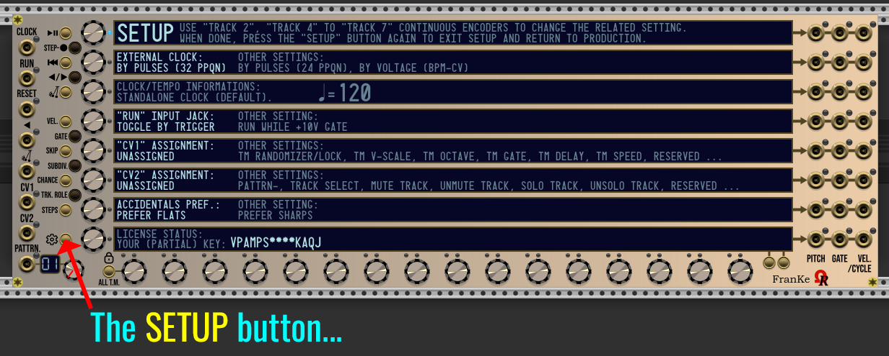
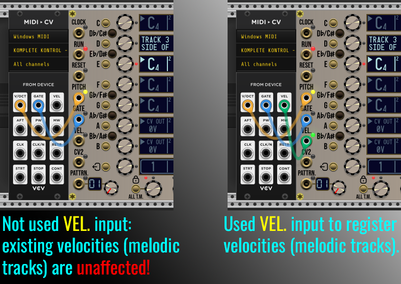
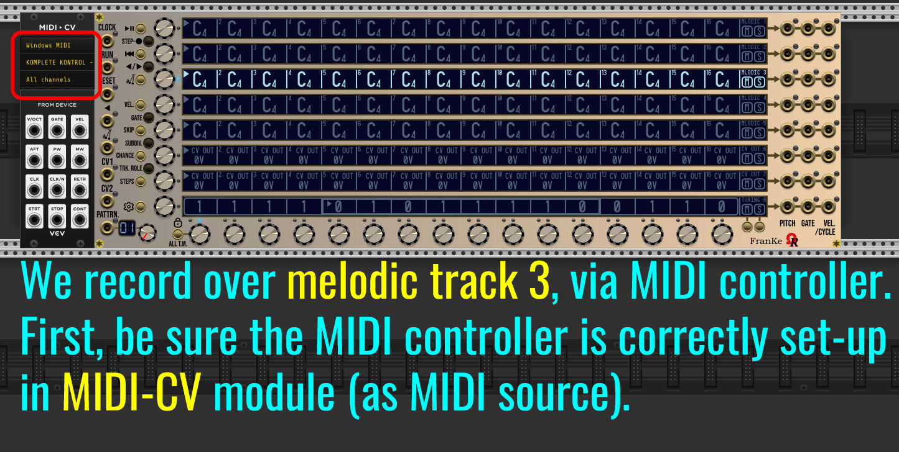

# FRANKE USER'S MANUAL (UNDER CONSTRUCTION)

### TOPICS

- [**INTRODUCTION**](#intro)
- [**FREE/TRIAL LIMITATION/RESTRICTION**](#trial)
- [**TECHNICAL CONSTRAINTS**](#technical)
- [**COLORSCHEME CONVENTION IN THE MANUAL**](#colorscheme)
- [**THE MODULE LAYOUT**](#layout)
- [**INPUT JACKS**](#inputs)
- [**OUTPUT JACKS**](#outputs)
- [**LEFT-SIDE MOMENTARY BUTTONS**](#lsmbuttons)
- [**LOCK ALL T.M. MOMENTARY BUTTON**](#tmlockmbutton)
- [**THE MODULE'S SETUP**](#modulesetup)
- [**CLOCK SOURCE**](#clocking)
- [**FIRST AND LAST STEPS**](#firstlaststep)
- [**STEP-RECORDING**](#steprec)

_All 8 models (panel theme variants) for FranKe module:_

---

### INTRODUCTION

As kind of "complement" of _FroeZe_ trigger-based step-sequencer (used mainly for drum machines, percussions and trigger outputs), _FranKe_ module is a 80HP analog step-sequencer, as requested by an OhmerPrems member (since 2019), for his particular projects!

_FranKe_ (a tribute to [Christopher Franke](https://en.wikipedia.org/wiki/Christopher_Franke), member of Tangerine Dream band during best-known mid-1970s lineup) - is providing **64 patterns**, **8 tracks** per pattern, **16 steps** per track.

Tracks are versatile, any track may have one of following role:
- Melodic track, by using notes (from **C-1** to **G9**) with possible flat/sharp accidentals.
- Modulation track (also named **CV OUT** track) who can send sequenced voltages of your choice, or random (from -10V to +10V range, by 0.01V resolution). "+10.01V"-equivalent will generate a random voltage.
- 16-bit Turing Machine track, useful for random and generative patches.

Please consider a track role is always common for all 64 patterns.

By default as fresh module added in your rack, or after **Initialize** command from module's right click context menu (**Ctrl**+**I** / **Cmd**+**I** on Mac, as keyboard shorcut), tracks 1 to 5 are **melodic tracks** (all steps are filled by C4 notes with 100% maxed velocities, 50% gates, quarter note as note subdivision, 100% chance), tracks 6 and 7 are **modulation tracks** (also named **CV OUT** tracks) who send sequenced voltages (all steps are filled by 0V, 50% gates, quarter note as subdivision, and 100% chance), and track 8 is defined as **16-bit Turing Machine** (TM) track, with a random locked sequence (16-bit as sequence lenght, 100% voltage scale, floor octave 4, no quantization, 50% gate, no delay, speed x1 of the module's tempo).

To change a track role anytime, first select the track (either by touching its **TRACK encoder**, or by touching its related **touchscreen**), then press **TRK. ROLE** momentary button (located near "CV1" input jack), once or many times as required, in order to switch between roles, like melodic -> modulation (CV OUT) -> Turing Machine -> melodic, and so on...

While the sequencer is running, all tracks (including unused roles) are processed, despite 8 roles are active simultaneously, a total of 24 roles (like 24 tracks) are sequenced at the same time (8 tracks x 3 roles), and depending your computer, this may impact its CPU usage.

Each track (row, also "line") have its own **PITCH**, +10V **GATE**, and (optional to use) **VELocity** (or +10V 1ms **CYCLE** trigger) output jacks, all are located at the right side of _Franke_ module. Please consider **VEL**ocities are applicable only for melodic (notes-based) tracks, for other roles, instead, a **+10V 1ms** trigger is send as **CYCLE** when the related track is restarting its sequence (this feature is useful to control by trigger an another module, like a sequential switch, as example).

:warning: Please keep in mind the _FranKe_ module **is not an instrument**, but a voltage-based (analog) step-sequencer, who sends pitch voltages ("V/Oct" compliant) or free voltages (including random), 0V/+10V gates, and possibly velocities voltages, in order to control other modules, such VCO, synth voice, enveloppe generator, VCA, VCF, or... any module you'll want to control via sequenced velocities. Please read [**OUTPUT JACKS**](#outputs) topic for more details...

Like future (still in development) [6OP-DX synth voice module](../6OP-DX/Manual.md), and [Vektor quad-VCO module](../Vektor/Manual.md), the _FranKe_ module provides 8 different models (aka panel variants), shown as animation top of this User's Manual. Model is compliant against **Prefer dark panels if available** VCV Rack's setting (from **View** menu) as proposal, from module browser. Existing models are **Aluminium**, (it's the default model if _Prefer dark panels if available_ setting is disabled/unchecked), **Stage Repro** (red theme), **Cobalt** (blue theme), **Absolute Night** (it's the default model if _Prefer dark panels if available_ setting is enabled/checked), **Dark "Signature"**, **Fort Knox "Signature"**, **Oxide "Signature"**, and **Titanium "Signature"**.

All four "Signature"-line models embed **gold metal** jacks, momentary buttons, and screws, 8 **OLED** touchscreens, OLED mini-display for current pattern number.

All four non-"Signature" models embed **silver metal** jacks, momentary buttons, and screws, and 8 **LCD** touchscreens, LCD mini-display for current pattern number. _Absolute Night_ is a lone model who provides a **dimmable yellow-backlit LCD** displays, however. Bright/dim can be toggled by clicking over the "Ohmer logo" as hotspot - indicated by the animation above).

Obviously, all models are providing exactly the same features!

---

### FREE/TRIAL LIMITATIONS/RESTRICTION

:information_source: **Following informations about Free/Trial don't concern OhmerPrems members (owners of a valid license V2 keyfile).**

The Free/Trial version permits to evaluate most module's features, freely, but with many limitations (restrictions) the full version doesn't have!

About Free/Trial, they're two possible scenarios:

- **Scenario 1:** You're loading a shared patch (.vcv file) made by an OhmerPrems member (who are using full version), and his patch embeds one (or many) _FranKe_ module instance(s): all of these instances are working as **full player**, meaning these modules are able to playback without any restriction. However, **everything** is locked against edition, including MUTE and SOLO states (individual and global), reverse and pendulum playback via momentary buttons (who affect the selected track only), track role, randomizations, module reset (via **Initialize** command from module's right click context menu, or **Ctrl**+**I** / **Cmd**+**I** on MacOS X, as keyboard shortcut), pattern/track copy/paste operations, and file operations. All settings from the module's SETUP cannot be changed, because the loaded patch structure was defined by its author.

- **Scenario 2:** You add a new instance of _FranKe_ module in any rack: from the "fresh" added module, patterns from 03 to 64 can't be selected/reached (either by potentiometer, or by voltage/triggers). From patterns 01 and 02, **only tracks 1 and 2 events can be edited**, all other tracks (from 3 to 8) are locked against edition. **PITCH outputs for tracks 3 to 8 send constant -10V**. Both CV1 and CV2 may be assigned (from module's SETUP), but their actions may impact tracks 1 and 2 only. Turing Machine sequences on tracks 1 and track 2 can be edited and saved (and later, loaded but to track 1 or 2 only). Track role (via **TRK. ROLE** momentary button) can be changed for tracks 1 and 2 only. All others many still locked/disabled, until you'll become OhmerPrems member!

:warning: In all cases, the extra right click context menu is hidden while the module runs either as Player and as Free/Trial.

All stuff made on _FranKe_ module is always saved and recalled at least by VCV Rack 2's autosave feature (occurs every 15 seconds) and by your .vcv patch files, including Turing Machine states (whatever locked, or not, as explained in TURING MACHINE section, later).

Following explanations in the remaining of this manual will assume you're using the **full version of the OhmerPrems plugin** (by using a valid license V2 keyfile, exclusively reserved to OhmerPrems members).

---

### TECHNICAL CONSTRAINTS

Due to limitation by current VCV Rack 2 API (v2.6.6, today), unfortunately _FranKe_ module doesn't support _Preset_ (.vcvm) and _Module selection_ (.vcvs) files features, as long as _onSave()_ and _onAdd()_ C++ methods aren't natively supported for both preset and module selection files. However, you'll can save (and load) whole sequencer state "as-is" to/from separate file, like you can do for any document (also, as explained later in this manual, you'll can save/load a particular pattern. Also, you'll can save (and load) any track to/from separate file, whatever its role (this include any Turing Machine track).

Due to important amount of saved datas, _FranKe_ module is using a **packed binary file** (instead of json who may cause signifiant lags during VCV Rack's autosave feature, occuring every 15 seconds). Also, the binary format is, strangely more efficient for data integrity checkings (the binary file is always checked after save, and saved again if necessary, upto five defered attempts).

All file operations are using file encryption and compressions algorithms, and strong _cryptographic hashing_ checking functions to avoid hex patching!

---

### COLORSCHEME CONVENTION IN THE MANUAL

This is the colorscheme used in this manual (including images and animations), for both **patch cords** and **module's LED**:

- Red (LEDs only) indicates a **step-recording session** in progress (red patch cords are used for audio, but it's not applicable for _FranKe_ module, who doesn't use audio).
- Yellow is used for either **PITCH** (Volt-per-octave-compliant on outputs and input for step-recording), and **BPM-CV** (analog clock, input only).
- Blue (cyan) is used for **trigger** and **gate** inputs and outputs LEDs, **CYCLE** outputs (when applicable), also for patch cords.
- Green is used for modulation by voltage (CV) LEDs, also for patch cords (**VEL**ocity input and outputs, **CV1** and **CV2** inputs, when applicable).
- Pink color (step LEDs only) represent a "1" as binary digit, for selected Turing Machine track (otherwise the LED is unlit for "0" as binary digit).

:information_source: All LEDs used by _FranKe_ module are RGB.

---

### THE MODULE LAYOUT

Following animation is showing the major parts of the _FranKe_ module (5 seconds per image):

---

### INPUT JACKS

All 8 input jacks are located at the left side of the module (arranged vertically).

Description of each, from top to bottom:

**CLOCK** input jack can be patched (connected) to any clocking source module, or similar (may be a LFO, manual CV source, master or slave clock module), who produces +10V 1ms triggers (also named _pulses_), or analog voltage (BPM-CV technique, more stable and instant for variations). Clock source nature can be changed from module's SETUP, by pressing the SETUP button (located just above PATTERN mini-display, the button have a printed "gear" on module's plate), by using TRACK 2 continuous encoder (bold setting at left side of display is always the current setting).

**RUN** input jack can be patched to any digital module capable to send +10V 1ms triggers, or +10V gate. From module's SETUP, the TRACK 4 display is indicating how the RUN input is set: as transport toggle (by triggers) - as default setting, or by continuous (held) +10V gate (the sequencer runs while +10V gate is applied on RUN jack, then pauses as soon as the gate voltage falls below +0.1V).

:warning: While RUN jack is patched, and configured as **RUN WHILE +10V GATE**, the transport (PLAY/PAUSE) momentary button becomes inoperative. This behavior is normal!

**RESET** input jack can be patched to any digital module capable to send +10V 1ms triggers. When the RESET jack receives a trigger signal, all tracks return to the beginning of their respective sequences (this will be explained in the sequencer topic, below).

**REVerse play** input jack can be patched to any digital module capable to send +10V gate. While the voltage is held at +10V, the direction of playing for all tracks is inverted from forward to reverse (already reverted individual tracks will play as normal/forward, in this case). Reverse play is applicable for any track role, including any Turing Machine line.

**PENDULUM play** input jack can be patched to any digital module capable to send +10V gate. While the voltage is held at +10V, all tracks (except Turing Machine tracks) are playing like "pendulum" between first and last step limits (also named "ping pong"). Pendulum play is applicable for melodic and modulation (CV OUT) tracks only, Turing Machine tracks don't support pendulum.

**CV1** and **CV2** input jacks can be patched to any analog or digital module, depending the role given to CV input jack (assignments from module's SETUP, tracks 5 for CV1, track 6 for CV2), the nature of the voltages are different regardling assignment. From module's SETUP, while assigning a role for CV1 and CV2, the hint system is displaying explanations about selected role, and the voltages requirement.

**PATTRN.** input jack can be patched to any analog module (or digital, if CV2 is assigned as PATTRN- / previous pattern select), in order to select the current pattern by voltage. In this case, the pattern's potentiometer is inoperative. However, if CV2 is assigned as **PATTRN-** (previous pattern select), in this case both **CV2** and **PATTRN.** input jacks are listening for +10V 1ms triggers, to select respectively previous or next pattern (relatively from current pattern).

While step-recording is engaged (not applicable for Turing Machine tracks), the module's plate reflects the temporary jacks assignments for these three jacks, and left-side buttons:

- _REVerse play_ input becomes **PITCH** input, patched to **PITCH** output of MIDI-CV module to record pitches from MIDI controller.
- _PENDULUM play_ input becomes **GATE** input, patched to **GATE** output of MIDI-CV module to detect monophonic keypresses from MIDI controller.
- _CV1_ input becomes **VEL**ocity input, (optionally) patched to **VEL.** output of MIDI-CV module, to record KEY ON velocities from MIDI controller. If not patched, _FranKe_ module doesn't alter existing velocities. Velocities are registered for melodic tracks only, and ignored for modulation tracks.

---

### OUTPUT JACKS

All 3x8 output jacks are located at the right side of the module. Each "line" is associated to relevant track (by its vertical position, indicated by printed arrows on the module's plate).

Description, from left to right:

- As melodic or Turing Machine track role, **PITCH** outputs "V/Oct" (pitch) voltage-compliant to be used by an oscillator (VCO) or similar module who embeds **V/OCT** (or **PITCH**) input jack (or any module you'll want, of course). As modulation (**CV OUT**) track role, sequenced voltages (between -10V and +10V, 0.01V stepping, or RANDOM voltages) are sent to **PITCH** output jack.
- **GATE** outputs 0V or +10V gate-compliant voltages, mainly to control an envelope generator (EG), or any other module who can be controlled by +10V gate. Related GATE LED is always cyan, lit when the gate is high (+10V), otherwise unlit at 0V.
- **VEL./CYCLE** (optional usage) outputs additional voltage regardling the velocity of related played note event (melodic track only, solid green LED), may be useful to control additional VCA, filter cutoff, or any module controllable by an analog unipolar voltage, from 0V to +10V. For modulation (CV OUT) and Turing Machine tracks, the same jack sends **+10V 1ms triggers** (cyan LED) as **CYCLE**, instead of VELocity, when the related track's sequence is restarted during playback.

---

### LEFT-SIDE MOMENTARY BUTTONS

Depending the context (as primary "function", or specifically while step-recording is engaged), the left-side momentary buttons have particular functions.

As primary function (aka while step-recording isn't engaged), from top to bottom:

- **RUN/PAUSE** (transport toggle, play or pause the sequencer). TIP: **RUN** LED is on, solid green, while the sequencer is running, unlit when paused.
- Engage step-recording (applicable for melodic and modulation tracks only, the button press is ignored for selected Turing Machine track). While step-recording is engaged, the **RUN** LED is turned on, solid red (instead of green while playing). Also, selected melodic/modulation track, and selected step, are indicated by solid red LEDs, alongside their respective encoders.
- Reset all sequences (all tracks) to their beginning points (no trigger occur to **CYCLE output jacks** when reset is done via RESET button and/or trigger on RESET input jack).
- Reverse play toggle: forward-to-reverse, or reverse-to-forward playing direction, **for selected track only** (including Turing Machine track).
- Pendulum play toggle, **for selected melodic or modulation (CV OUT) track only** (Turing Machine doesn't support pendulum play).
- **VEL.** to edit velocity for each step on selected melodic track only, modulation (CV OUT) and Turing Machine tracks don't use velocities.
- **GATE** to edit gate duration as %, for each step on selected melodic or modulation track (not applicable for Turing Machine, who have its independent **GATE** setting).
- **SKIP** to edit step skip(s), for any step on selected melodic or modulation track (not applicable for Turing Machine tracks). However, **at least one "not skipped" (OFF) step** must remains between first step and last step of the track (this is handled by the module's logic), as "cell" where the track's playhead will can stay permanently.
- **SUBDIV.** to edit subdivisions for each step (may be eighteenths, sixteenths, and rest-equivalents), selected melodic or modulation track (not applicable for Turing Machine).
- **CHANCE** to edit chance by % to be played, or muted, for each step on selected melodic or modulation track (not applicable for Turing Machine).
- TRACK ROLE (labelled **TRK. ROLE** on module's plate) to select next track role (from melodic to modulation/CV OUT, then to Turing Machine, then come back to melodic, and so on).
- **STEPS** to edit either **first step** and **last step** for selected melodic or modulation track (not applicable for Turing Machine track who have independent **LENGTH** setting), by using STEP 1 encoder to set the first step, and STEP 2 encoder to set the last step of the current track. Press STEPS button again (or another function button) when done.
- Enter and exit the module's SETUP.

While step-recording is engaged, as visible on the module's plate, each button enters a related note (semitone), exactly like a "piano" (clear and dark buttons).
Every pressed button registers the related note (semitone), or voltage-equivalent, using the current displayed octave, then advances the sequencer by **one step forward** (or return to the first possible step in the same track and pattern). **Step-recording over melodic tracks by using these momentary buttons don't alter the existing velocities.**

During step-recording session, you'll can select another melodic or modulation (CV OUT) track on the same pattern, also you'll can select different pattern by turning the **PATTRN.** potentiometer (or by voltage applied on **PATTRN.** input jack).

:warning: Step-recording is immediately disengaged as soon as you'll select any Turing Machine track, also disengaged when you start the sequencer's transport by trigger/gate applied on the **RUN** input jack!

To finish (disengage) an active step-recording session, simply press the **EXIT** button (it's the same button used to enter/exit the module's SETUP). Please notice during step-recording session, the "gear" icon on module's plate (alongside the button) is replaced by an "exit" icon!

---

### LOCK ALL T.M. MOMENTARY BUTTON

The momentary button located alongside **STEP 1** encoder, surrounded by a **lock** icon and **ALL T.M.** (on module's plate) like shown above, is designed to **lock all Turing Machine** sequences, by a simple press.

---

### THE MODULE'S SETUP

_FranKe_ module's logic embeds a (global) SETUP, which is accessible at any time, even while the sequencer is running, **but except while step-recording is engaged**, whenever you press the SETUP momentary button from "production" mode (aka displayed notes, modulation voltages, and/or Turing Machine tracks).

The following image shows the **factory settings** for a new/fresh _FranKe_ module instance:

To change a particular setting, turn the related TRACK continuous encoder (at the left side of corresponding display). By turning it clockwise, the first possible setting from OTHER SETTINGS list (or OTHER SETTING in case of two possible choices) is selected, and displayed **as bold at leftmost side** of the display, and becomes the active setting. By turning it counter clockwise, the lastest possible setting from OTHER SETTINGS list (possibly hidden after **...**) will be selected in the same way.

:information_source: Any changed setting "on-th-fly" is **immediately applied** and used by _FranKe_ module (no need to "validate" something).

Some "settings" in fact aren't... settings, but displayed informations only (who cannot be changed):
- TRACK 1 always display a contextual hint, regardling the selected setting (selected TRACK, indicated by **solid cyan** LED).
- TRACK 3 always indicates the current clock source status, and the global tempo.
- TRACK 8 always indicates your OhmerPrems plugin license status (either partial key, or FREE/DEMO).

By selecting a particular "track" (you can simply "touch" the relevant encoder, no need to rotate it), the hint system shows complementary informations over track 1 display!

When all settings are good for your needs, simply press the SETUP button again to exit SETUP, and return to production mode. Also, by pressing a function button (other left-side button), this disengage the module's SETUP automatically, prior to enter the selected function!

---

### CLOCK SOURCE

As indicated above, _FranKe_ sequencer requires a (well-configured) external clock source module, in order to work properly. _FranKe_ sequencer module is able to accept either digital pulses (+10V 1ms triggers, or square waveform) or analog voltage (named BPM-CV), in order to establish its working frequency (Hz) - and by this way, the current tempo (in BPM / Beats Per Minute).

Depending the nature of the external clock signal, probably you'll must set it from module's SETUP, in order to match, by selecting the nature of the source clock (by turning the TRACK 2 encoder). Current setting is the leftmost indicated value, bold (at right side, they're other possible settings).

As soon as frequency of the external clock source is established, the new frequency is registered in the module's memory as "last known" frequency. This registered frequency will be used by _FranKe_'s standalone (internal) clock in case of the CLOCK input jack is disconnected, later.

From module's SETUP, when external clock is set to **BY VOLTAGE (BPM-CV)**, and the CLOCK input jack is patched, the LED turns on, **solid yellow** color. The internal frequency (and global tempo) is, in this case, based by voltage conversion (exactly like V/Oct does), so 0V gives 120 BPM, +1V gives 240 BPM, -1V gives 60 BPM, and so on. Any voltage applied on CLOCK input jack into -6V / +6V range is considered as valid voltage, prior to be converted as frequency (Hz) equivalent (and by this way, as BPM global tempo). Minimum frequency is **0.02Hz (1 BPM)**, maximum (given by +6V) is **64Hz (7680 BPM)**!

When external clock is set to **BY PULSES (32 PPQN)** (it's the default setting), or **BY PULSES (24 PPQN)**, and patched, the LED turns on, **solid cyan** color. The CLOCK input jack needs to receive **at least two consecutive triggers** in order to establish the frequency (Hz) / global tempo. 32 PPQN resolution was choosen as default to be coherent with _FroeZe_ sequencer module (also part of OhmerPrems plugin), who are using the same clocking resolution. 24 PPQN is useful when VCV Rack (Pro) is used as plugin from your DAW, because the VCV DAW module provides 24 PPQN as maximum resolution. By pulses, either 32 or 24 PPQN, maximum supported frequency by _FranKe_ module is **16Hz (960 BPM)**, because they're too many signifiant clocking unstabilities above (due to bandwith limitation). For the external clock module, it's highly recommended it delivers proper and stable triggers/pulses (or square waves) at +10V, [as specified in VCV Rack 2 manual, **Voltage Standards** section](https://vcvrack.com/manual/VoltageStandards). Avoid sine/triangle/saw/ramp/noise/S&H waveforms delivered by the clock source module (like a LFO does).

:information_source: For realtime variable tempo, it will better to consider analog **BPM-CV** rather than "by pulses/triggers", in order to avoid possible timing and synchronization issues, in particular while the sequencer is running! Also, analog **BPM-CV** is always considered as smooth, reliable and immediate. By using BPM-CV method, an excellent technique is to use a LFO (low-frequency oscillator) module as clock source (who deliver any waveform type, like sine, triangle, saw/ramp, or noise/S&H/random). Also, by using a patch cord, you'll can route a PITCH output signal from modulation track to... CLOCK input jack!

On new instance of _FranKe_ module in your rack, standalone (internal) tempo is automatically set as **2Hz (120 BPM)**, as "factory" setting, until the CLOCK input jack will register a new frequency from an external clock source module.

:warning: Standalone (internal) module's frequency/tempo cannot be manually changed!

From module's SETUP, current clock/tempo informations/status is displayed on TRACK 3 display.

---

### FIRST STEP & LAST STEP

For any melodic and modulation (CV OUT) track, you can define both first step and last step. By default, first step is always step 1, and last step is always step 16, giving 16 steps for a melodic/modulation track. Concerning Turing Machine tracks, the process is different (it will be explained in Turing Machine section of this manual, later).

First step and last step can be changed only when step-recording isn't engaged.

To change either first and/or last step(s):
- Press **STEPS** momentary button.
- Select the track by touching the corresponding track encoder (left of track display).
- Turn **STEP 1 encoder** to change first step, and/or **STEP 2 encoder** to change last step.
- If necessary, you'll can select another track (melodic or modulation), then repeat the same process.
- When done, press **STEPS** momentary button again: the hint system for first/last steps edit disappears.

During first and last step edition, the hint system indicates (second line) the first step setting, the last step setting and by the way, the current track length.

:warning: Minimum track length is 1 (0 as track length isn't possible).

:information_source: First and last steps, for a particular track, is pattern-dependent.

---

### STEP-RECORDING

Step-recording is a possible way to define notes (semitones) or raw voltages for either melodic and modulation (CV OUT) tracks. For melodic tracks, recorded steps are always notes/semitones by names/alterations/octaves (like F#3, Ab4, C-1, G9, and so on). For modulation tracks, the notes names/alterations/octaves are simply replaced by their corresponding voltages (C4 = 0V).

To engage step-recording, press **STEP-REC** momentary button, located in left-side momentary buttons area (it's the second button from top, near CLOCK input jack).

To finish a step-recording session, press **EXIT** momentary button (it's the same than used to access module's SETUP, but during step-recording session, it have an exit icon along the button - screen-printed on the module's plate). Also, by selecting a Turing Machine track, or by starting the transport via voltage on **RUN** input jack, will disengage the step-recording automatically!

While step-recording is active, you'll can either use left-side momentary buttons (in this case, these buttons act as a "piano" keys), or a MIDI controller. By using a MIDI controller, you'll can also register velocities (if your MIDI controller supports velocities, and if the **VEL.** input jack is connected to **VEL** output jack on MIDI-based module). By using the "piano" button, existing velocity on current step isn't affected.

Connected patch cords for step-recording via a MIDI controller:

Please notice the velocities are used by melodic tracks exclusively. However, during an active step-recording session, the velocities are recorded for either melodic or modulation (CV OUT) tracks, this feature may be useful in case you'll change the track role, later, from modulation track to melodic track.

The patch cord to **VEL.** input jack is useless in case you're using left-side "piano" momentary buttons to set a note (or voltage-equivalent for a modulation track), or you're editing notes/voltages by turning related step encoders.

:information_source: In case you don't use a MIDI controller, but left-side "piano" momentary buttons only (and step encoders to edit), it's useless to connect the patch cords to MIDI-based module(s).

:warning: Lowest possible note is C-1 (C, octave -1) or -5V as equivalent for modulation track. Highest possible note is G9 (G, octave 9) or +5.58V for modulation track.

:warning: While step-recording is active, both reverse play, pendulum play and CV1 input jacks are disabled as their main functions, because they're used for pitches, gates and velocities!

Following animation (10 sec. per image) shows an example of step-recording process by using a MIDI controller:

---
