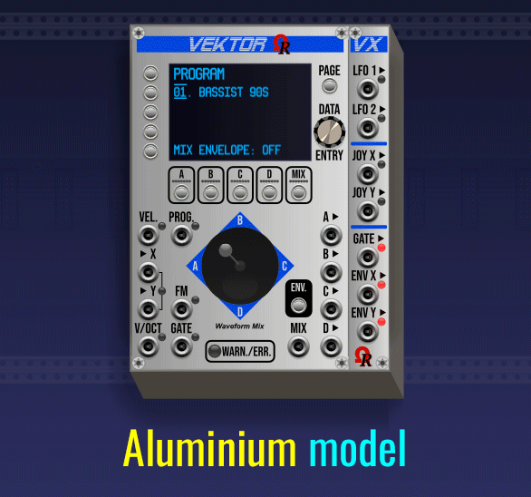
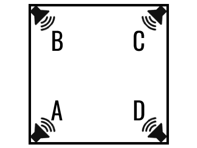
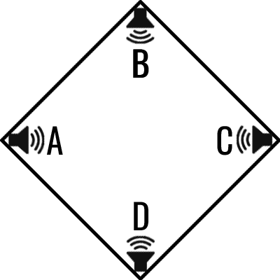
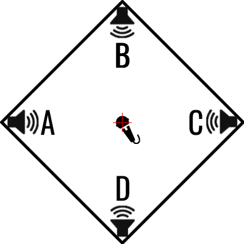
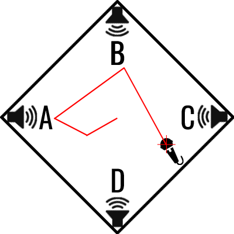
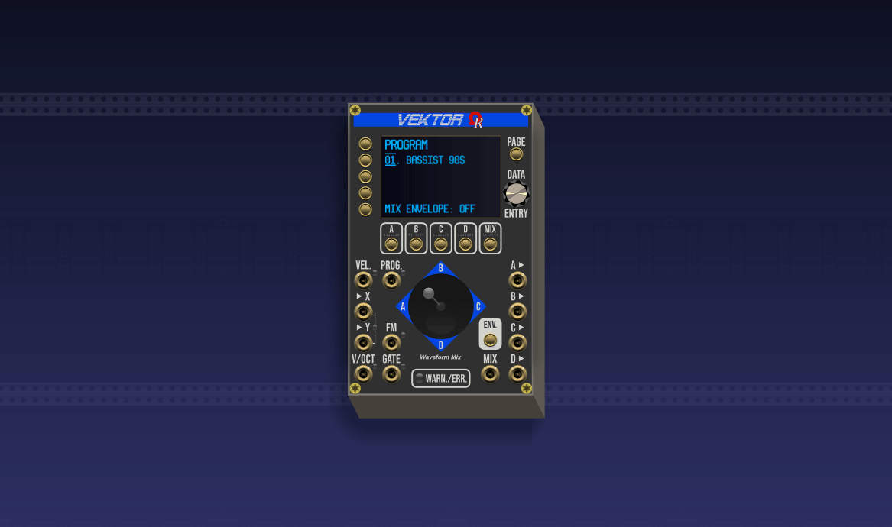
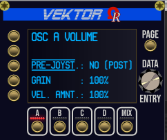

# VEKTOR & VX: USER'S MANUAL (UNDER CONSTRUCTION)

_They're all 8 models (GUI theme variants) for Vektor module and its "right-side" VX expander module:_

### TOPICS

- [**HISTORY OF THE VECTOR SYNTHESIS**](#history)
- [**WHAT IS "VECTOR SYNTHESIS" EXACTLY?**](#whatisvs)
- [**INTRODUCTION**](#intro)
- [**MODULES SPECIFICATIONS**](#specs)
- [**DISCLAIMER: VCV RACK 2 "PRESET" LIMITATIONS**](#presetlimitation)
- [**VEKTOR MODULE LAYOUT**](#layoutvektor)
- [**VX EXPANDER MODULE LAYOUT**](#layoutvx)
- [**CONTEXT SELECTION**](#contextsel)
- [**ADVANTAGE OF DISCRETE OSCILLATOR OUTPUTS**](#discreteouts)
- [**PROGRAMS**](#programs)

---

### HISTORY OF THE VECTOR SYNTHESIS

Welcome into the **Vector Synthesis** universe!

_Vektor_ is a 16HP polyphonic quad-oscillator digital VCO module, using [**Vector Synthesis**](https://en.wikipedia.org/wiki/Vector_synthesis) technique (often abbreviated as **VS**) conceived by Sequential Circuits company (Dave Smith) for his [**Prophet VS**](https://en.wikipedia.org/wiki/Prophet_VS) synthesizer, manufactured from 1986. Unfortunately, this innovative form of synthesis did not meet with great success, probably due to the high price of the Prophet VS synthesizer during this epoch (approx. USD 9,000 after 2026 conversion!).

_This is the 1986 Prophet VS synthesizer, manufactured by Sequential Circuits:_

When the Sequential Circuits went bankrupt during 1987, the company was sold to Yamaha, who have developed the SY22, SY35, and TG33, both of them are using VS, too.

Then later (mid-1989), Dave Smith, the founder of Sequential Circuits company, have started the Korg USA R&D group, which went on to produce the [**Korg Wavestation**](https://en.wikipedia.org/wiki/Korg_Wavestation) synthesizer, also using Vector Synthesis but... as "advanced", mainly due to extra amazing feature named _Wave Sequencing_, useful to create evolving sounds!

During 2015, Yamaha had returned the original trademark to **Dave Smith Instruments** (prior to be rebranded as **Sequential**, three years later).

Notable artists who have used the Prophet VS synthesizer was Depeche Mode, Vangelis, Brian Eno, Prince, Kraftwerk, Erasure, Rush, French singers Michel Berger and Christophe, and the filmmaker John Carpenter.

---

### WHAT IS "VECTOR SYNTHESIS" EXACTLY?

In case you are unfamiliar about _Vector Synthesis_, the best way to explain it is to use the following fictious scene, where you are the actor!

Try to imagine a square room, consider this room doesn't have sound reflection on walls/floor/roof, having a placed loudspeaker on each corner, each loudspeaker constantly outputs a basic waveform at same frequency and volume (like an oscillator can do). First, if you're looking the room from above:
- Loudspeaker **A** is located at the bottom-left corner (angle).
- Loudspeaker **B** is located at top-left corner.
- Loudspeaker **C** is located at top-right corner.
- Loudspeaker **D** is located at bottom-right corner. Like the following image:

Now, by a strange mechanism, the room is rotated **clockwise by 45 degrees** (but you keep your initial orientation!): obviously, after rotation, the room remains a square, but from above view, now the room shape looks like a **diamond** (in geometry, square is a particular form of... diamond).

By doing this room rotation, now loudspeaker A becomes at left, B at top, C at right, and D at bottom. Easy at the moment, aren't?:

Now, you enter the room, having a (omnidirectional) microphone in your hand, and you place the microphone exactly at the center of the room: it captures sound "components" of each loudspeaker, as equal parts (in Vector Synthesis world: 50% of A, 50% of B, 50% of C, and 50% of D):

As soon as you move by short line "segments" into the room (origin point, any direction, any distance), on every position in realtime, the mix (**crossfading**) captured by the microphone will change (amounts of captured loudspeakers depends the microphone position at every instant, regardling distances to loudspeakers). As example, if the microphone is nearest as possible of the loudspeaker A, it will capture maximum 100% of it, nearly 0% from the opposite C, and a signifiant part of remaining C and D (but less than 50%). And so on!

Every line segment of your moves, as red segments just above (point where the segment start, direction, and distance) is named... a **vector**.

:information_source: **If you understand the principle, be sure you have understood 99.9% about the Vector Synthesis!**

Real and virtual synthesizers using Vector Synthesis (also true concerning the _Vektor_ module), the X horizontal & Y vertical position of the "microphone" in the "diamond room" is simulated either by a mechanical (unsprung) joystick controlled by your hand (**or** by voltages applied on both X and Y input jacks), and/or by (optional to use) programmable MIX ENVelope, kind of **timed automation** of vectors & X/Y points in realtime (and related crossfading, by this way).

Of course, the described fictious scene above is assuming, in ideal word, all of the loudspeakers output at same frequency and volume level. However, in _Vektor_ world, all may be totally different, because each oscillator (loudspeaker) can use different frequency (by transposition, and/or by modulated frequency), and/or different volume (base volume of the oscillator, and possible level reduction by the velocity).

Also, an another important aspect of the MIX ENVelope are times (in milliseconds), named **RATES**, it's the time to run between an origin point of the vector, and the next point to be reached. By this way, this introduces the speed notion for every vector. Every vector (line segment) can be covered from **minimum 0 millisecond** (in this case, the vector is ignored, and next is processed immediately), up to **maximum 5,000 milliseconds** (5 seconds). Default rates depend of the selected program (or 500 milliseconds for **16. INIT** program).

---

### INTRODUCTION

Partially inspired by the Behringer's [**Victor**](https://www.behringer.com/en/products/0720-ADA) Eurorack module, the main objective of _Vektor_ is to provide the "VCO parts" of the Prophet VS synthesizer, including the famous mixer joystick (for dynamic waveform crossfading) inside "the diamond", and its possible MIXing ENVelope who is working like an "automation curve" (in modern DAWs) to control the timed crossfading trajectory, automatically!

Also provided by _Vektor_, two internal (independent) low-frequency oscillators (**LFO 1** and **LFO 2**), plus **FM input** jack, able to work as either **TZ FM** (linear Through-Zero FM) or **PM** (Phase Modulation, variant of FM synthesis used by Yamaha DX synthesizers family). These possible **frequency modulators** are designed to modulate any oscillator (waveform) you'll want (OSC A, B, C or D), offering near infinite possibilities in sound design sessions. Also, LFO 1 and/or LFO 2 can be used by external module(s) in your rack, by attaching the _VX_ expander alsongside _Vektor_ (right side, without space between each other).

However, many parts of the real Prophet VS synthesizer, such analog low-pass filter, ADSR envelope generators, modulation matrix, stereo and panning, stereo chorus, aren't provided by the _Vektor_ module, assuming they're a lot of capable third-party modules to do similar tasks inside our virtual Eurorack modular environment! By this way, when used "alone", _Vektor_ cannot be considered as "ready-to-use" synth voice module (like most VCO modules, in fact).

_Vektor_ is using four independent waveform-based oscillators, named **OSC A**, **OSC B**, **OSC C** and **OSC D** (or by simple letters **A**, **B**, **C**, and **D** also refer to respective OSC A, OSC B, OSC C, and OSC D), located in four angles of the diamond (as explained by previous topic). All of them are mixed (crossfading) either manually by the joystick (or by external voltages applied to **X** and **Y** input jacks), or via fully automated **MIX ENV**elope (controlled by **GATE** input jack).

Each oscillator is using **waveform**, like the Prophet VS hardware synthesizer does. The 96 official waveforms are provided as "built-in ROM", numbered from **032** to **125**, have a name and graphical representation from oscillator context (**OSC x WAVEFORM** page). Please notice the built-in waveform number **126** (named **SILENCE**), when selected, the related oscillator isn't processed by the DSP. Also, waveform number **127** is constant-frequency **WHITE NOISE** (made by a dedicated Gaussian white noise generator, to a buffer).

:warning: Built-in **126. SILENCE** waveform, when selected for a particular oscillator (A, B, C, or D), doesn't provide "pages" for extra settings, because it's a nonsense to set the frequency and/or the volume for... a muted (disabled) oscillator! In this case, the **PAGE** button doesn't have effect! Also, built-in **127. WHITE NOISE** waveform have only **OSC VOLUME** as extra page, but nothing about **OSC FREQUENCY**, because white noise frequency is always constant (it doesn't follow "V/octave" rule), and cannot be modulated by FM/PM or by internal LFO.

The _Vektor_ module permits to import custom WAVE (.wav) file to any **USER waveform** slot (numbered from **000** to **031**, respectively labelled **USER #1** to **USER #32**). WAVE file importation will be explained later (having a dedicated section in this User's Manual).

As module outputs, the most important in Vector Synthesis is surely the **MIX** output (always post-joystick or post MIX ENVelope), but they're also **A**, **B**, **C**, and **D** discrete oscillator outputs, useful as as separate oscillators, of for particular FX processings. Every discrete OSC output may be either **pre-joystick** (or pre MIX ENVelope) as dry/unmixed - it's the default behavior, or **post-joystick** (or post MIX ENVelope). The joystick/mix envelope routing can be configured from every **OSC x VOLUME** page (3rd page, for each oscillator context).

Every output jack delivers a **mono audio signal** (10V peak-to-peak, -5V/+5V range, polyphonic), can be sent to a mixer (or VCV AUDIO output) module, to another module for specific FX processing, or as modulation source to other module(s) in your rack (modules who support FM, AM, ring modulation, or any you'd like).

_Vektor_ comes with (optional-to-use) 3HP "right side" expander module, named _VX_ (accronym of **V**ektor e**X**pander), offering 7 additional outputs:
- **LFO 1** and **LFO 2** (top section), each outputs the related (and configured) LFO signal (-5V/+5V range, can be sine, triangle, sawtooth, ramp, square or random).
- **JOY X** and **JOY Y** (middle section) who report respectively the X (horizontal) and Y (vertical) position of the **physical joystick** in the diamond (whatever the applied voltages on X and Y input jacks, whatever the mix envelope, it's **always** the **physical joystick 2D position**).
- **GATE** (bottom section) who outputs +10V while the MIX ENVelope is running (its LED is blue), 0V otherwise (its LED is unlit).
- **ENV X** and **ENV Y** (bottom section) who report the X and Y positions of the MIX ENVelope while the MIX ENVelope is running (otherwise 0V). Offsets by joystick position (or by voltages applied on X and Y inputs) is not included.

Vektor module is polyphonic, up to 16 voices (channels). Please be careful about CPU load as soon as you increase the number of polyphony voices (defined by the source modules, for V/OCT and GATE inputs), please keep in mind 16 polyphonic channels x 4 oscillators, plus two LFO (realtime computed waveforms), plus the MIX ENVelope who are using Pythagorean and trigonometric functions to establish vectors (trajectory), and speeds per vector, may require a more or less amount of CPU resources. Recommended polyphony setting for _Vektor_ is 4 or 8 voices.

---

:information_source: The best for the end, _Vektor_ and _VX_ modules are free for everyone (license V2 keyfile is not required)!

---

### MODULES SPECIFICATIONS

_Vektor_ module technical specifications:

- Designed to operate in VCV Rack 2 (v2.6.6, or higher), "Free" and "Pro" editions.
- Width: 16HP.
- Available models (GUI theme variants): 8 (please watch the animation at the top of this page, for available models).
- Display: **non-touchscreen** OLED (blue).
- 5 "context" momentary buttons OSC A, OSC B, OSC C, OSC D, MIX, overlooked by horizontal red LED "bars".
- 5 left-side momentary buttons L1 to L5.
- PAGE momentary button.
- DATA ENTRY continuous encoder.
- ENV Momentary button (to enable or disable the mix envelope on-the-fly). Per program.
- Polyphony: max. 16 voices/channels (recommended: 4 or 8 voices).
- Sound sources: 4 (OSC A, OSC B, OSC C, and OSC D), using waveforms/samples.
- Built-in ROM waveforms: 96, including "silence" (disabled OSC), and not-pitchable (constant frequency) white noise.
- User waveforms: max. 32 (per module instance).
- Wave importation: Microsoft/IBM WAVE, PCM signed 16-bit, 44100Hz, mono, 2048 samples. **Filesize must be 4140 bytes**.
- Wavetable support: no (like the real Prophet VS synthesizer).
- LFO: 2 independent internal LFO 1 and LFO 2 (settings per program).
- LFO frequency range: min. 0.01Hz, max. 50Hz, resolution 0.01Hz, default 2Hz.
- LFO AMPlitude range: min. 0% (LFO is turned off), max. 100% (+5V).
- LFO waveforms: sine, triangle, sawtooth, ramp, square, random.
- Joystick: manual A/B/C/D volume crossfading (absolute, or offset), MIX ENVelope points edit.
- MIX ENVelope (automated A/B/C/D crossfading): per program. Can be enabled/disabled via a dedicated ENV. button.
- MIX ENVelope control: by held GATE input jack (min. +1V, recommended +10V).
- MIX ENVelope points: 5 (point 0 is the start point, point 3 is the sustain point, point 4 is the release point).
- MIX ENVelope rates: 4 (times in milliseconds, min. 0ms, max. 5000ms, per vector).
- MIX ENVelope loop: yes, from 1 up to 12 times (or infinite), unidirectional or bidirectional, from point 3 to 2, to 1 or to 0.
- Input jacks: 7 (V/OCT, X, Y, GATE, VEL., PROG., FM).
- Supported FM modes: linear Through-Zero (TZ FM), Phase Modulation (PM). Per program.
- OSCillators modulation: by external FM/PM, by internal LFO 1, by internal LFO 2. Per oscillator and per program.
- Frequency response: 10 octaves, 16.352Hz (C0) to 15804.416Hz (B9). Band-limiting up to Nyquist (half of sample rate).
- DAC resolution: 12-bit.
- Operational sample rate: recommended 44100Hz/48000Hz, or higher.
- Output jacks: 5 (MIX, A, B, C, D).
- Output voltage ranges: -5V to +5V (10V peak-to-peak).
- Stereo: none (all outputs are mono, but polyphonic).
- Programs: 16 (all are fully customizable). Any program can be saved/loaded to/from external file(s).
- Program change: supported via PROG. input jack (+1V to +8.5V).
- LED: yellow for V/OCT, blue for GATE, green for VEL., PROG. and FM, green/red for combined X and Y inputs.
- Self-test feature: on first installation in the rack, on full reset to factory ("Initialize" command, from right click context menu).

_VX_ expander module technical specifications:

- Designed to operate in VCV Rack 2 (v2.6.6, or higher), "Free" and "Pro" editions.
- Width: 3HP.
- Must be placed alongside the **right side** of any _Vektor_ module, **without space** between them.
- Available models (GUI theme variants): 8, automatically inherit the _Vektor_ module's model (when "connected").
- Outputs: 7 (LFO 1, LFO 2, JOY X, JOY Y, GATE, ENV X, ENV Y).
- Output voltage ranges: -5V to +5V (0V or +10V for GATE).
- LED: per output (all are RGB).

---

### DISCLAIMER: VCV RACK 2 "PRESET" LIMITATIONS

:warning: Due to **important amount of datas by using custom WAVE files as USER waveforms** (each waveform represents **4096 bytes size**, largely more in json, because all numerical values are coded as plain text), by this way the "100 kilobytes limit recommendation" for json serialization - as indicated by VCV Rack manual - can be reached very quickly). The absence of "patch storage" for preset files (.vcvm) is really problematic - unfortunately, it's a bad VCV Rack 2 limitation (I guess). Also, VCV Rack 2 doesn't provide specific functions or "flags" to distinguish preset save file versus regular patch save file!

To be 100% compatible vs. VCV Rack 2 presets feature (as requested by many end users), any imported .wav file to USER waveform slot is saved inside the patch/preset json file (including autosave, occuring every 15-second), instead of inside an external "patch storage" (via **onSave()** and **onAdd()** C++ methods).

**So, please proceed with caution about the number of .wav files you'll import to USER waveform slots!**. Above 4 imported waveforms, the WARNING (orange) LED at the bottom of the module (WARN./ERR. section, below joystick) is blinking orange, twice per second, to inform you it's risky about amount of datas stored to json file (patch or autosave file). Do not forget you'll can free (erase/clear) unused user waveform slots, by selecting any oscillator context (A, B, C, or D), in this case, the module's right click context menu offers a command to free (erase) the current user waveform slot, when required.

---

### VEKTOR MODULE LAYOUT

The best way to present the _Vektor_ module layout is by the following **5 minutes** animation (21 frames, 15s/frame):

---

### VX EXPANDER MODULE LAYOUT

Unlike the _Vektor_ as "master", complex CPU-controlled module, _VX_, its right-side expander, is a passive module. It offers only outputs (7, all controlled by _Vektor_). Usage of the _VX_ expander isn't mandatory (in fact, depending your needs).

The _VX_ expander is divided by 3 sections (blue lines on the module's plate, as section separators):

- Upper section is dedicated to LFO 1 and LFO 2 (both are handled by the _Vektor_ module).
- Middle section is dedicated to position of the _Vektor_'s **physical joystick**.
- Lower section is dedicated to the _Vektor_'s MIX ENVelope, including mix envelope GATE output jack.

Every output jack have its own LED, mainly green (exception is GATE, who are using blue, instead).

:warning: All **fast blinking red** LED indicates the _VX_ expander module is not "linked" to a _Vektor_ module!

:information_source: As long as MIX ENVelope is OFF, both **GATE**, **ENV X**, and **ENV Y** LED are solid red, indicating the constant 0V are not relevant!

---

### CONTEXT SELECTION

 _Vektor_ is a small VCO module (16HP), so it can't provide all controls on the same plate. By this way, the _Vektor_ is using a **context** system. _Vektor_'s context can be compared to "module mode", or "module section", or something similar.

They're exactly 6 contexts. Each context is represented by the red LED state above its button, and can be changed by pressing the relevant button (LED and buttons are located just below the OLED display, each box is a "context").

Those contexts are:

- **A**, **B**, **C**, and **D**, for related oscillator A, B, C, or D context, when its corresponding LED above the button is on (lit).
- **MIX**, covers all the aspects of the MIX ENVelope feature, when the LED above the MIX button is lit.
- **PROGRAM**, concerns programs management, when **all LED are turned off** (unlit).

Any oscillator-based context (A, B, C, or D) permits:
- to choose the oscillator waveform (can be a _built-in ROM_ waveform, or a _user_ waveform).
- to import a custom waveform from external ".wav" file, to current USER waveform "slot" (from number **000** to **031** only).
- to free (to clear/erase) the current user waveform slot (via right click context menu command, when applicable).
- to access additional oscillator parameters, like oscillator frequency on second page, volume/velocity response on third page), by using the **PAGE** button.

The MIX context permits to edit (or to view/review) all the parameters concerning the current MIX ENVelope (TIP: each program have its mix envelope), including mix envelope loop feature.

Program is a kind of _synthesizer preset_ (or _synthesizer patch_), identified either by a number (from **01** to **16**) and by an explicit name (eg. **PIPE ORGAN**). Every program collects its name, all settings for the four oscillators (A, B, C, and D), the physical joystick position, the mix envelope, FM input depth and mode (TZ FM, or PM), LFO 1 settings, and LFO 2 settings.

To select another context (except program), press the related button (A, B, C, D, or MIX) when its LED is unlit: _Vektor_ is switched to the new context, and its red LED becomes lit.

:information_source: To select the PROGRAM context, press the button **where the LED is already lit**: by doing this, all LED are unlit, indicating the _Vektor_ module is switched to PROGRAM context.

Except for the **MIX** context (default display - for its 1st page - is the MIX ENVelope trajectory / _vectors_), oscillator and program contexts is also visible on top of the OLED display (**OSC A WAVEFORM**, **OSC B WAVEFORM**, **OSC C WAVEFORM**, **OSC D WAVEFORM**, or **PROGRAM**), as "header" of their respective first page.

---

### ADVANTAGE OF DISCRETE OSCILLATOR OUTPUT JACKS

Even the **MIX** output jack can be assumed as the most important in Vector Synthesis word, because all oscillators are constantly mixed (manually by the joystick or by applied voltages on both **X** and **Y** input jacks, and possibly by the MIX ENVelope), by using discrete A, B, C, and D output jacks only, in this case, you get **four independent oscillators** (or sound sources) in case you'll don't need the Vector Synthesis aspect of the module. However, you'll can combine every discrete A, B, C, and D output jacks, together with the **MIX** output jack.

By default, discrete oscillator outputs are unmixed (pre-MIX ENVelope / pre-joystick, like a "dry" audio signal), but it's possible - from relevant oscillator context, 3rd page (**OSC x VOLUME**, along **L3** button) - to get a blended oscillator signal, in case you'll need it for further usage!

_Example: from OSC A context, 3rd page (OSC A VOLUME), press L3 button to select **PRE-JOYST.** setting, then by turning the DATA ENTRY encoder, you'll can change the setting from **YES (DRY)** to **NO (POST)**, and vice-versa:_

---

### PROGRAMS

The _Vektor_ module can handle up to 16 programs (similar to _synthesizer presets_), all first 15 (numbered from 01 to 15) are based on real Prophet VS hardware. Program numbered 16 is the INIT program.

To select a different program:
- Be sure the PROGRAM context is selected, all context red LED must be unlit. If not, simply press the button where the red LED is lit, to switch the module to PROGRAM context!
- Rotate clockwise the DATA ENTRY continuous encoder to select next program (or 01 if the current program number was 16).
- Rotate counter-clockwise the DATA ENTRY continuous encoder to select previous program (or 16 if the current program number was 01).

Also, you'll can control the program select (like MIDI Program Change) by applying a voltage to PROG. input jack (can be done by an analog sequencer, such FranKe). Voltage must be into +1V ~ +8.5V range (each 0.5V step selects next program, from 01 to 16).

:warning: **Applied voltages on PROG. jack above +8.51V (or below +1V) are not processed.**

Any program can be altered, saved to a **.vktProg** (_Vektor PROGRAM_) file, and loaded later from **.vktProg** file.

:information_source: Program name always follows the indicated filename when you save the current program (but with restrictive character set, and number of characters).

All programs (and their relevant default settings) are always saved along the VCV patch file (.vcv), VCV preset file (.vcvm), and VCV Rack 2 autosave feature.

A _Vektor_ program is using 4 pages:
- The first (home) page displays the program number and name along L2 button, and MIX ENVelope state (on/off) along L5 button.
- The second page displays settings for FM input (FM depth along L4 button, and FM mode along L5 button).
- The third page displays settings dedicated to LFO 1 (L2: AMP amount, L3: waveform, L4: frequency, L5: retrigger).
- The fourth page displays settings dedicated to LFO 2 (L2: AMP amount, L3: waveform, L4: frequency, L5: retrigger).

To restore a displayed setting to its default value (factory, or last saved program), hold **left Ctrl** key (**left Command** key on MacOS X platforms) then press the relevant L (left-side) momentary button!

---

...TO BE CONTINUED... THANKS FOR YOUR PATIENCE! ;)