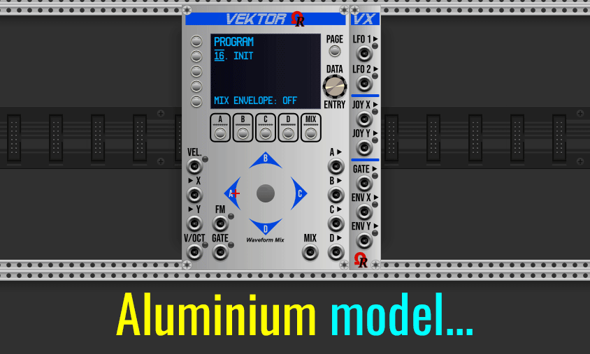
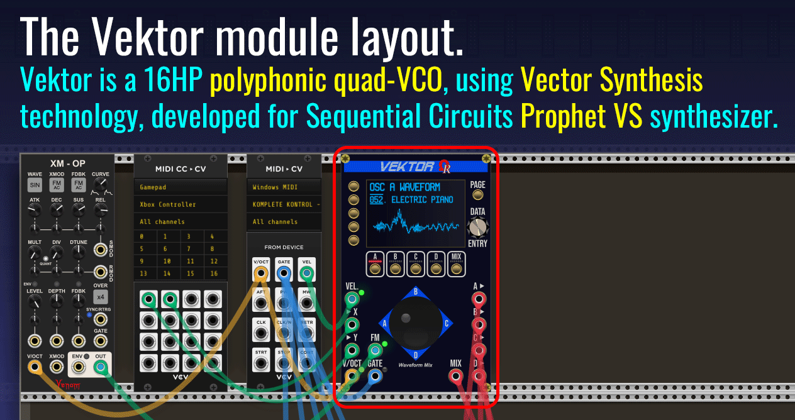
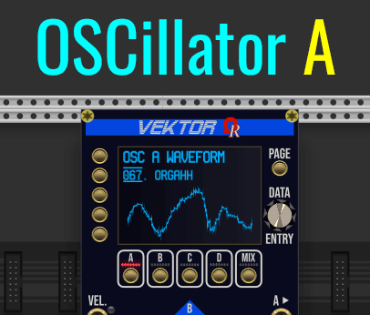

# VEKTOR & VX: USER'S MANUAL (UNDER CONSTRUCTION)

_They're all 8 models (GUI theme variations) for Vektor and its right-side attached VX expander modules:_

### TOPICS

- [**HISTORY OF THE VECTOR SYNTHESIS**](#history)
- [**INTRODUCTION**](#intro)
- [**MODULES SPECIFICATIONS**](#specs)
- [**DISCLAIMER: VCV RACK 2 "PRESET" LIMITATIONS**](#presetlimitation)
- [**VEKTOR MODULE LAYOUT**](#layoutvektor)
- [**VX EXPANDER MODULE LAYOUT**](#layoutvx)
- [**CONTEXT SELECTION**](#contextsel)

---

### HISTORY OF THE VECTOR SYNTHESIS

Welcome into the **Vector Synthesis** universe!

_Vektor_ is a 16HP polyphonic digital VCO module, using [**Vector Synthesis**](https://en.wikipedia.org/wiki/Vector_synthesis) technology (often abbreviated as **VS**) conceived by Sequential Circuits company for [**Prophet VS**](https://en.wikipedia.org/wiki/Prophet_VS) synthesizer (manufactured from 1986). Unfortunately, this innovative form of synthesis did not meet with great success, probably due to the high price of the Prophet VS synthesizer during this epoch (approx. USD 9,000 after 2026 conversion!).

_This is the 1986 Prophet VS synthesizer, manufactured by Sequential Circuits:_

When the Sequential Circuits went bankrupt during 1987, the company was sold to Yamaha, who have developed the SY22, SY35, and TG33. Then later (mid-1989), Dave Smith, the founder of Sequential Circuits company, have started the Korg USA R&D department, which went on to produce the [**Korg Wavestation**](https://en.wikipedia.org/wiki/Korg_Wavestation) synthesizer, also using Vector Synthesis but... as advanced, mainly due to extra feature named _Wave Sequencing_ (useful to create evolving sounds).

During 2015, Yamaha had returned the original trademark to **Dave Smith Instruments** (prior to be rebranded as **Sequential**, three years later).

Notable artists who have used the Prophet VS synthesizer was Depeche Mode, Vangelis, Brian Eno, Prince, Kraftwerk, Erasure, Rush, French singers Michel Berger and Christophe, and filmmaker John Carpenter.

---

### INTRODUCTION

Partially inspired by the Behringer's [**Victor**](https://www.behringer.com/en/products/0720-ADA) Eurorack module, the main objective of _Vektor_ is to provide the "VCO parts" of the Prophet VS synthesizer, including the famous mixer joystick (for dynamic waveform crossfading) inside "the diamond" pattern, and its MIXing ENVelope who is working like an "automation curve" (in modern DAWs) to control the timed crossfading trajectory, automatically.

Also provided by _Vektor_, two internal (independent) low-frequency oscillators (**LFO 1** and **LFO 2**), plus **FM input** jack, able to work as either **TZ FM** (linear Through-Zero FM) or **PM** (Phase Modulation, variant of FM synthesis used by Yamaha DX synthesizers family). These possible **frequency modulators** are designed to modulate any oscillator (waveform) you'll want (OSC A, B, C or D), offering near infinite possibilities in sound design. Also, LFO 1 and/or LFO 2 can be used by external module(s) in your rack, by attaching the _VX_ expander alsongside _Vektor_ (right side, without space between each other).

However, many parts of the real Prophet VS synthesizer, such analog low-pass filter, ADSR envelope generators, modulation matrix, panning, stereo chorus, aren't provided by the _Vektor_ module, assuming they're a lot of capable third-party modules to do similar tasks inside our virtual Eurorack modular environment! By this way, when used "alone", _Vektor_ cannot be considered as "ready-to-use" synth voice module, like most VCO modules in fact!

_Vektor_ is using four independent waveform-based oscillators, named **OSC A**, **OSC B**, **OSC C** and **OSC D** (or by simple letters **A**, **B**, **C**, and **D** also refer to respective OSC A, OSC B, OSC C, and OSC D), as _sound sources_, located in four angles of the diamond (like four speakers placed in angles into a square room). All of them are mixed (crossfading) either manually by the joystick, by external voltages applied to **X** and **Y** input jacks, or via fully automated **MIX ENV**elope (controlled by **GATE** input jack).

Each oscillator uses **waveform**, like the Prophet VS hardware synthesizer does. The 96 official waveforms are provided as "built-in ROM", numbered from **032** to **125**, have a name and graphical representation from oscillator context (**OSC x WAVEFORM** page). Please notice the built-in waveform number **126** (named **SILENCE**), when selected, the related oscillator isn't processed by the DSP. Also, waveform number **127** is constant-frequency **WHITE NOISE** (made by a dedicated Gaussian white noise generator, to a buffer).

:warning: Built-in **126. SILENCE** waveform, when selected for a particular oscillator (A, B, C, or D), doesn't provide "pages" for extra settings, because it's a nonsense to set the frequency and/or the volume for... a muted oscillator! In this case, the **PAGE** button does nothing! Also, built-in **127. WHITE NOISE** waveform have only **OSC VOLUME** as extra page, but nothing about **OSC FREQUENCY**, because white noise frequency is always constant (it doesn't follow "V/octave" rule), and cannot be modulated by FM/PM or by internal LFO.

The _Vektor_ module permits to import custom WAVE (.wav) file to any **USER waveform** slot (numbered from **000** to **031**, respectively labelled **USER #1** to **USER #32**). WAVE file importation will be explained later (having a dedicated section in this User's Manual).

As module outputs, the most important in Vector Synthesis concept is **MIX** (always post-joystick or post MIX ENVelope), but they're also **A**, **B**, **C**, and **D** discrete oscillator outputs (useful for particular FX processings). Every discrete OSC output may be either **post-joystick** (or post MIX ENVelope) - it's the default behavior, or **pre-joystick** (or pre MIX ENVelope) like "dry" (unmixed), can be configured from **OSC x VOLUME** page (3rd page from oscillator context).

Every output jack delivers a **mono audio signal** (10V peak-to-peak, -5V/+5V range, polyphonic), can be sent to a mixer (or VCV AUDIO output) module, to another module for specific FX processing, or as modulation source for other module in your rack (FM, AM, envelope follower, ring modulator, any you'd like in fact).

_Vektor_ comes with (optional-to-use) 3HP "right side" expander module, named _VX_ (accronym of **V**ektor e**X**pander), offering seven additional outputs:
- **LFO 1** and **LFO 2** (top section), each outputs the related (and configured) LFO signal (-5V/+5V range, can be sine, triangle, sawtooth, ramp, square or random).
- **JOY X** and **JOY Y** (middle section) who report respectively the X (horizontal) and Y (vertical) position of the **physical joystick** in the diamond.
- **GATE** (bottom section) who outputs +10V while the MIX ENVelope is running (its LED is blue), 0V otherwise (its LED is unlit).
- **ENV X** and **ENV Y** (bottom section) who report the X and Y positions of the running MIX ENVelope (envelope point 4/release stage position, otherwise).

Vektor VCO module is polyphonic, up to 16 voices (channels). Please be careful about CPU usage as soon as you increase the number of polyphony voices from the source module(s), please keep in mind 16 polyphonic channels x 4 oscillators, plus two LFO (computed waveforms), plus the MIX ENVelope who are using Pythagorean and trigonometric functions to establish trajectories, may require a more or less amount of CPU resources. Recommended polyphony setting for _Vektor_ is 4, or 8 voices.

---

:information_source: The best for the end, _Vektor_ and _VX_ modules are free for everyone (license V2 keyfile is not required)!

---

### MODULES SPECIFICATIONS

_Vektor_ module technical specifications:

- Designed to operate in VCV Rack 2 (v2.6.6, or higher), "Free" and "Pro" editions.
- Width: 16HP.
- Available models (GUI theme variants): 8 (please watch the animation at the top of this page, for available models).
- Display: **non-touchscreen** OLED (blue).
- 5 "context" momentary buttons OSC A, OSC B, OSC C, OSC D, MIX, overlooked by horizontal red LED "bars".
- 5 left-side momentary buttons L1 to L5.
- PAGE momentary button.
- DATA ENTRY continuous encoder.
- Polyphony: yes (max. 16 polyphonic voices/channels).
- Sound sources: 4 (OSC A, OSC B, OSC C, and OSC D), using waveforms/samples.
- Built-in ROM waveforms: 96, including "silence" (disabled OSC), and constant-frequency white noise.
- User waveforms: max. 32 (per module instance).
- Wave importation: Microsoft/IBM WAVE, PCM signed 16-bit, 44100Hz, mono, 2048 samples. **Filesize must be 4140 bytes**.
- Wavetable support: no (like the real Prophet VS synthesizer).
- LFO: 2 internal (separate) LFO 1 and LFO 2 (settings per program).
- LFO frequency range: min. 0.01Hz, max. 50Hz, resolution 0.01Hz, default 2Hz.
- LFO AMPlitude range: min. 0% (LFO is turned off), max. 100% (+5V).
- LFO waveforms: sine, triangle, sawtooth, ramp (inverted sawtooth), square, random.
- Joystick: manual A/B/C/D volume crossfading, MIX ENVelope points edit.
- MIX ENVelope (automated A/B/C/D mixing): fully customizable (mix envelope settings per program).
- MIX ENVelope control: by GATE input jack.
- MIX ENVelope points: 5, all customizable (point 0 is start, point 3 is sustain, point 4 is release).
- MIX ENVelope rates: 4,all customizable (times in milliseconds, min. 0ms, max. 5000ms).
- MIX ENVelope loop: yes, all customizable (please read MIX ENVELOPE LOOP chapter).
- Input jacks: 7 (V/OCT, joystick X, joystick Y, GATE, VEL, FM). All accept -5V/+5V voltages (no limit for V/OCT).
- Supported FM modes: linear Through-Zero (TZ FM), Phase Modulation (PM). Settings per program.
- OSCillators modulation: by external FM/PM, by internal LFO 1, by internal LFO 2. Per oscillator and per program.
- Output jacks: 5 (MIX, A, B, C, D).
- Output voltage ranges: -5V to +5V (10V peak-to-peak).
- Stereo: none (all outputs are mono).
- Programs: 16, all customizable. Any program can be saved/loaded to/from separate file(s).
- RGB LED: no (single colored LEDs. Inputs: yellow for V/OCT, blue for GATE, green for VEL and FM. No LED for outputs).
- Operational sample rate: recommended 44100Hz and higher frequencies.
- SIMD technology: no.
- Self-test feature: on first module installation in the rack, on full reset to default factory (Initialize / Ctrl+I).

_VX_ expander module technical specifications:

- Designed to operate in VCV Rack 2 (v2.6.6, or higher), "Free" and "Pro" editions.
- Width: 3HP.
- Must be placed alongside the **right side** of any _Vektor_ module, **without space** between them.
- Available models (GUI theme variants): 8, automatically follows the _Vektor_ module's model when linked.
- Outputs: 8 (LFO 1, LFO 2, JOY X, JOY Y, GATE, ENV X, ENV Y).
- Output voltage ranges: -5V to +5V.
- LED: per output, all RGB.

---

### DISCLAIMER: VCV RACK 2 "PRESET" LIMITATIONS

:warning: Due to **important amount of datas by using custom WAVE files as USER waveforms** (each waveform represents **4096 bytes size**, largely more in json, because all numerical values are coded as plain text), by this way the "100 kilobytes limit recommendation" for json serialization - as indicated in VCV Rack manual - can be reached very quickly). The absence of "patch storage" for preset files (.vcvm) is really problematic - unfortunately, it's a bad VCV Rack 2 limitation I guess. Also, VCV Rack 2 doesn't provide specific functions or "flags" to distinguish between preset save file and regular patch save file!

To be compatible about the VCV Rack 2 presets feature (as requested by many end users), any imported .wav file to USER waveform slot is, unfortunately, saved inside the patch/preset json file, including 15-sec autosave file (instead of in a "patch storage" via **onSave()** / **onAdd()** methods).

**So, please proceed with caution about the number of .wav files you'll import to USER waveform(s)!**. Do not forget you'll can clear (free) unused waveform, when selected from any oscillator context (A, B, C, or D), the module's right click context menu offers a command to clear/free the current user waveform.

---

### VEKTOR MODULE LAYOUT

The best way to present the _Vektor_ module layout is by the (long) animation (11 frames, approx. 20 s per frame):

---

### VX EXPANDER MODULE LAYOUT

Section in under construction...

---

### CONTEXT SELECTION

_Vektor_'s context can be compared to "mode".

They are exactly 6 contexts:
- **A**, **B**, **C**, and **D**, for related oscillator (A, B, C, or D), when its LED above the button is on (lit).
- **MIX**, concerns the MIX ENVelope feature, when the LED above the MIX button is lit.
- **PROGRAM**, concerns "synth-like patch/preset", when **all LED are turned off** (all are unlit).

These contexts are represented by the five buttons (+ related red LED) group, located just below the OLED display, listed by the following animation:

The oscillator-related context (A, B, C, or D) permits to choose the oscillator waveform (by rotating the **DATA ENTRY** continuous encoder, to choose previous or next waveform slot, either a built-in ROM or user waveform), to import a custom waveform (from external ".wav" file) - valid only when the current waveform is a USER waveform (from number **000** to **031**), to clear (to free) the current user waveform slot (via right click context menu command, but only enabled/visible when appropriate), and to access additional oscillator parameters (frequency on 2nd page, volume/velocity on 3rd page) by pressing the **PAGE** button (located above DATA ENTRY continuous encoder) once or twice.

The MIX context permits to edit (or review) all the parameters concerning the current MIX ENVelope (TIP: each program have its own mix envelope).

A "program" is a kind of _synthesizer preset_ or _synthesizer patch_, identified either by a number (from **01** to **16**) and by an explicit name (eg. **PIPE ORGAN**). Every program collects its name, all settings for the four oscillators (A, B, C, and D), the physical joystick position, the mix envelope, specific legato/unison/detune settings (not available at the moment/planned), FM input depth and mode (TZ FM or PM), LFO 1, and LFO 2.

To select another context, press the related button (A, B, C, D, or MIX) when its LED is unlit: _Vektor_ is switched to the new context, and its red LED becomes lit.

:information_source: To select the PROGRAM context, press the button **where the LED is already lit**: by doing this, all LED become unlit, indicating the _Vektor_ module is switched to PROGRAM context.

Except for the **MIX** context (default display - for its 1st page - is the MIX ENVelope trajectory also named _vectors_), oscillator and program contexts is also visible on top of the OLED display (**OSC A WAVEFORM**, **OSC B WAVEFORM**,**OSC C WAVEFORM**, **OSC D WAVEFORM**, or **PROGRAM**) as "header" of first page!

---

...TO BE CONTINUED... THANKS FOR YOUR PATIENCE! ;)