# VEKTOR USER'S MANUAL

### TOPICS

- [**HISTORY OF THE VECTOR SYNTHESIS**](#history)
- [**WHAT IS "VECTOR SYNTHESIS" EXACTLY?**](#whatisvs)
- [**CABLE & LED COLORSCHEME CONVENTION**](#colorscheme)
- [**INTRODUCTION**](#intro)
- [**VEKTOR MODULE TECHNICAL SPECIFICATIONS**](#vektorspecs)
- [**VX EXPANDER MODULE TECHNICAL SPECIFICATIONS**](#vxspecs)
- [**DISCLAIMER: VCV RACK 2 "PRESET" LIMITATIONS**](#presetlimitations)
- [**VEKTOR MODULE LAYOUT**](#layoutvektor)
- [**VX EXPANDER MODULE LAYOUT**](#layoutvx)
- [**CONTEXT SELECTION & RELATED "PAGES"**](#contextsel)
- [**SOME WORDS ABOUT POLYPHONY**](#aboutpoly)
- [**PROGRAMS, IN DETAIL**](#programs)
- [**MIX ENVELOPES, IN DETAIL**](#mixenvelope)
- [**OSCILLATORS, IN DETAIL**](#oscillators)
- [**SUPPORTED WAVE FILE FORMAT (IMPORT TO USER WAVEFORM SLOT)**](#waveformat)
- [**BENEFITS OF DISCRETE OSCILLATOR OUTPUTS**](#discreteouts)
- [**FROM MODULE BROWSER**](#modulebrowser)
- [**OUTRO...**](#outro)

_All 8 models (panel theme variants) for Vektor module, and its attached VX expander:_
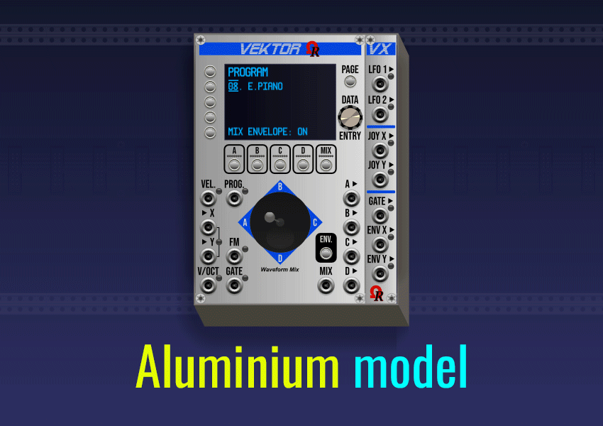

All four "Signature"-line models (from 5th, Dark "Signature") embed **gold metal** jacks, momentary buttons, and screws. All four Non-"Signature" models (from first Aluminium) embed **silver metal** jacks, momentary buttons, and screws, instead. Obviously, all proposed models are providing exactly the same features!

---

### HISTORY OF THE VECTOR SYNTHESIS

Welcome to the **Vector Synthesis** universe!

_Vektor_ is a 16HP polyphonic quad-oscillator digital VCO module, using [**Vector Synthesis**](https://en.wikipedia.org/wiki/Vector_synthesis) technique (often abbreviated as **VS**) conceived by Sequential Circuits company (Dave Smith) for his [**Prophet VS**](https://en.wikipedia.org/wiki/Prophet_VS) synthesizer, manufactured from 1986. Unfortunately, this innovative form of synthesis did not meet with great success, probably due to the high price of the Prophet VS synthesizer during this epoch (approx. USD 9,000 after 2026 conversion!).

_This is the 1986 Prophet VS synthesizer, manufactured by Sequential Circuits:_
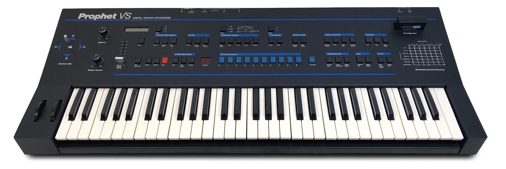

When the Sequential Circuits went bankrupt during 1987, the company was sold to Yamaha, who have developed the SY22, SY35, and TG33, both of them are using _Vector Synthesis_, too.

Then later (mid-1989), Dave Smith, the founder of Sequential Circuits company, have started the Korg USA R&D group, which went on to produce the [**Korg Wavestation**](https://en.wikipedia.org/wiki/Korg_Wavestation) synthesizer, also using Vector Synthesis but... as "advanced", mainly due to extra amazing feature named _Wave Sequencing_, useful to create evolving sounds!

During 2015, Yamaha had returned the original trademark to **Dave Smith Instruments** (prior to be rebranded as **Sequential**, three years later).

Notable artists who have used the Prophet VS synthesizer was Depeche Mode, Vangelis, Brian Eno, Prince, Kraftwerk, Erasure, Rush, French singers Michel Berger and Christophe, and the filmmaker John Carpenter.

---

### WHAT IS "VECTOR SYNTHESIS" EXACTLY?

In case you are unfamiliar about _Vector Synthesis_, the best way to explain it is to use the following fictious scene, where you are the actor!

Try to imagine a square room, consider this room doesn't have sound reflection on walls/floor/roof, having a loudspeaker on each corner, each loudspeaker constantly outputs a waveform at same frequency and volume (like an oscillator can do). First, if you're looking the room from above:
- Loudspeaker **A** is located at the bottom-left corner (angle).
- Loudspeaker **B** is located at top-left corner.
- Loudspeaker **C** is located at top-right corner.
- Loudspeaker **D** is located at bottom-right corner. Like the following image:

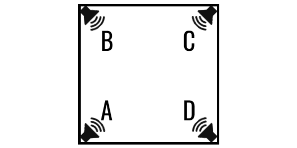

Now, by a magical mechanism, the room is rotated **clockwise by 45 degrees** (but you keep your initial orientation!):

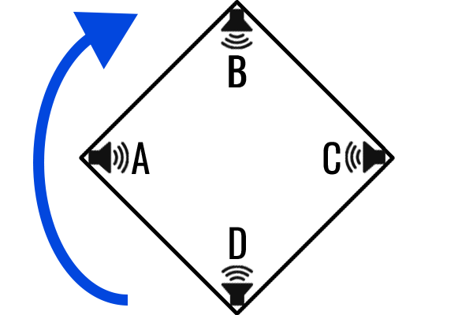

Obviously, after the rotation, the room remains a square. But from above view, now the room shape looks like a **diamond** (in geometry, square is a particular form of... diamond).

By doing the room rotation, now loudspeaker A becomes at your left hand, B at top, C at right, and D at bottom.

Now, you enter the room, having a (omnidirectional) microphone in your hand, and you place the microphone exactly at the center of the room: the microphone captures sound "components" of every loudspeaker, as equal parts (in Vector Synthesis world: 50% of A, 50% of B, 50% of C, and 50% of D):

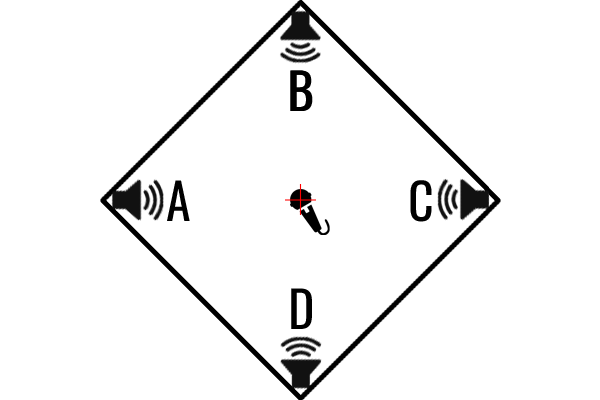

As soon as you move by short line "segments" in the room (any direction and distance), on every position, in realtime, the mix (**crossfading**) captured by the microphone changes: amounts of captured loudspeakers depend the microphone position, regardling distances to loudspeakers. As example, if the microphone is nearest as possible of the loudspeaker A, it captures maximum 100% of it, near 0% from the opposite C, and a signifiant part of remaining C and D (but less than 50%). And so on!

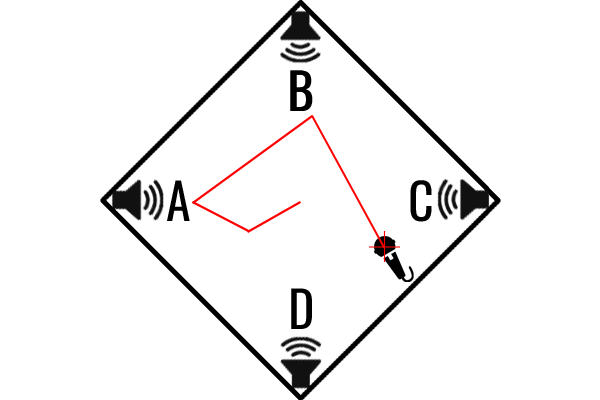

Every line segment corresponding of your moves, as red segments just above (point where the segment start, direction, and distance) is named... a **VECTOR**. This is the reason why this synthesis technique, by blending 4 loudspeakers (4 oscillators, as sound sources) is named Vector Synthesis!

:information_source: **If you understand the principle, be sure you have understood 99.9% about the Vector Synthesis!**

Real and virtual synthesizers who are using Vector Synthesis (also true concerning the _Vektor_ module), the X horizontal & Y vertical position (coordinates) of the "microphone" in the "diamond room" is simulated by a mechanical (unsprung) joystick controlled by your hand (**-or-** by voltages applied on both **X** and **Y** input jacks), and can be combined with (optional) fully programmable MIX ENVelope, kind of **timed automation** of vectors & X/Y points in realtime (and related crossfadings, by this way).

Of course, the described fictious scene as introduction is assuming, in ideal word, all of the loudspeakers output same sound, at same frequency, and same volume level. However, the reality is different, because each loudspeaker (oscillator) may use different waveform, frequency (by transposition, and/or by modulated frequency), and/or different volume (base gain of the oscillator).

Also, an another important aspect of the MIX ENVelope are timings (in milliseconds), named **RATES**. Rate is basically the time required to run between an origin point of the vector, to the next point. Every vector can be covered from **minimum 0 millisecond** (_faster than light_, in this case, the vector is ignored, and next is immediately processed), up to **maximum 5,000 milliseconds** (5 seconds). Default proposed rates is depending of the selected program (all are default 500 milliseconds for **16. INIT** program).

---

### CABLE & LED COLORSCHEME CONVENTION

Following convention is used by the developer, and mainly follows the convention used by an influencer on YouTube (I won't mention his name, as long as he boycotts my modules, however), for cable colors usage. Also, the LED colorscheme used by both _Vektor_ and _VX_ modules follow this convention:

- Yellow, for V/OCT and pitch-based (used once by **V/OCT** input jack, on _Vektor_ module).
- Blue, for triggers and gates (used by **GATE** input jack on _Vektor_ module, and **GATE** output jack on _VX_ expander).
- Green, for CV, either inputs and outputs (modulation voltages, both modules).
- Red, for audio (**MIX** output, also **A**, **B**, **C**, and **D** discrete oscillator output jacks, on _Vektor_ module).

---

### INTRODUCTION

Partially inspired by the Behringer's [**Victor**](https://www.behringer.com/en/products/0720-ADA) Eurorack module, the main objective of _Vektor_ is to provide the "VCO parts" of the Prophet VS synthesizer, including the famous mixer joystick (for dynamic waveform crossfading) inside "the diamond", and its possible MIXing ENVelope who act like an "automation curve" to control the timed crossfading trajectory, automatically!

Also provided by _Vektor_, two internal (independent) low-frequency oscillators (**LFO 1** and **LFO 2**), plus **FM input** jack, able to work as either **TZ FM** (linear Through-Zero FM) or **PM** (Phase Modulation, variant of FM synthesis used by Yamaha DX synthesizers). These possible **frequency modulators** are designed to modulate any oscillator (waveform) you'll want (OSC A, B, C or D), offering near infinite possibilities in sound design sessions. Also, LFO 1 and/or LFO 2 can be used by external module(s) in your rack, by attaching the _VX_ expander alsongside _Vektor_ (right-side, without space between them!).

However, many parts of the real Prophet VS synthesizer, such analog low-pass filter, ADSR envelope generators, modulation matrix, stereo and panning, stereo chorus, aren't provided by the _Vektor_ module, assuming they're a lot of capable third-party modules to do similar tasks inside our virtual Eurorack modular environment! By this way, when used "alone", _Vektor_ cannot be considered as "ready-to-use" synth voice module (like most VCO modules, in fact).

_Vektor_ is using four independent waveform-based oscillators, named **OSC A**, **OSC B**, **OSC C** and **OSC D** (or by simple letters **A**, **B**, **C**, and **D** also refer to respective OSC A, OSC B, OSC C, and OSC D), located in four angles of the diamond (as explained by previous topic). All of them are mixed (crossfading) either manually by the joystick (or by external voltages applied to **X** and **Y** input jacks), or via fully automated **MIX ENV**elope (controlled by **GATE** input jack).

Each oscillator is using **waveform**, like the Prophet VS hardware synthesizer does. The 96 official waveforms are provided as "built-in ROM", numbered from **032** to **125**, have a name and graphical representation from oscillator context (**OSC x WAVEFORM** page). Please notice the built-in waveform number **126** (named **SILENCE**), when selected, the related oscillator isn't processed by the DSP. Also, waveform number **127** is constant-frequency **WHITE NOISE** (made by a dedicated Gaussian white noise generator, to a buffer).

:warning: Built-in **126. SILENCE** waveform, when selected for a particular oscillator (A, B, C, or D), doesn't provide "pages" for extra settings, because it's a nonsense to set the frequency and/or the volume for... a muted (disabled) oscillator! In this case, the **PAGE** button doesn't have effect!

:warning: Also, built-in **127. WHITE NOISE** waveform have only **OSC VOLUME** as extra page, but nothing about **OSC FREQUENCY**, because white noise frequency is always constant (it doesn't follow "V/octave" rule), cannot be "pitched", nor frequency modulated by FM/PM/LFO.

The _Vektor_ module permits to [import custom WAVE file](#waveformat) to any **USER waveform** slot of your choice (these slots are numbered from **000** to **031**, and respectively labelled **USER #1** to **USER #32**).

:warning: For user waveforms, **USER #1** to **USER #32** labels can't be changed.

As module outputs, the most important in Vector Synthesis is the **MIX** output (always post-joystick or post MIX ENVelope), but the _Vektor_ module provides additional **A**, **B**, **C**, and **D** discrete oscillator outputs, useful as separate oscillators, or for particular FX processings. Every discrete OSC output may be either **pre-joystick** (or pre-MIX ENVelope), as dry/unmixed - it's the default setting, or **post-joystick** (or post-MIX ENVelope). This joystick/mix envelope routing can be set-up from every **OSC x VOLUME** page (3rd page, **L4** button, from any oscillator context).

Every output jack delivers a **mono audio signal** (10V peak-to-peak, -5V/+5V range, polyphonic), can be sent to a mixer (or VCV AUDIO output) module, to another module for specific FX processing, or as modulation source for other module(s) in your rack (modules who support FM, AM, ring modulation, or any you'd like).

Vektor module is polyphonic, up to 16 voices (16 polyphony channels).

_Vektor_ comes with (optional-to-use) 3HP "right-side" expander module, named _VX_ (accronym of **V**ektor e**X**pander), adding 7 additional output jacks:

Outputs provided by the _VX_ expander module:
- **LFO 1** and **LFO 2** (top section), each outputs the related (and configured) LFO signal (-5V/+5V range, can be sine, triangle, sawtooth, ramp, square or random).
- **JOY X** and **JOY Y** (middle section) who report respectively the X (horizontal) and Y (vertical) position of the **physical joystick** in the diamond (whatever the applied voltages on X and Y input jacks, whatever the mix envelope, it's **always** the **physical joystick 2D position**).
- **GATE** (bottom section) who output +10V while the MIX ENVelope is running (its LED glows blue), 0V otherwise (its LED is off).
- **ENV X** and **ENV Y** (bottom section) who report the X and Y coordinates of the MIX ENVelope, while the MIX ENVelope is running (otherwise 0V, and all LED of the bottom section glow solid red).

---

### VEKTOR MODULE TECHNICAL SPECIFICATIONS

- Designed to operate in VCV Rack 2 (v2.6.6, or higher), "Free" and "Pro" editions.
- Width: 16HP.
- Available models (GUI theme variants): 8 (please watch the animation at the top of this page, for available models).
- Display: **not a touchscreen** OLED, blue monochrome.
- 5 "context" momentary buttons OSC A, OSC B, OSC C, OSC D, MIX, overlooked by horizontal red LED.
- 5 left-side momentary buttons (L1 to L5, from top to bottom).
- PAGE momentary button.
- DATA ENTRY continuous encoder.
- ENV momentary button (as toggle to enable or disable the mix envelope "on-the-fly"). Per program.
- Polyphony: max. 16 voices/channels (recommended: 4 or 8 voices).
- Oscillators: 4 (OSC A, OSC B, OSC C, and OSC D), using waveforms/samples.
- Built-in ROM waveforms: 96, including "silence" (disabled OSC), and not-pitchable (constant frequency) white noise.
- User waveforms: max. 32 (per module instance).
- Wave importation: Microsoft/IBM WAVE, PCM signed 16-bit, 44100Hz, mono, 2048 samples, 4140 bytes.
- Wavetable support: no.
- LFO: 2 independent internal LFO 1 and LFO 2 (settings per program).
- LFO frequency range: min. 0.01Hz, max. 50Hz, resolution 0.01Hz.
- LFO AMPlitude range: min. 0% (LFO is turned off), max. 100% (+5V).
- LFO waveforms: sine, triangle, sawtooth, ramp, square, random.
- Joystick: manual A/B/C/D volume crossfading (absolute, or offset), MIX ENVelope points edit.
- MIX ENVelope (automated A/B/C/D crossfading): per program. Can be enabled/disabled via a dedicated ENV. button.
- MIX ENVelope control: by held GATE input jack (min. +1V, recommended +10V).
- MIX ENVelope points: 5 (point 0 is the start point, point 3 is the sustain point, point 4 is the release point).
- MIX ENVelope rates: 4 (times in milliseconds, min. 0ms, max. 5000ms, per vector).
- MIX ENVelope loop: yes, from 1 up to 12 times (or infinite), unidirectional or bidirectional, from point 3 to 2, to 1 or to 0.
- Input jacks: 6 (PROG., X, Y, FM, V/OCT, GATE).
- Supported FM modes: linear Through-Zero (TZ FM), Phase Modulation (PM). Per program.
- FM depth: 0% (NO FM) to 100%, or negative -100% (inverted modulator signal). Per program.
- OSCillators frequency modulation: by external FM/PM, by internal LFO 1, by internal LFO 2. Per oscillator, and per program.
- Frequency response: 10 octaves, from 16.352Hz (C0) to 15804.416Hz (B9).
- Band-limiting: up to Nyquist frequency (half of sample rate).
- DAC resolution: 12-bit.
- Operational sample rate: recommended 44100Hz/48000Hz, or higher.
- Output jacks: 5 (MIX, A, B, C, D).
- Output voltage ranges: -5V to +5V (10V peak-to-peak).
- Stereo: none (all outputs are mono, but polyphonic).
- Programs: 16 (all are fully customizable). Any program can be saved/loaded to/from external file(s).
- Program change: supported via PROG. input jack (+1V to +8.5V).
- LED: yellow for V/OCT, blue for GATE, green for PROG. and FM, green/red for combined X and Y inputs.
- Self-test feature: on first installation in the rack, on full reset to factory (**Initialize** command, from right click menu).

---

### VX EXPANDER MODULE TECHNICAL SPECIFICATIONS

- Designed to operate in VCV Rack 2 (v2.6.6, or higher), "Free" and "Pro" editions.
- Width: 3HP.
- Must be placed alongside (**right-side**) of any _Vektor_ module, **without space** between them to establish the link.
- Available models (GUI theme variants): 8, automatically inherit the _Vektor_ model (when link is established).
- Outputs: 7 (LFO 1, LFO 2, JOY X, JOY Y, GATE, ENV X, ENV Y).
- Output voltage ranges: -5V to +5V (0V or +10V for GATE).
- LED: per output (all LED are RGB).

---

### DISCLAIMER: VCV RACK 2 "PRESET" LIMITATIONS

:warning: Due to **important amount of datas by using custom WAVE files as USER waveforms** (each waveform represents **4096 bytes**, twice in json files, because all numerical values for every sample are hex-coded as plain text), by this way, the "100 kilobytes limit recommendation" for json serialization - as indicated by VCV Rack manual - can be reached very quickly). The absence of "patch storage" for preset files (.vcvm) is really problematic - unfortunately, it's a bad VCV Rack 2 limitation (I guess). Also, VCV Rack 2 doesn't provide specific functions or "flags" to distinguish preset save file versus regular patch save file!

To be 100% compatible vs. VCV Rack 2 presets feature (as requested by many end users), any imported .wav file to USER waveform slot is saved inside the patch/preset json file (including autosave, occuring every 15-second), instead of inside an external "patch storage" (via **onSave()** and **onAdd()** C++ methods).

**So, please proceed with caution about the number of .wav files you'll import to USER waveform slots!**. From 9 (and more) imported waveforms, the WARNING (orange) LED at the bottom of the module (WARN./ERR. section, below the joystick) is **blinking orange** (twice per second) to inform you it's risky about important amount of datas stored to json file (.vcv patch file, .vcvm preset file, .vcvs module selection file, or autosave file). Do not forget you'll can clear (free) unused user waveform slots, by selecting any oscillator context (A, B, C, or D), then browsing to unused waveform. In this case, the module's right click menu offers a command to clear (free) the current user waveform slot (grayed if the slot isn't used).

---

### VEKTOR MODULE LAYOUT

The best way to present the _Vektor_ module layout is by the following **5 minutes** animation (22 frames, 15 seconds/frame):

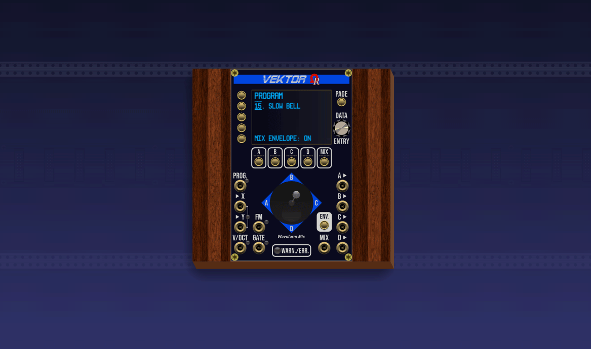

---

### VX EXPANDER MODULE LAYOUT

_VX_, the 3HP "right-side" expander, is a _passive_ module. It offers outputs only (7, all are controlled by _Vektor_'s logic). Usage of the _VX_ expander is optional, depending your needs.

_VX_ expander module is divided by 3 sections (blue lines on the module's plate are section separators):

- Upper section is dedicated to LFO 1 and LFO 2 (both are handled by the _Vektor_ module).
- Middle section is dedicated to position of the _Vektor_'s **physical joystick**.
- Lower section is dedicated to the _Vektor_'s MIX ENVelope, including mix envelope **GATE** output jack.

Every output jack have its own LED, all green, the exception is **GATE** who are using a blue LED, instead.

:warning: All **fast blinking red** LED indicates the _VX_ expander module is not "linked" to a parent _Vektor_ module!

The upper section, dedicated to _Vektor_'s LFO 1 and LFO 2, reports each LFO by bipolar -5V/+5V voltage, and can be used as CV to modulate any other module. In case of LFO is disabled from the _Vektor_ module, the relevant voltage is constant 0V on output jack, and its LED glows red, just to warn the user.

The middle section, dedicated to _Vektor_'s physical joystick, constantly reports X and Y joystick coordinates by bipolar -5V/+5V voltages, and can be used as CV source for any other external module.

The lower section, dedicated to _Vektor_'s MIX ENVelope, constantly reports X and Y coordinates while the MIX ENVelope is running, by bipolar -5V/+5V voltages. Also, while the MIX ENVelope is running, the GATE jack outputs +10V. However, as long as the MIX ENVelope is turned OFF, both **GATE**, **ENV X**, and **ENV Y** LED glow red, meaning the constant 0V applied on these output jacks are not relevant, just to warn the user.

:information_source: Offsets by the physical joystick position (**-or-** by voltages applied on both **X** and **Y** input jacks) are not included in **ENV X** and **ENV Y** voltages!

---

### CONTEXT SELECTION & RELATED "PAGES"

_Vektor_ is a small VCO module (16HP), so it can't provide all controls on the same plate. By this way, the _Vektor_ is using a **context** system. _Vektor_'s context can be compared to "module mode", or "module section", or something similar.

They're exactly 6 contexts. Each context is represented by the red LED above its button, and can be changed by pressing the relevant button (context buttons/LED are located just below the OLED display, each box is a "context").

Contexts are:

- **A**, **B**, **C**, and **D**, for related oscillator A, B, C, or D context, when its corresponding LED above the button glows red.
- **MIX**, covers all the aspects of the MIX ENVelope feature, when the LED above the MIX button glows red.
- **PROGRAM**, concerns program selection and settings for selected program, when **all LED of the group are off**.

Any oscillator-based context (A, B, C, or D) permits:
- to choose the oscillator waveform (can be a _built-in ROM_ waveform, or a _user_ waveform).
- to import a custom waveform from external ".wav" file, to current USER waveform "slot" (from number **000** to **031**).
- to clear (free) the current user waveform slot, if used (command from right click menu, when applicable).
- to access additional oscillator settings, like frequency on second page, and volume on third page, by pressing the **PAGE** button.

The MIX context permits to edit (or to view) all the parameters concerning the MIX ENVelope and mix envelope loop feature.

Program is a kind of _synthesizer preset_, identified either by a number (from **01** to **16**) also by an explicit name (eg. **PIPE ORGAN**). Every program collects its name, all settings for the four oscillators (A, B, C, and D), the physical joystick position, the mix envelope, FM input depth and mode (TZ FM, or PM), LFO 1 settings, and LFO 2 settings.

To select a context (except PROGRAM), press the related button (A, B, C, D, or MIX) when its LED is off: _Vektor_ is switched to the new context, and its LED glows red.

To select the PROGRAM context, press the button **where the LED is already glowing red**, by this way, all LED of the group are turned off, indicating the _Vektor_ module now is switched to PROGRAM context.

Except for the **MIX** context (default display for its first page is the MIX ENVelope trajectory, aka _vectors_), oscillator and program contexts is also visible on top of the OLED display (**OSC A WAVEFORM**, **OSC B WAVEFORM**, **OSC C WAVEFORM**, **OSC D WAVEFORM**, or **PROGRAM**), as "header" of their respective first/home page.

Each context have a certain number of theme-related "pages" for extra settings, so you can select next page by pressing the **PAGE** momentary button (top-right side of the module). To return to first (home) page anytime, hold **left Ctrl** key (**left Command** key on MacOS X computers), then press the **PAGE** button.

For every context, the number of pages is:

- Oscillators **A**, **B**, **C**, and **D**: 3 pages (waveform select/display/import, frequency, and volume).
- **MIX**: 3 pages (trajectory/points editor/viewer, rates, loop).
- **PROGRAM**, 4 pages (program select, FM input, LFO 1, LFO 2).

---

### SOME WORDS ABOUT POLYPHONY

The number of polyphony voices is automatically defined by these possible connected "sources" from other module(s), applied on the following input jacks:

- **V/OCT**, defines the "base" pitches/frequencies (prior frequency modulation by FM/PM or LFO), for all oscillators.
- **GATE**, mainly required to control the MIX ENVelope (if enabled), but also (optional) for LFO 1 and/or LFO 2 retriggering.

These sources come, in general, from the same module, but it's not an absolute rule. The most common module is **MIDI>CV** (provided with VCV Rack software), who convert incoming MIDI datas (by MIDI controller, by MIDI track) to voltage equivalents to be compatible with the Eurorack standard. However, any polyphonic or monophonic module(s) can do exactly the same job.

The greatest number of polyphony voices from these sources is always selected by the _Vektor_ module. Minimum is 1 (meaning the _Vektor_ module is working as monophonic VCO). Maximum number of polyphonic voices (channels) is 16.

:warning: Please be careful about CPU load as soon as you increase the number of polyphony voices, please keep in mind 16 polyphonic channels x 4 oscillators, plus two LFO (realtime computed waveforms), plus the MIX ENVelope who are using a lot of Pythagorean and trigonometric functions to establish vectors (trajectory) and speeds per vector, may require an signifiant amount of CPU resources! **Recommended polyphony setting for _Vektor_ is 4 or 8 voices** (depending your computer and the patch complexity), exactly like the Prophet VS hardware synthesizer.

---

### PROGRAMS, IN DETAIL

The _Vektor_ module can handle up to 16 programs (similar to _synthesizer presets_), per module instance. All first 15 (numbered from 01 to 15, and having an explicit name) are based on the real Prophet VS programs. Program numbered 16 is the **INIT** program (the settings was choosen by the developer).

To select a different program:
- Be sure the PROGRAM context is selected first, **all context red LED must be off**. If not, simply press the button where the LED glows red, by doing this, the _Vektor_ module is switched to PROGRAM context (the OLED must display **PROGRAM** as header) !
- If necessary, press the **L2** button (the blinking "cursor" must surround the program number, along L2 button).
- Rotate clockwise the **DATA ENTRY** continuous encoder to select next program (cycle to 01 if the current program number was 16).
- Rotate counter-clockwise the **DATA ENTRY** continuous encoder to select previous program (cycle to 16 if the current program number was 01).

Also, you'll can control the program select (similar to _MIDI Program Change_) in realtime, by applying a voltage to **PROG.** input jack (can be done by an analog sequencer, such FranKe, or any module capable to deliver unipolar 0V/+10V voltage). Voltage must fit into +1V ~ +8.5V range (each 0.5V step selects next program, from **01** to **16**). The **PROG.** input jack, of course, is working whatever the current module's context!

:warning: **Applied voltages on PROG. input jack below +1V (including negative voltages) are ignored, to avoid unwanted program changes! Also, any voltage above +8.5V always selects program #16.**

Obviously, any program can be altered (depending your needs), saved to external **.vktProgram** (_Vektor PROGRAM_) file, then possibly loaded later (to same or different program number).

:information_source: **Program name always follows the specified filename** when you save the current program, but with restrictive character set (see below). If more than 16 characters is specified as filename, the new program name is truncated to first seven characters, followed by three periods, then the last six characters of the filename. For example, ABCDEFGHIJKLMNOPQRST as filename gives "ABCDEF...OPQRST" as new program name. However, the filename itself is not affected.

Allowed character set for **.vktProgram** filenames (also used for program names) is:
- Any latin letters: A..Z, a..z (lowercase letters are automatically converted to uppercase letters, for displayed program name)
- Any digits: 0..9
- Space
- Minus/hyphen (-)
- Plus (+)
- Underscore (_)
- Equals sign (=)
- Period (.) - **please avoid it as leading character** (Linux and MacOS X operating systems consider these files as hidden!)
- Round brackets (parentheses)
- Square brackets
- Exclamation mark (!)
- Apostrophe (')
- Hash (#)
- Ampersand (&)
- At (@)
- Tilde (~)

To save a program:
- Be sure the _Vektor_ module's context is PROGRAM. If not, click the context button **where the LED above glows red**.
- Do a right-mouse click over the module. From the menu, select **Program #xx**, then **Save to .vktProgram file** (xx is the current program number).
- From **Save As** dialog, select the path where you'd like to save the file, then enter its filename, then click _Save_ button.

To load a program (right click context menu method):
- Be sure the _Vektor_ module's context is PROGRAM. If not, click the context button **where the LED above glows red**.
- Do a right-mouse click over the module. From the menu, select **Program #xx**, then **Open from .vktProgram file** (xx is the current program number).
- From **Open** dialog, select the path where the file is located, select its filename, then click _Open_ button.

To load a program (file drag and drop method):
- Be sure the _Vektor_ module's context is PROGRAM. If not, click the context button **where the LED above glows red**.
- From your operating system file browser (Explorer on Windows computers, Finder on MacOS X computers), open the folder where the file is.
- Drag the relevant **.vktProgram** file, then drop it over the module.

:warning: In case of file operation failure, the **WARN./ERR.** LED (below the joystick) is **blinking red** (twice per second), and a related error cause is shown on the OLED display (press any momentary button to acknowledge the error condition).

All programs (and their relevant default settings) are always saved along the VCV patch file (.vcv), VCV preset file (.vcvm), VCV module selection file (.vcvs) and VCV Rack 2 autosave feature, every 15 seconds.

_Vektor_'s PROGRAM context have 4 pages:

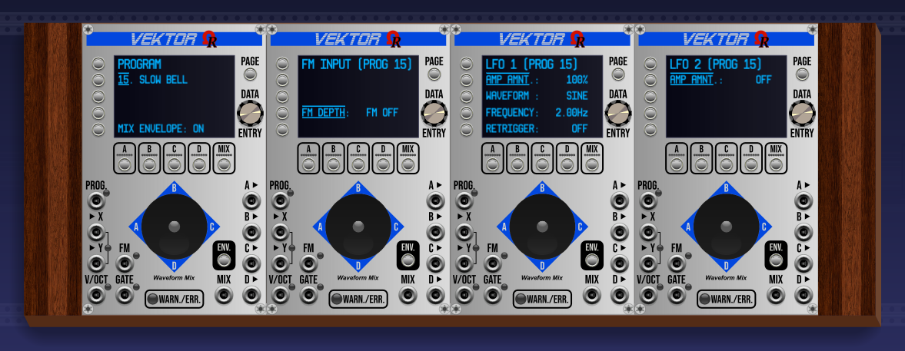

- The first (home) page displays the program number and name along L2 button, and MIX ENVelope state (on/off) along L5 button.
- The second page displays settings dedicated to FM input (FM depth along L4 button, and FM mode along L5).
- The third page displays settings dedicated to LFO 1: AMP amount (L2), waveform (L3), frequency (L4), and retrigger(L5).
- The fourth page displays settings dedicated to LFO 2: AMP amount (L2), waveform (L3), frequency (L4), and retrigger(L5).

:information_source: To restore a displayed setting to its default value (factory, or by last saved program), hold **left Ctrl** key (**left Command** key on MacOS X computers), then press the relevant **L1 ~ L5** (left-side) momentary button!

A program always includes:
- Its name (default, or defined when saving). Limited to 16 characters, see above for allowed character set.
- X and Y coordinates of the physical joystick.
- All MIX ENVelope settings, including rates and loop.
- All four oscillators (A, B, C, and D) settings.
- FM depth & FM mode settings.
- LFO 1 settings.
- LFO 2 settings.

---

### MIX ENVELOPES, IN DETAIL

The MIX ENVelope is the essence of Vector Synthesis. Unlike traditional ADSR envelope (who control a VCA, or a VCF cutoff/resonance), the MIX ENVelope is a **timed** automation curve for oscillators crossfading (volume parts of each). Typically, this envelope - if enabled, is triggered and controlled by the **GATE** input jack - and follows a 2D trajectory into "the diamond" (like the joystick **-or-** the combined X & Y input jacks can do). Also, looping a mix envelope is possible, useful to create movements for very long sustained sounds.

When the MIX ENVelope is enabled (ON), the mix between each oscillator is firstly controlled by the MIX ENVelope. However, the physical joystick (**-or-** the combined X & Y input jacks, **but not both at the same time**), in this case, will apply an "offset" to the mix envelope.

While the envelope is triggered, a visible small diamond is running along vectors (visible from the first page of MIX context).

Every program have its MIX ENVelope settings, and can be turned on or off, regardling your needs.

To access the MIX context, simply press the **MIX** button (located below the OLED display), **only if its LED is off**.

_Vektor_'s MIX context have 3 pages:

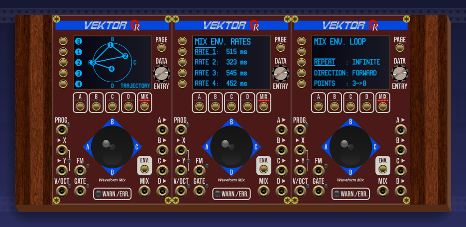

- First page (home page) permits to edit each point of the envelope (use left-side L buttons and the joystick).
- Second page is used to define **rates**, aka durations for each vector (line segment), from 0ms, up to 5,000ms.
- Third page is used to set up the MIX ENVelope loop (loop always starts and finished from/to point #3 / sustain).

The MIX ENVelope is always composed by 5 points (forming 4 vectors):
- Point #0, always the start point, when the applied voltage on **GATE** input jack is +1V or more (high gate).
- Point #1.
- Point #2.
- Point #3, the sustain point (optional loop always starts and finishes at point #3).
- Point #4, the release point, when the applied voltage on **GATE** input jack falls below +1V (low gate).

To edit the position of a particular point:
- Press the L (left-side) related button (L1 for point #1, to L5 for point #5): the "pill" along the button blinks.
- Move the joystick to set the X and Y positions for this point.
- Press the same L button to complete (or press another L button to edit another point, or select another context).

:information_source: as soon as you start to edit a point, the position of the joystick is saved (then restored to previously saved when you complete the edition of the position of the point).

They're 4 rates:
- RATE 1 is the time (milliseconds) to run the first vector, between points #0 and #1.
- RATE 2 is the time (milliseconds) to run the second vector, between points #1 and #2.
- RATE 3 is the time (milliseconds) to run the third vector, between points #2 and #3 (sustain).
- RATE 4 is the time (milliseconds) to run the last vector, between points #3 (sustain) and #4 (release).

:information_source: The module's logic computes needed _speeds_ to run each vector, depending the distance between points, and specified rate.

:warning: Except points #3 (sustain) and #4 (release), any point can be bypassed if the "distance" is zero (overlapping consecutive points), or if the RATE is set to 0ms.

:warning: When enabled, the MIX ENVelope is **always retriggered** on every new incoming "high gate" (in particular for polyphony). This behavior is normal.

Current MIX ENVelope can be saved to **.vktMixEnv** file, then loaded later to any program of you choice! Only point positions, rates and loop settings are saved and recalled.

:warning: The ON/OFF state of the MIX ENVelope is never saved or recalled (stay unchanged if you load an envelope file). Please remember you'll can enable (or disable) the MIX ENVelope quickly by pressing the **ENV** (toggle) button, located just above the MIX output jack.

To save the current MIX ENVelope to a **.vktMixEnv** file:
- Be sure the _Vektor_ module's context is set to **MIX**. If not, press the MIX context button **only if its LED above is off**.
- Do a right-mouse click over the module. From the menu, select **MIX ENVelope**, then **Save to .vktMixEnv file** command.
- From **Save As** dialog, select the path where you'd like to save the file, then enter its filename, then click _Save_ button. Unlike programs, filenames for mix envelope is restricted only by the operating system you are using (like any document).

To load a saved mix envelope (right click context menu method):
- Be sure the _Vektor_ module's context is set to **MIX**. If not, press the MIX context button **only if its LED above is off**.
- Do a right-mouse click over the module. From the menu, select **MIX ENVelope**, then **Open from .vktMixEnv file** command.
- From **Open** dialog, select the path where the file is located, select its filename, then click _Open_ button.

To load a saved mix envelope (file drag and drop method):
- Be sure the _Vektor_ module's context is set to **MIX**. If not, press the MIX context button **only if its LED above is off**.
- From your operating system file browser (Explorer on Windows computers, Finder on MacOS X computers), open the folder where the file is.
- Drag the relevant **.vktMixEnv** file, then drop it over the module, that's all.

 :warning: In case of file operation failure, the **WARN./ERR.** LED (below the joystick) is **blinking red** (twice per second), and a related error information is displayed, until you press any button (to acknowledge the error condition).

:information_source: To restore a displayed setting to its default value (factory, or by last saved program), hold **left Ctrl** key (**left Command** key on MacOS X computers), then press the relevant **L1 ~ L5** (left-side) momentary button!

---

### OSCILLATORS IN DETAIL

An oscillator is, obviously, the most important part of a VCO module, because it's the sound source, exactly like an instrument in a ensemble!

Like real Prophet VS synthesizer, the _Vektor_ module is using four **digitally-generated oscillators**, every is a sample-based waveform (except for white noise, generated by math/synthesis before buffered). It's the reason why the _Vektor_ module is assumed as "Quad" and uses it as tag for possible module search criteria, from VCV Rack 2 [module browser](#modulebrowser).

Each oscillator is identified by a letter: **A**, **B**, **C**, and **D**. In the 2D environment of _Vector Synthesis_ (into the "diamond"), the convention is oscillator A is located at left-hand, oscillator B at top, oscillator C at right, and oscillator D at bottom, like:

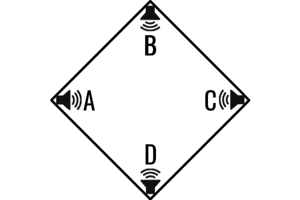

This scheme is always used by Vector Synthesis-based hardware synthesizers, such Sequential Circuits Prophet VS (1986), Yamaha SY22 series (1990), Korg Wavestation (1990), Korg wavestate (since 2004), Behringer Pro VS Mini (2025), and Victor (as Eurorack module).

Every oscillator uses a **single-cycle waveform**. Can be a built-in ROM waveform (numbered from **032. SINE** to **127. WHITE NOISE**), or a "user" waveform (they're numbered from **000. USER #1** to **031. USER #32**, empty/unused by default, but can be filled regardling your needs by [importing external WAVE files](#waveformat) - per module instance!).

To select a particular oscillator (context), press its relevant context button (**A**, **B**, **C**, or **D**) only if its LED (above the button) is off (if its LED glows red, this mean the oscillator was already selected). This display the first (home) page of the oscillator context, labelled **OSC A WAVEFORM**, **OSC B WAVEFORM**, **OSC C WAVEFORM**, or **OSC D WAVEFORM**. From this first page, along L2 (left-side) button, the number (**000** to **127**) of the selected (current) waveform, followed by its name (or **USER #xx** for any user waveform, xx varies from 01 to 32). The lower part of the OLED display is the graphic representation of the selected waveform (or horizontal line for **126. SILENCE**, or empty/free user waveform slot).

To select next or previous waveform, rotate the **DATA ENTRY** continuous encoder clockwise or counter-clockwise. The selection cycles to **000** (or **127**) when an _edge_ of the list is reached.

:information_source: The waveform **126. SILENCE** (also empty/free user waveform) is a particular waveform: by selecting it, the oscillator is disabled (not processed by the module's logic).

:warning: The waveform **127. WHITE NOISE** is using constant frequency and cannot be "pitched", nor frequency modulated.

_Vektor_'s oscillator context (can be oscillator **A**, **B**, **C**, or **D**) have 3 pages:

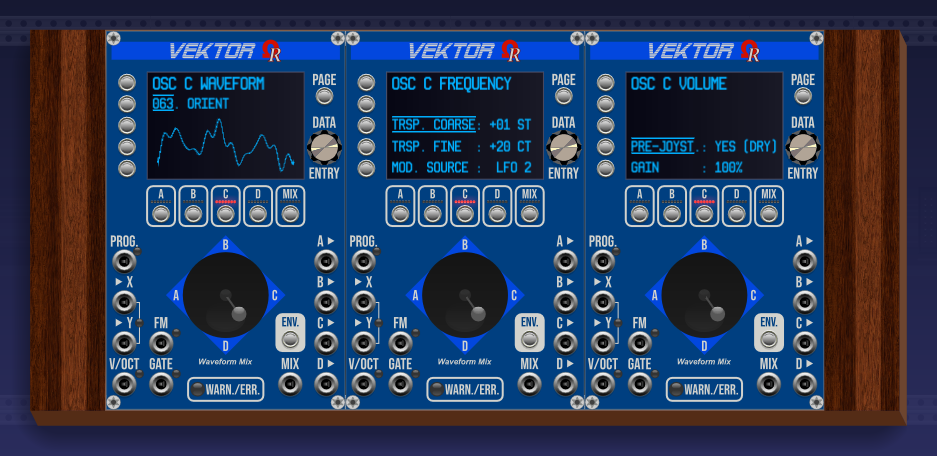

- First page (home page) permits to select a waveform (by using DATA ENTRY continuous encoder), import an user waveform from an external compliant WAVE (.wav) file (explained below in this topic), or free/clear an user waverform (if applicable).
- Second page is used to set up oscillator transposition (**COARSE** by semitones, **FINE** by cents), and the possible source (FM input jack, LFO 1, or LFO 2) for frequency modulation.
- Third page is used to set up the pre-/post-joystick (used by discrete output only), and nominal gain.

By pressing the **PAGE** momentary button (top-right side of the module), you select the next page (or cycle to first/home if the page was the last). To return to first (home) page anytime, hold **left Ctrl** key (**left Command** key on MacOS X computers), then press the **PAGE** button.

:information_source: Except on first page, to restore a displayed setting to its default value (factory, or last saved program), hold **left Ctrl** key (**left Command** key on MacOS X computers), then press the relevant **L1 ~ L5** (left-side) momentary button!

To import a custom WAVE file to USER WAVEFORM slot (right click context menu method):
- Be sure the _Vektor_ module's context is set to **A**, **B**, **C**, or **D**. If not, press the relevant oscillator context button **only if its LED above is off**.
- Do a right-mouse click over the module. From the menu, select **User waveform**, then **Import .wav file as USER #xx** command (**xx** stands for the current waveform number).
- From **Open** dialog, select the path where the .wav file is located, select the filename, then click _Open_ button.

To import a custom WAVE file to USER WAVEFORM slot (file drag and drop method):
- Be sure the _Vektor_ module's context is set to **A**, **B**, **C**, or **D**. If not, press the relevant oscillator context button **only if its LED above is off**.
- From your operating system file browser (Explorer on Windows computers, Finder on MacOS X computers), open the folder where the WAVE file is.
- Drag the relevant **.wav** file, then drop it anywhere over the module.

:warning: In case of file operation failure, the **WARN./ERR.** LED (below the joystick) is **blinking red** (twice per second), and a related error cause is displayed, until you press any button (to acknowledge the error condition).

:warning: You'll cannot import a WAVE file over built-in ROM waveform (labelled **032. SINE** to **127. WHITE NOISE**), otherwise this generate an error condition.

:warning: The _Vektor_ module doesn't allow to dump/export any waveform to an external .wav file!

---

### SUPPORTED WAVE FILE FORMAT (IMPORT TO USER WAVEFORM SLOT)

For the first firmware version (v2.6.13), the _Vektor_ module is able to accept (for import) this format **only**:

- Microsoft/IBM WAVE compliant.
- File extension: .wav
- 2048 samples, signed 16-bit PCM single-cycle (wavetables are not supported, like the real Prophet VS synthesizer).
- 44100Hz sample rate.
- 1 channel (mono).
- **Filesize must be exactly 4140 bytes**.

:warning: Other formats will be ignored, and generate an error condition on import attempt.

---

### BENEFITS OF DISCRETE OSCILLATOR OUTPUT JACKS

Even the **MIX** output jack is considered as the most important in Vector Synthesis universe, because all oscillators are constantly blended (manually by the joystick **or** by applied voltages on both **X** and **Y** input jacks, and possibly by the MIX ENVelope). But by using discrete A, B, C, and D output jacks only (without **MIX**), in this case you get **four independent oscillators** (or sound sources), whatever the Vector Synthesis state of the module. It's the first benefit!

As second benefit, you are able to apply particular FX processing on discrete A, B, C, and/or D output signal(s), like delays or reverbs, and use it/them together with the **MIX** output jack. All of these outputs can be used at the same time, like you want, either as final audio output, or as modulation source for another module.

By default, discrete oscillator outputs are unmixed (pre-joystick / pre-MIX ENVelope, similar to a "dry" audio signal), but it's possible - from relevant oscillator context, 3rd page (labelled **OSC x VOLUME**), the **PRE-JOYST.** setting along **L4** button permits to set as post-joystick / post-MIX ENVelope, instead, to get a blended oscillator signal, in case you'll need it for further usage (like separate FX processing).

_Example: from OSC B context, 3rd page (labelled "OSC B VOLUME"), press L4 button to highlight **PRE-JOYST.** setting, then rotate the DATA ENTRY encoder to change this setting from **YES (DRY)** to **NO (POST)**:_

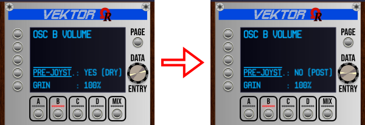

_For now, discrete B will output a possible blended (by joystick and/or by MIX ENVelope) audio signal (instead of an unmixed/pure audio signal)._

---

### FROM MODULE BROWSER

Like all Ohmer modules, _Vektor_ module and _VX_ expander follow **Use dark panel if available** VCV Rack 2's global setting (from _View_ menu), in order to display a "light" or a "dark" panel in the module browser.

If the **Use dark panel if available** is disabled (unchecked), the presented model is always **Aluminium**:

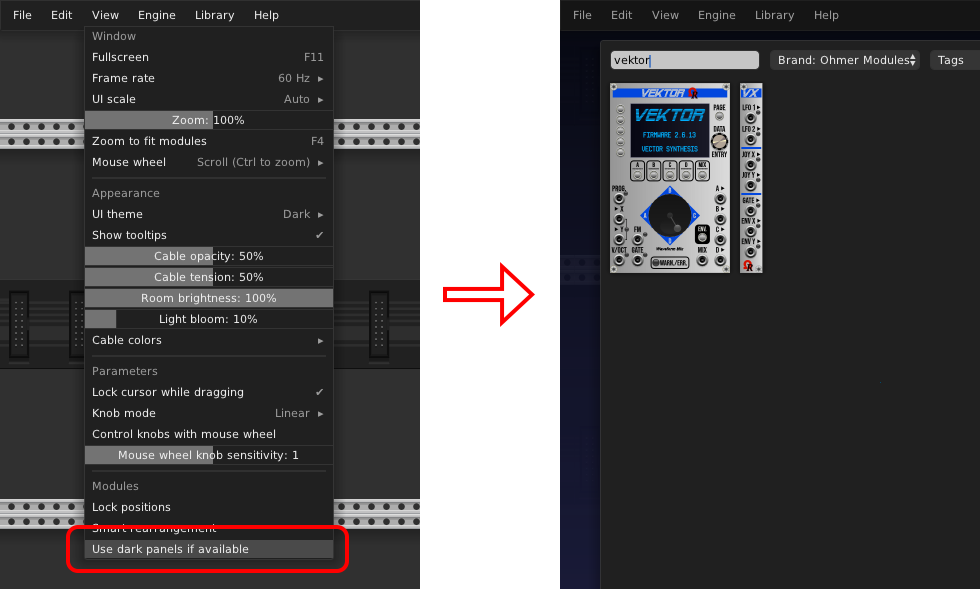

If the **Use dark panel if available** is enabled (checked), the presented model is always **Absolute Night**:

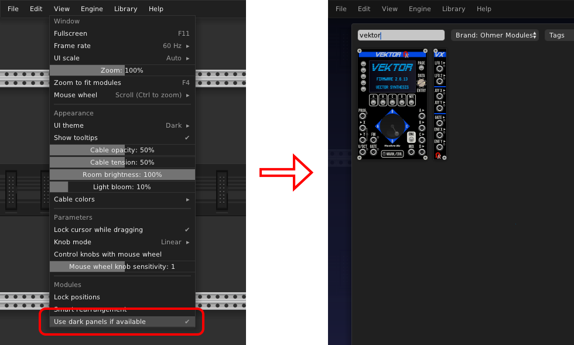

As soon as a _Vektor_ module is installed in your rack (it's a _module instance_, or _instanciated module_), it does a quick self-test sequence. You'll can freely change its model anytime you'll want: from right click context menu, select **Model** menu item, then select the model you'd like from the submenu (Aluminium, Stage Repro, and so on).

:information_source: _VX_ expander always inherits the _Vektor_'s model as soon as the "link" between them is established.

The _Vektor_ module is using **Oscillator**, **Quad**, and **Polyphonic** tags. The _VX_ module is using **Expander** tag only.

---

### OUTRO...

As final words, any _Vektor_ module instance:

- can be duplicated (with all settings, including user waveforms), and possibly with connected cables.
- can be saved as **Preset** file (.vcvm file), for later reuse.
- can be saved as part of **Module selection** file (.vcvs file), for later reuse.
- can be reset to factory settings (**Initialize** command, from right click menu / **Ctrl + I** / **Command + I** key shortcut).
- can be bypassed (**Bypass** command, from right click menu / **Ctrl + E** / **Command + E** key shortcut).

:warning: Randomize command (**Ctrl + R** / **Command + R** key shortcut) is not yet implemented, so using it have no effect at the moment. Will be implemented in future release.

Thanks for reading, and have fun in Vector Synthesis with _Vektor_ and _VX_ modules! ;)
